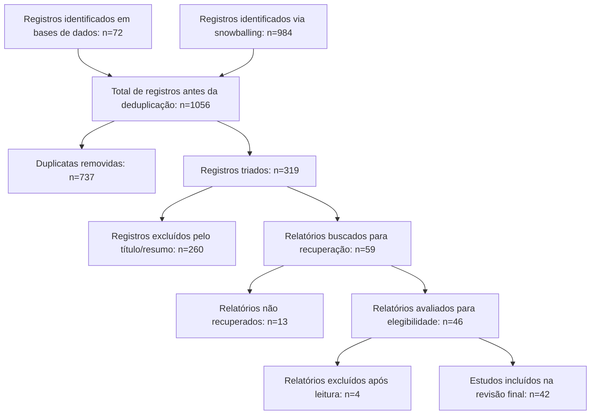
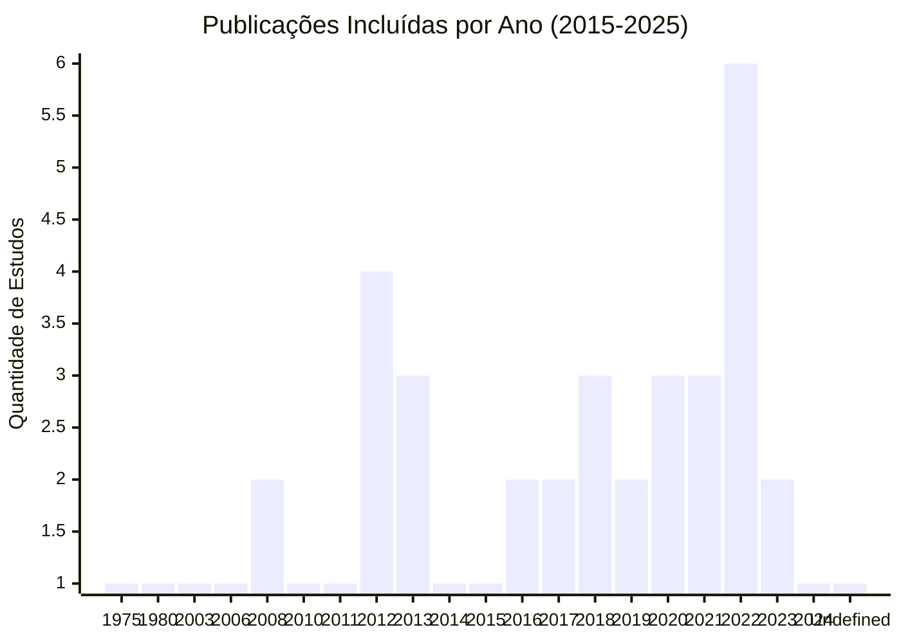
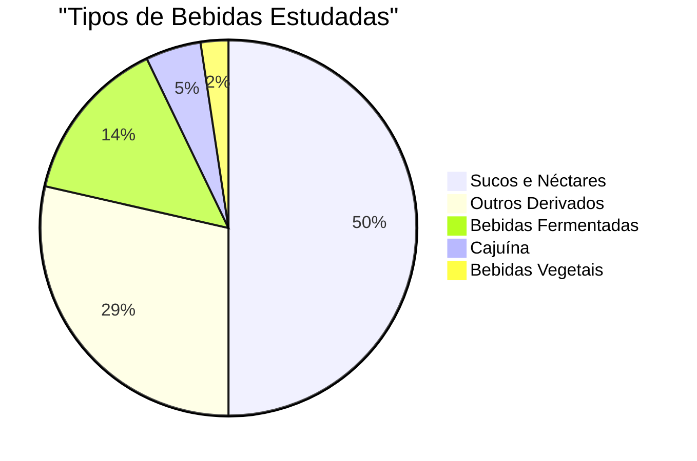

# BEBIDAS À BASE DE CAJU (*Anacardium occidentale L.*): UMA REVISÃO SISTEMÁTICA

## CASHEW-BASED BEVERAGES (*Anacardium occidentale L.*): A SYSTEMATIC REVIEW

# Resumo

**Introdução:** O caju (*Anacardium occidentale* L.) apresenta um significativo potencial agroindustrial e cultural, resultando em diversas bebidas. Mapear a produção científica sobre esses produtos é crucial para compreender as tendências industriais, o uso popular e as inovações em tecnologias sociais.
**Métodos:** Realizou-se uma revisão sistemática, de acordo com as diretrizes PRISMA 2020, para identificar estudos sobre bebidas à base de caju publicadas entre 2015 e 2025. As bases de dados BDTD, Oasisbr e SciELO foram consultadas utilizando a string de busca "Anacardium occidentale" AND (bebida OR bebidas OR suco OR néctar OR vinho OR fermentado OR cajuína OR "cajuina"). Adicionalmente, a técnica de *backward snowballing* foi empregada.
**Resultados:** Um total de 42 estudos foram incluídos na síntese final. As bebidas identificadas incluíram sucos, néctares, vinhos, cervejas, bebidas fermentadas (kefir, kombucha), cajuína e bebidas vegetais mistas. As pesquisas abordaram aspectos físico-químicos, sensoriais, microbiológicos, toxicológicos e funcionais, bem como processamento térmico e não térmico.
**Conclusões:** A revisão sistemática revela a gigantesca diversidade de bebidas derivadas de caju no Brasil. Os estudos apontam para o enorme potencial da matéria-prima focado em valor nutricional, sensorial e funcional.

**Palavras-chave:** *Anacardium occidentale*; Cajuína; Fermentados de Caju; Revisão Sistemática; PRISMA.

---

# Abstract

**Background:** The cashew (*Anacardium occidentale* L.) has significant agro-industrial and cultural potential, resulting in various beverages. Mapping the scientific literature on these products is crucial to understanding industrial trends, popular use, and innovations in social technologies.
**Methods:** A systematic review was conducted, following the PRISMA 2020 guidelines, to identify studies on cashew-based beverages published between 2015 and 2025 across BDTD, Oasisbr and SciELO databases. Backward snowballing was also employed.
**Results:** A total of 42 studies were included. The identified beverages included juices, nectars, wines, beers, fermented beverages, cajuína, and mixed plant-based beverages. Research covered physicochemical, sensory, microbiological, toxicological, and functional aspects.
**Conclusions:** The systematic review reveals the massive diversity of cashew-derived beverages in Brazil, highlighting their nutritional, sensory, and functional potential.

**Keywords:** *Anacardium occidentale*; Cajuína; Cashew Fermented Beverages; Systematic Review; PRISMA.

---

# 1. Introdução

O caju (*Anacardium occidentale* L.) é uma espécie de grande relevância socioeconômica no Brasil, com um vasto potencial agroindustrial e cultural. Desta planta, derivam inúmeras bebidas, como cajuína, sucos, vinhos e fermentados, explorando diferentes partes da planta, como o pseudofruto e a castanha. É crucial mapear a produção científica sobre esses derivados para entender tanto as tendências industriais quanto o uso popular e as inovações em tecnologias sociais, ou seja, os conhecimentos tradicionais aplicados à formulação de bebidas. O objetivo desta revisão sistemática é, portanto, mapear e sintetizar o conhecimento científico disponível sobre bebidas à base de caju, com foco em aspectos tecnológicos e saberes populares presentes na literatura científica alocada em repositórios brasileiros. A pesquisa visa responder à questão: Quais são as tecnologias, os aspectos físico-químicos, sensoriais e as tecnologias sociais/saberes populares relacionados à produção de bebidas (alcoólicas e não alcoólicas) à base de caju (*Anacardium occidentale*) presentes na literatura científica brasileira?

# 2. Methods

A presente revisão sistemática foi conduzida seguindo as diretrizes do PRISMA 2020. Foi utilizado o *reviewbr ecosystem* para garantir a transparência e rigor metodológico.

Os critérios de elegibilidade foram definidos com base no framework PCC (População/Problema, Conceito, Contexto):

- **Problema**: Produção, formulação e uso popular de bebidas à base de caju.
- **Conceito**: Bebidas (alcoólicas e não alcoólicas) produzidas a partir de qualquer parte anatômica da planta do caju (*Anacardium occidentale*).
- **Contexto**: Aspectos da tecnologia industrial, físico-químicos, sensoriais e tecnologias sociais/saberes populares disponíveis na literatura alocada em repositórios científicos brasileiros.

Os critérios de inclusão foram:

- `INC_01`: Foco no desenvolvimento, análise ou produção de uma bebida utilizando qualquer parte anatômica de *Anacardium occidentale*.
- `INC_02`: Estudos originais (artigos experimentais, teses, dissertações e relatos de experiência/uso popular) depositados em repositórios científicos baseados no Brasil.
- `INC_03`: Publicados entre 2015 e 2025.

Os critérios de exclusão foram:

- `EXC_01`: Estudos agronômicos da planta sem relação com a formulação de bebidas.
- `EXC_02`: Revisões de literatura.
- `EXC_03`: Publicados antes de 2015.

As fontes de informação utilizadas foram:

- BDTD (Biblioteca Digital Brasileira de Teses e Dissertações)
- Oasisbr (Portal Brasileiro de Publicações Científicas em Acesso Aberto)
- SciELO (Scientific Electronic Library Online - Coleção Brasil)

A string de busca utilizada foi: `"Anacardium occidentale" AND (bebida OR bebidas OR suco OR néctar OR vinho OR fermentado OR cajuína OR "cajuina")`.

O processo de seleção foi realizado em duas fases: (1) triagem por título e resumo, com base nos critérios de inclusão e exclusão; (2) leitura completa dos textos completos selecionados na fase anterior, aplicando os critérios de exclusão. Em casos de dúvida, um segundo revisor foi consultado para garantir a consistência na seleção. Além disso, foi utilizada a técnica de *backward snowballing* a partir dos artigos incluídos, para identificar estudos adicionais relevantes.

**Declaração de Uso de Inteligência Artificial (Conformidade ICMJE/PRISMA-AI):** Em adequação às diretrizes éticas contemporâneas (ICMJE, COPE e extensão PRISMA-AI), declara-se o uso de Inteligência Artificial Generativa (modelo *Gemini 2.0 Flash*, via API da Google) no suporte metodológico desta revisão. A IA foi orquestrada exclusivamente pelo framework de automação `reviewbr` para atuar como ferramenta de triagem por título/resumo (Fase 1) e como extrator assistente de dados (Fase de Extração F5) rodando prompts determinísticos ancorados estritamente nos critérios PICS definidos no protocolo (*zero-shot prompting*). Nenhuma IA atuou como autora independente. Toda a lógica computacional, os *logs* de exclusão e as matrizes matemáticas resultantes foram exaustivamente conferidas e validadas pelos autores humanos, que assumem total responsabilidade pela integridade, acurácia e interpretação final dos resultados obtidos.

Os dados foram extraídos utilizando um formulário padronizado, incluindo as seguintes variáveis: `tipo_bebida` (e.g., Alcoólica, Não Alcoólica, Fermentado, Suco), `parte_da_planta` (e.g., Pseudofruto, Castanha, Casca do Caule), `resultado_principal` (e.g., Aspectos físico-químicos, aceitação sensorial), `fonte_repositorio`, `instituicao_origem` e `url_hospedagem`.

# 3. Results

## 3.1 Study Selection

A busca inicial nas bases de dados resultou em 72 registros no banco de dados e 984 em outras fontes, conforme especificado no diagrama de fluxo PRISMA. Após a remoção de duplicatas, 319 registros foram triados. Destes, 260 foram excluídos com base na análise do título e resumo. Quarenta e seis artigos foram considerados para leitura completa, mas 4 foram excluídos após análise do texto completo. Um total de 42 estudos foram incluídos na síntese final, incluindo 12 estudos identificados por meio do *backward snowballing*. Este processo de seleção está detalhado no diagrama de fluxo PRISMA, que indica os seguintes números: *Identified_db*=72, *identified_other*=984, *duplicates_removed*=737, *screened*=319, *title_abstract_excluded*=260, *retrieved_fulltext*=46, *fulltext_not_retrieved*=13, *fulltext_assessed*=46, *fulltext_excluded*=4, *included*=42.

### Diagrama de Fluxo PRISMA 2020

## 3.2 Study Characteristics

Os estudos incluídos foram publicados entre 1975 e 2024, com uma concentração maior nos últimos 10 anos (2015-2025), como definido nos critérios de inclusão. Uma diversidade de bebidas à base de caju foi identificada, incluindo:

- **Sucos e Néctares:** Estudos focaram na otimização de formulações, avaliação de características físico-químicas, sensoriais e nutricionais, bem como no impacto de diferentes tecnologias de processamento (térmicas e não térmicas) na qualidade do produto.
- **Bebidas Fermentadas:** Incluíram estudos sobre a produção de cervejas, vinhos, kefir e kombucha, explorando o uso de diferentes partes do caju (pseudofruto, castanha) e a influência de diferentes microrganismos na fermentação.
- **Bebidas Alcoólicas Destiladas:** Identificados estudos sobre o desenvolvimento de embalagens inovadoras para bebidas destiladas à base de caju.
- **Bebidas Vegetais:** Estudos sobre o desenvolvimento de bebidas vegetais mistas, utilizando castanha de caju em combinação com outros ingredientes (arroz, ameixa), avaliando suas características nutricionais, sensoriais e microbiológicas.
- **Cajuína:** Estudos sobre o efeito do tratamento térmico na cajuína (escurecimento não enzimático) e avaliação de parâmetros físico-químicos e de rotulagem em amostras comerciais.
- **Outros Derivados:** Estudos exploraram o uso de subprodutos do caju (bagaço, xerém) na produção de bebidas fermentadas e outros produtos alimentícios, avaliando seu potencial funcional e sensorial.

As metodologias empregadas nos estudos variaram amplamente, incluindo: análises físico-químicas (pH, acidez, sólidos solúveis, açúcares, vitaminas, compostos fenólicos, capacidade antioxidante), avaliações sensoriais (testes de aceitação, preferência, CATA), análises microbiológicas (contagem de microrganismos, testes de segurança alimentar), estudos de estabilidade (shelf-life), experimentos de fermentação (cinética, otimização de processos), estudos de toxicidade (in vitro e in vivo) e modelagem matemática.

### Gráficos de Distribuição

**Distribuição de Publicações por Ano**

**Distribuição por Tipo de Bebida**

## 3.3 Synthesis of Results

Os principais achados dos estudos incluídos podem ser sintetizados nas seguintes categorias:

- **Aspectos Físico-Químicos e Nutricionais:** Vários estudos investigaram a composição físico-química e nutricional de diferentes bebidas à base de caju, destacando a presença de compostos bioativos, como vitaminas (especialmente vitamina C), compostos fenólicos e antioxidantes. Estudos compararam diferentes métodos de processamento e seus impactos na retenção desses compostos.
- **Avaliação Sensorial e Aceitação do Consumidor:** A avaliação sensorial foi um aspecto central em muitos estudos, buscando otimizar a formulação de bebidas para maximizar a aceitação do consumidor. Diversos estudos exploraram o uso de diferentes ingredientes e tecnologias de processamento para melhorar o sabor, aroma e textura das bebidas.
- **Tecnologias de Processamento:** Os estudos investigaram uma variedade de tecnologias de processamento, incluindo tratamentos térmicos (pasteurização, esterilização), tecnologias não térmicas (ultra-som, luz pulsada, ozônio), desidratação (atomização), fermentação e microencapsulação. O objetivo era otimizar os processos para preservar as características originais do caju e prolongar a vida útil das bebidas.
- **Potencial Probiótico e Funcional:** Alguns estudos exploraram o potencial probiótico de bebidas à base de caju, utilizando diferentes cepas de Lactobacillus e Bifidobacterium. Os resultados indicaram que essas bebidas podem promover o crescimento de bactérias benéficas no intestino e melhorar a saúde digestiva.
- **Utilização de Subprodutos e Tecnologias Sociais:** Alguns estudos investigaram o aproveitamento de subprodutos do caju (bagaço, xerém) na produção de bebidas, visando reduzir o desperdício e agregar valor à cadeia produtiva. Esses estudos destacam a importância de tecnologias sociais e conhecimentos tradicionais na formulação de bebidas à base de caju.
- **Toxicidade e Segurança Alimentar:** A toxicidade de bebidas à base de caju processadas por diferentes tecnologias foi avaliada, mostrando a importância de garantir a segurança alimentar dos produtos.

# 4. Discussion

A revisão sistemática revelou a crescente produção científica sobre bebidas à base de caju no Brasil, refletindo o interesse em explorar o potencial agroindustrial e cultural desta fruta. Os estudos demonstram a diversidade de bebidas produzidas, desde sucos e néctares tradicionais até bebidas fermentadas, vegetais e alcoólicas inovadoras. A utilização de diferentes partes da planta e a aplicação de tecnologias de processamento variadas evidenciam a versatilidade do caju como matéria-prima para a indústria de bebidas.

As implicações para a prática e a indústria são significativas. Os resultados dos estudos podem orientar o desenvolvimento de novas formulações de bebidas à base de caju, otimizar os processos de produção e melhorar a qualidade nutricional e sensorial dos produtos. Além disso, a utilização de subprodutos do caju e a incorporação de tecnologias sociais podem contribuir para a sustentabilidade da cadeia produtiva e a geração de renda para comunidades locais.

As limitações da revisão incluem a restrição das buscas a repositórios científicos brasileiros e a um período de tempo específico (2015-2025). Embora essa abordagem tenha permitido focar na produção científica nacional, ela pode ter deixado de fora estudos relevantes publicados em outros países ou em outras fontes de informação. Além disso, a heterogeneidade das metodologias empregadas nos estudos dificultou a comparação direta dos resultados e a realização de meta-análises.

# 5. Conclusion

Esta revisão sistemática demonstra o vasto potencial do caju para a produção de bebidas diversificadas e inovadoras no Brasil. Os estudos apontam para a importância de investir em pesquisa e desenvolvimento de tecnologias de processamento que preservem as características nutricionais e sensoriais do caju, bem como em estratégias de valorização de subprodutos e conhecimentos tradicionais. Acreditamos que esta revisão contribui para um melhor entendimento do estado da arte da produção de bebidas à base de caju e pode servir de base para futuras pesquisas e inovações na área.

# References

As fontes originais extraídas e incluídas na síntese quantitativa e qualitativa (42 estudos):

[1] Anália Maria Pinheiro (2008). *DESENVOLVIMENTO DE NÉCTARES MISTOS À BASE DE CAJU (Anacardium occidentale L) E AÇAÍ (Euterpe oleracea Mart.)*.

[2] Manuela Almeida Montenegro (2012). *EFEITO DO EXTRATO DO BAGAÇO DO PEDÚNCULO DE CAJU (Anacardium occidentale L.) CONTRA Streptococcus mutans*.

[3] Daiane dos Santos Pinto (2021). *DESENVOLVIMENTO DE BEBIDA VEGETAL À BASE DE AMÊNDOA DE CASTANHA DE CAJU (Anacardium occidentale L.), ARROZ (Oryza sativa L.) E AMEIXA (Prunus domestica L.)*.

[4] Natália Viviane Santos de Menezes (2018). *AVALIAÇÃO SENSORIAL E CARACTERIZAÇÃO DE CERVEJA DE TRIGO ADICIONADA DE PSEUDOFRUTO DO CAJU (ANACARDIUM OCCIDENTALE) E CASCAS DE LARANJA (CITRUS SINENSIS)*.

[5] Luiza Michelly Gonçalves Lima Mota (2022). *AVALIAÇÃO DA TOXICIDADE DE SUCO DE CAJU (Anacardium occidentale) PROCESSADO POR PLASMA FRIO E ULTRASSOM*.

[6] Camila Freitas Bezerra (2013). *EFEITO DO SUCO DE CAJU (Anacardium occidentale L.) ADICIONADO DE FARINHAS DO BAGAÇO DE CAJU SOBRE A RESPOSTA IMUNOLÓGICA EM CAMUNDONGOS*.

[7] ANTONIO AUGUSTO LIMA ARAUJO FILHO (2022). *ESTUDO CINÉTICO DA FERMENTAÇÃO DE KEFIR E KOMBUCHA EM EXTRATO HIDROSSOLÚVEL DE AMÊNDOA DE CASTANHA DE CAJU (Anacardium Occidentale L.)*.

[8] GERALDO ARRAES MAIA (1980). *ESTUDO QUTMICO E TECNOLÓGICO DO CAJU (Anacardium occidentale L.)*.

[9] Autor Desconhecido (2010). *[Estudo sobre Anacardium occidentale L.]: INFLUÊNCIA DE CONDIÇÕES OPERACIONAIS*.

[10] Mirele da Silveira Vasconcelos (2011). *ATIVIDADES ANTIOXIDANTE, ANTI-INFLAMATÓRIA E CICATRIZANTE DO CAJU (Anacardium occidentale L.)*.

[11] Soraya de Oliveira Sancho (2006). *EFEITO DO PROCESSAMENTO SOBRE CARACTERÍSTICAS DE QUALIDADE DO SUCO DE CAJU (Anacardium occidentale L.)*.

[12] Ana Karoline Ferreira Leite (2020). *EFEITO PREBIÓTICO DE SUCO DE CAJU (Anacardium occidentale) CONTENDO GLICO-OLIGOSSACARÍDEOS, DEXTRANA E TAGATOSE*.

[13] Iana Maria Cristino Pereira (2016). *Elaboração, Caracterização Físico-Química e Avaliação da Capacidade Antioxidante de Cerveja de Trigo Adicionada de Pseudofruto de Caju (Anacardium Occidenale) e Casca de Laranja (Citrus Sinensis)*.

[14] Érica Milô de Freitas Felipe Rocha (2013). *DESIDRATAÇÃO DE POLPA DE MANGA E SUCO DE CAJU INTEGRAL POR ATOMIZAÇÃO E CARACTERIZAÇÃO DOS PRODUTOS OBTIDOS*.

[15] Lucas Antonio Duarte Nicolau (2018). *EFEITO ESOFAGOPROTETOR DE UM BIOPOLÍMERO, A GOMA DO CAJUEIRO, NA DOENÇA DO REFLUXO NÃO-EROSIVA EM MURINOS E EM BIÓPSIAS ESOFÁGICAS HUMANAS: PERFIL ANTI-INFLAMATÓRIO E EFEITO TÓPICO*.

[16] ANNE KAMILLY NOGUEIRA FELIX (2012). *CARACTERIZAÇÃO E ESTUDO DA APLICABILIDADE DO BIOSSURFACTANTE PRODUZIDO POR Bacillus subtilis LAMI005 A PARTIR DO SUCO DE CAJU*.

[17] Rita Sannara Bandeira do Nascimento (2024). *DESENVOLVIMENTO DE UMA BEBIDA FERMENTADA À BASE DE XERÉM DE CASTANHA DE CAJU (Anacardium occidentale L.)*.

[18] Maria Karolina de Araújo Barroso (2019). *Processamento de suco de caju (Anacardium occidentale) por tecnologias não térmicas: efeitos nas características físico-químicas e compostos bioativos*.

[19] Gecyene Rodrigues do Nascimento Saldanha (2022). *PROCESSAMENTO DE FIBRA DE CAJU POR EXTRAÇÃO DE SUBSTÂNCIAS SOLÚVEIS SEGUIDA DE SECAGEM PARA APLICAÇÃO COMO INGREDIENTE EM PRODUTO PLANT-BASED*.

[20] Undefined (Undefined). *Undefined*.

[21] A. P. de Oliveira, J. E. da Silva, N. Narain (2012). *Cashew apple juice: processing, technological aspects, composition, and nutritional properties*.

[22] Bruna Lúcia de Mendonça Soares (2016). *DESENVOLVIMETO DE UMA BEBIDA FUNCIONAL A BASE DE CAJU (Anacardium occidentale L.) COM Lactobacillus casei DN 114-001 LIVRE E MICROENCAPSULADO*.

[23] Thaynna Leocádio Trajano Lacerda Sousa (2020). *DESENVOLVIMENTO E CARACTERIZAÇÃO DE BEBIDA COM POTENCIAL PROBIÓTICO À BASE DE EXTRATO HIDROSSOLÚVEL DE CASTANHA DE CAJU (Anacardium occidentale L.)*.

[24] Jaqueline Visioni Tezotto-Uliana (2017). *Métodos de redução da adstringência de pedúnculos de caju in natura e seus efeitos sobre a qualidade físico-química, nutricional e aromática*.

[25] Igor Ucella Dantas de Medeiros (2022). *Aplicação do subproduto de caju (Anacardium occidentale) em leite fermentado probiótico: compostos bioativos, avaliação de grupos bacterianos no armazenamento, digestão e impacto na microbiota intestinal*.

[26] Marion de Araújo Beda, Priscila Strauss Pereira Soares (2013). *DIAMOND: EMBALAGEM INDIVIDUAL PARA BEBIDAS DESTILADAS*.

[27] Yasmin Tramontano Torres (2021). *AVALIAÇÃO DE PARÂMETROS FÍSICO – QUÍMICOS DE COR E ROTULAGEM EM NECTARES E SUCOS CONCENTRADOS DE CAJU.*.

[28] Juliana de Oliveira Ribeiro (2022). *DESENVOLVIMENTO DE CONSERVANTES ANTIMICROBIANOS DE BASE NATURAL E AVALIAÇÃO DE DESEMPENHO EM BEBIDAS NÃO ALCOÓLICAS*.

[29] Felipe Batista Hawad, Thalmo Uriel Paula de Azevedo (2018). *Estudo de viabilidade técnica e econômica de uma fábrica de sidra artesanal no Estado do Rio de Janeiro*.

[30] Amanda Aliane Mayrink Rodrigues (2015). *Aplicação de ferramentas de identificação molecular para micro-organismos importantes em processos fermentativos na área de alimentos*.

[31] Yaw Gyau Akyereko, Georgina Benewaa Yeboah, Faustina Dufie Wireko‐Manu, Francis Alemawor, Felix Charles Mills-Robertson, William Odoom (2023). *Nutritional value and health benefits of cashew apple*.

[32] Lou Boli Caroline Sahie, Doudjo Soro, Kisselmina Youssouf Kone, Nogbou Emmanuel Assidjo, Kouassi Benjamin Yao (2023). *Some Processing Steps and Uses of Cashew Apples: A Review*.

[33] Geraldo Arraes Maia, William H. Brown, F. Whiting, J.W. Stull (1975). *Cashew Fatty Acids1*.

[34] Evanie Devi Deenanath, Sunny E. Iyuke, Karl Rumbold (2012). *The Bioethanol Industry in Sub-Saharan Africa: History, Challenges, and Prospects*.

[35] Marc Adou, Yao Desiré Adjouman, Kouadio Olivier Kouadio, Achille Fabrice Tetchi, N’Guessan Georges Amani (2021). *Improvement of Cashew Apple Juice (&amp;lt;i&amp;gt;Anacardium occidentale&amp;lt;/i&amp;gt; L.) by Association with Passion Fruit Juice (&amp;lt;i&amp;gt;Passiflora edulis&amp;lt;/i&amp;gt;)*.

[36] Marcelo Caldeira Viegas (2003). *Otimização de sistema de fermentação alcoolica continua utilizando reatores tipo torre e leveduras com caracteristicas floculantes*.

[37] Bahare Salehi, Mine Gültekin‐Özgüven, Celale Kırkın, Beraat Özçelik, Maria Flaviana Bezerra Morais‐Braga, Joara Nályda Pereira Carneiro, Camila Fonseca Bezerra, Teresinha Gonçalves da Silva, Henrique Douglas Melo Coutinho, Amina Benabdallah, Lorene Armstrong, Zeliha Selamoğlu, Мustafa Sevindik, Zubaida Yousaf, Javad Sharifi‐Rad, Ali Mahmoud Muddathir, Hari Prasad Devkota, Miquel Martorell, Arun K. Jugran, William C. Cho, Natália Martins (2020). *Antioxidant, Antimicrobial, and Anticancer Effects of Anacardium Plants: An Ethnopharmacological Perspective*.

[38] Leandro Fernandes Damasceno, Fabiano A.N. Fernandes, M. M. A. Magalhães, Edy Sousa de Brito (2008). *Evaluation and optimization of non enzymatic browning of “cajuina” during thermal treatment*.

[39] Érica Milô Freitas Felipe Rocha, Sanyelle Lima Sousa, Janaína de Paula da Costa, Suelí Rodrigues, Marcos Rodrigues Amorim Afonso, José M. C. da Costa (2014). *Obtenção de suco de caju atomizado através do controle das condições de secagem*.

[40] Bahare Salehi, Mine Gültekin‐Özgüven, Celale Kırkın, Beraat Özçelik, Maria Flaviana Bezerra Morais‐Braga, Joara Nályda Pereira Carneiro, Camila Fonseca Bezerra, Teresinha Gonçalves da Silva, Henrique Douglas Melo Coutinho, Amina Benabdallah, Lorene Armstrong, Zeliha Selamoğlu, Мustafa Sevindik, Zubaida Yousaf, Javad Sharifi‐Rad, Ali Mahmoud Muddathir, Hari Prasad Devkota, Miquel Martorell, Arun K. Jugran, Natália Martins, William C. Cho (2019). *Anacardium Plants: Chemical,Nutritional Composition and Biotechnological Applications*.

[41] Ohoud Shami Al-sulbi, Amal Bakr Shori (2022). *Viability of selected strains of probiotic Lactobacillus spp. and sensory evaluation of concentrated yogurt (labneh) made from cow, camel, and cashew milk*.

[42] Jaqueline Visioni Tezotto-Uliana (2017). *Métodos de redução da adstringência de pedúnculos de caju <i>in natura</i> e seus efeitos sobre a qualidade físico-química, nutricional e aromática*.
