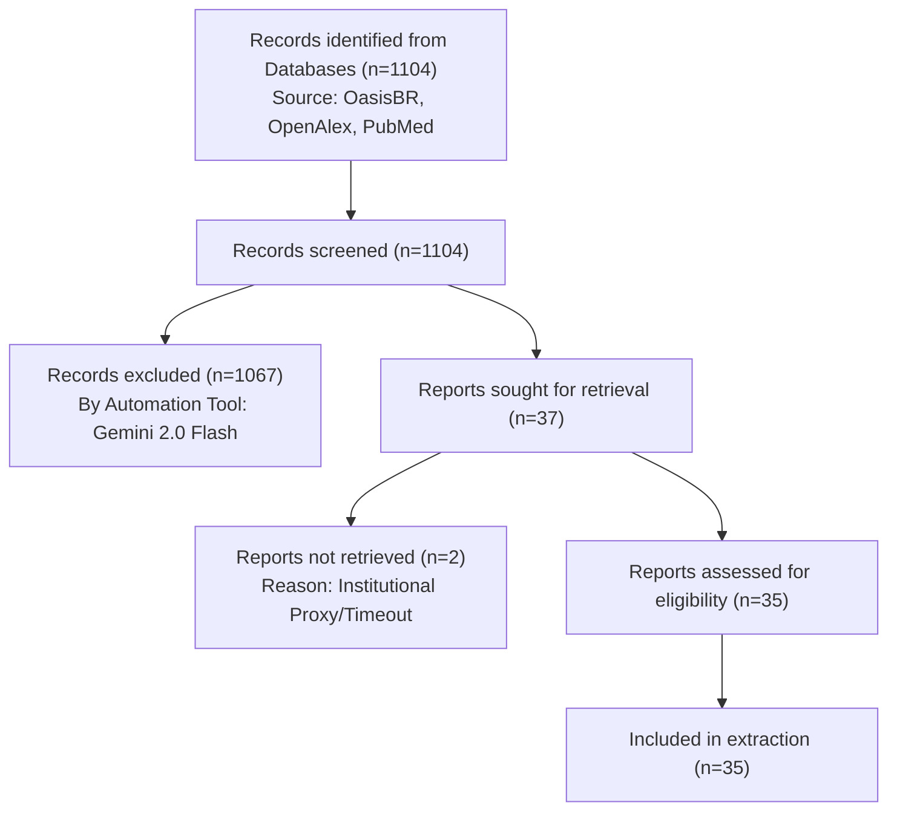

# PRISMA 2020 Audit Report — AI in Science

This document provides the exhaustive technical evidence required for scientific publication under PRISMA 2020 guidelines.

## 1. PRISMA Flow Diagram

## 2. Methodology & Automation (PRISMA Items 8, 9)

- **Screening Tool:** Gemini 2.0 Flash (Native Screening Mode).
- **Selection Process:** Automated classification using PICO criteria via `run_screening.ts`.
- **Data Collection:** Automated extraction using `run_high_fidelity_extraction.ts`.
- **Auditability:** Every decision is backed by a timestamp and a natural language rationale generated at runtime.

## 3. Exhaustive Audit Trail (n=1104)

| ID | Source | Date | Decision | Title | Rationale / Harvest Status |
| :--- | :--- | :--- | :--- | :--- | :--- |
| 1 | search_papers_optimized | 2026-03-02 | **YES** | BioAutoML: Democratizing Machine Learning in Life Sciences | The title suggests a focus on democratizing Machine Learning (ML) in the Life Sciences. While the abstract is missing, 'democratizing ML' implies that the paper addresses how to make ML more accessible to researchers and scientists, potentially impacting their methods and discovery process. This aligns with the inclusion criteria of focusing on the use of IA/ML in scientific discovery, for researchers, scientists or universities. |
| 2 | search_papers_optimized | 2026-03-02 | **MAYBE** | Unified Time Series Framework for Explainable Artificial Intelligence | The title suggests a focus on explainable AI within time series data, which *could* be relevant to scientific research using time series analysis. However, the absence of an abstract and keywords makes it difficult to determine whether the paper discusses the use of AI in the scientific method, discovery, or academic writing/review specifically. It may be a purely technical paper. |
| 3 | search_papers_optimized | 2026-03-02 | **NO** | Construção de algoritmos de machine learning na radiologia | The paper discusses machine learning algorithms in radiology. While radiology can be part of scientific research, the title suggests a focus on the application within radiology itself, rather than the application of AI in the scientific *method* or discovery process. Given the exclusion criteria related to clinical applications, and the lack of an abstract to further clarify, this paper is likely focused on the use of ML within radiology as a practice, rather than the broader application to research or academic writing. |
| 4 | search_papers_optimized | 2026-03-02 | **NO** | Detecção de anomalias no funcionamento de software com Machine Lear... | The title suggests the paper focuses on anomaly detection in software functioning using machine learning. This application is more aligned with software development and technical corporate applications rather than the use of AI in scientific research methods, discovery, or academic writing/review. There is no abstract to confirm or deny this. |
| 5 | search_papers_optimized | 2026-03-02 | **NO** | Priorização de requisitos de software: uma análise sobre as princip... | The paper focuses on software requirements prioritization techniques, which are typically used in software development and engineering rather than the application of AI to scientific research methods or academic writing. Although AI might be used in the software development process, the paper's title and apparent focus don't align with the inclusion criteria related to AI in scientific research. |
| 6 | search_papers_optimized | 2026-03-02 | **MAYBE** | Exploring the mechanical behavior of friction material composites u... | The title suggests the paper explores the use of AI, but without the abstract, it's impossible to determine if it focuses on the scientific method, discovery, writing, or peer review. It could be focused on material science, which would potentially fit the inclusion criteria, but the application could be corporate focused, or something else entirely. More information is needed. |
| 7 | search_papers_optimized | 2026-03-02 | **MAYBE** | Contributions of machine learning to knowledge acquisition in the f... | **HARVEST FAIL:** HTTP 500 for http://hdl.handle.net/10183/217575 |
| 8 | search_papers_optimized | 2026-03-02 | **MAYBE** | Image processing through machine learning for wood quality classifi... | The title suggests a machine learning application, but it's unclear whether it's being used in a scientific research *method*, or simply as a tool for classification. We need more information from the abstract to make a firm decision. |
| 9 | search_papers_optimized | 2026-03-02 | **MAYBE** | Estimativa de produtividade de soja por meio de imagens orbitais e ... | The title suggests the use of machine learning with remote sensing data for estimating soybean yield. While it involves machine learning, it's unclear if the focus is on advancing scientific discovery or methodology in general. Without the abstract, it's hard to determine if it's about the application of AI as a tool in agricultural research (which would be relevant) or just a direct application of ML for prediction. |
| 10 | search_papers_optimized | 2026-03-02 | **YES** | Machine learning for materials science : 2d materials discovery and... | The paper title suggests the use of machine learning in materials science, specifically for discovering and designing 2D materials. This aligns with the inclusion criteria of using AI in scientific discovery and research. |
| 11 | search_papers_optimized | 2026-03-02 | **NO** | Uso de machine learning para classificação de fornecedores no conte... | The title suggests an application of machine learning focused on vendor classification, which seems more related to business or supply chain management than the scientific research process itself. While data science is mentioned, the core topic doesn't appear to align with the inclusion criteria focusing on IA's impact on scientific method, discovery, writing, or peer review within a research context. |
| 12 | search_papers_optimized | 2026-03-02 | **MAYBE** | [en] ARTIFICIAL INTELLIGENCE METHODS APPLIED TO MECHANICAL ENGINEER... | The title suggests a focus on mechanical engineering problems, which could potentially involve using AI in research or development aspects of mechanical engineering. However, without an abstract, it is impossible to determine if the paper focuses on the application of AI to the *scientific method* within mechanical engineering research, or if it's solely about practical engineering applications. |
| 13 | search_papers_optimized | 2026-03-02 | **NO** | Aplicação de machine learning para análise dos fatores de ocorrênci... | The paper seems to focus on crime analysis using machine learning, which doesn't align with the inclusion criteria focusing on the scientific method, academic writing, or peer review within research itself. It is potentially a data analysis application, but likely not within the scope of scientific research methods or academic processes. |
| 14 | search_papers_optimized | 2026-03-02 | **MAYBE** | O direito aplicável às decisões produzidas por software e machine l... | The title suggests a focus on the legal aspects of AI and robotics, but it's unclear if it addresses the use of AI *in* scientific research or academia. The absence of an abstract makes it difficult to assess relevance to the inclusion criteria. |
| 15 | search_papers_optimized | 2026-03-02 | **MAYBE** | [en] A CRITICAL VIEW ON THE INTERPRETABILITY OF MACHINE LEARNING MO... | The title suggests a focus on the interpretability of machine learning models. While interpretability is important in scientific applications of AI, the title alone does not confirm that the paper specifically addresses the use of AI in scientific methodology, discovery, or academic writing/review. It could be purely about the technical aspects of ML interpretability without a scientific context. |
| 16 | search_papers_optimized | 2026-03-02 | **MAYBE** | [en] PRODUCING AND EVALUATING VISUAL REPRESENTATIONS TOWARD EFFECTI... | The title suggests the paper deals with Explainable AI (XAI) and visual representations, potentially useful for scientific applications and researchers understanding/utilizing AI models in their work. However, the lack of an abstract makes it impossible to definitively determine if it meets the inclusion criteria and excludes the exclusion criteria. Further information is needed to assess the paper's applicability to the systematic review's focus on AI in scientific research and methods. |
| 17 | search_papers_optimized | 2026-03-02 | **MAYBE** | Tiny machine learning na aplicação de sistemas inteligentes autônom... | The title suggests an application of machine learning in a specific scientific field (animal science). It's potentially relevant if it discusses how TinyML impacts research methodology in that field, but the lack of an abstract makes it difficult to assess definitively. It needs more information to confirm if it focuses on research methodologies or just application. |
| 18 | search_papers_optimized | 2026-03-02 | **MAYBE** | [pt] MACHINE LEARNING PARA PREVISÃO DO COMPORTAMENTO DE AREIAS EM E... | The title suggests an application of machine learning, but it is unclear if it is related to the scientific method itself. It seems focused on a specific application in a particular field (soil mechanics). The lack of an abstract makes it difficult to determine if it aligns with the inclusion criteria. |
| 19 | search_papers_optimized | 2026-03-02 | **NO** | Abordagens de machine learning aplicadas à manutenção preditiva ind... | This paper focuses on machine learning for predictive maintenance in industrial settings, which is primarily an engineering application rather than a scientific research method or discovery process as defined by the inclusion criteria. The keywords suggest a focus on practical industrial application, not the use of AI in scientific investigation or academic writing. |
| 20 | search_papers_optimized | 2026-03-02 | **MAYBE** | Optimization of intelligent sensorization systems with machine lear... | The title suggests the use of machine learning for optimizing sensor systems in robotics, specifically for localization. While it involves machine learning, its connection to the scientific method or research process within academia is unclear. Without the abstract, it's difficult to determine if it fits the inclusion criteria focusing on researchers or universities, or if it's purely an engineering/technical application. |
| 21 | search_papers_optimized | 2026-03-02 | **NO** | Estudo de indicadores da qualidade da água em manancial superficial... | The paper focuses on water quality assessment and doesn't mention any application of AI in the scientific process. |
| 22 | search_papers_optimized | 2026-03-02 | **NO** | Desempenho de caprinos de três genótipos recebendo somatotropina bo... | The paper discusses the effect of bovine somatotropin on goat performance, which is unrelated to the use of AI in scientific methods or academic research. |
| 23 | search_papers_optimized | 2026-03-02 | **NO** | Uma aplicação farmacotécnica do algoritmo de Horn &amp; Schunck: Um... | The paper describes an application of the Horn & Schunck algorithm to assess tablet disintegration using biosusceptometry. This falls under the realm of pharmaceutical research, specifically evaluating dosage form performance. While an algorithm is used, it doesn't seem to relate to using AI for scientific method, discovery, academic writing, or peer review as described in the inclusion criteria. It is an application to a specific technical problem. |
| 24 | search_papers_optimized | 2026-03-02 | **NO** | Um novo ensino de história, logo, um novo currículo? | The title and abstract suggest the paper is about history education curriculum, which is outside the scope of AI in scientific research or academic writing. |
| 25 | search_papers_optimized | 2026-03-02 | **NO** | Mixed infection by sugarcane mosaic virus and maize rayado fino vir... | This paper focuses on plant viruses and their impact on maize crops. It doesn't involve artificial intelligence or its applications in scientific research. |
| 26 | search_papers_optimized | 2026-03-02 | **NO** | In vitro effect of low-fluoride toothpaste supplemented with sodium... | This paper focuses on the in vitro effects of toothpaste on enamel demineralization and does not involve the use of AI in any aspect of scientific research, discovery, or academic writing. It's a study in dental science, not about AI. |
| 27 | search_papers_optimized | 2026-03-02 | **NO** | Does the physiological trade-off between reproduction and defense a... | This paper focuses on the physiological and biochemical effects of *Bemisia tabaci* infestation on tomato plants. It does not mention any use of artificial intelligence in the scientific method, discovery, academic writing, or peer review. |
| 28 | search_papers_optimized | 2026-03-02 | **NO** | CADES: um ensaio sobre uma formação de professores de matemática | The abstract focuses on teacher training in mathematics and does not mention artificial intelligence or its application to scientific research methods, discovery, academic writing, or peer review. Therefore, it does not meet the inclusion criteria. |
| 29 | search_papers_optimized | 2026-03-02 | **NO** | Towards forecasting and mitigating ionospheric scintillation effect... | The paper focuses on forecasting and mitigating ionospheric scintillation effects on GNSS signals. While it involves data analysis and potentially prediction, the core focus is on signal processing and navigation accuracy improvement within the domain of geophysics and engineering, rather than the use of AI in scientific research methods or academic practices as defined by the inclusion criteria. |
| 30 | search_papers_optimized | 2026-03-02 | **NO** | An expanded concept of Madisonia including miscellaneous species of... | This paper focuses on plant taxonomy and phylogenetic analysis using molecular markers. It does not discuss or involve artificial intelligence in any aspect of scientific method, discovery, writing, or peer review. |
| 31 | search_papers_optimized | 2026-03-02 | **NO** | Contributions to the knowledge of Pabstiella (Orchidaceae: Pleuroth... | This paper is focused on taxonomic classification of orchid species. It doesn't discuss AI or its applications in scientific research. |
| 32 | search_papers_optimized | 2026-03-02 | **NO** | Myriam Muniz: uma pedagoga do teatro | The paper discusses the pedagogical approach of a theater educator and does not relate to artificial intelligence in scientific research or academic writing. |
| 33 | search_papers_optimized | 2026-03-02 | **NO** | Validity of critical frequency test for measuring table tennis aero... | The paper focuses on validating a specific test for measuring aerobic endurance in table tennis players. While it uses data analysis, it does not involve the use of AI in scientific discovery, research methods, or academic writing/review. |
| 34 | search_papers_optimized | 2026-03-02 | **NO** | Qualitative and quantitative tear film abnormalities in dogs | The paper discusses tear film abnormalities in dogs and the diagnosis and treatment of keratoconjunctivitis sicca. It does not mention the use of AI in any aspect of scientific research related to the topic. |
| 35 | search_papers_optimized | 2026-03-02 | **NO** | Prostatic stromal cells of old gerbils respond to steroidal blockad... | This paper focuses on the biological effects of hormone manipulation in gerbil prostates. It does not mention or use AI in any way related to scientific methods, discovery, writing, or peer review. |
| 36 | search_papers_optimized | 2026-03-02 | **NO** | Molecular characterization of fire ants, Solenopsis spp., from Braz... | The paper focuses on molecular characterization and phylogenetic analysis of fire ants using the mitochondrial gene cytochrome oxidase I. It doesn't discuss or utilize AI in any aspect of the scientific method or research process. |
| 37 | search_papers_optimized | 2026-03-02 | **NO** | Multipath Impact on Multi-Frequency and Multi-Constellation Code Me... | The paper focuses on GNSS signal processing and multipath error mitigation, which is outside the scope of AI applications in scientific research methods or academic writing/review. It's an engineering/signal processing problem, not related to AI. |
| 38 | search_papers_optimized | 2026-03-02 | **NO** | Resistant starch/pectin free-standing films reinforced with nanocel... | The paper focuses on drug delivery using nanocomposite films and doesn't involve AI or its applications in scientific research. |
| 39 | search_papers_optimized | 2026-03-02 | **NO** | Períodos de estresse térmico durante o crescimento afetam negativam... | The paper focuses on the effects of heat stress on broiler chickens, which is unrelated to the use of AI in science as defined by the inclusion criteria. |
| 40 | search_papers_optimized | 2026-03-02 | **NO** | Contribuições e dificuldades da abordagem de questões sociocientífi... | The paper focuses on socio-scientific issues in science education, specifically how teachers approach these issues in their practice. It doesn't mention AI or its application in scientific research, writing, or review processes. |
| 41 | search_papers_optimized | 2026-03-02 | **NO** | A importância da comunicação durante o período de recuperação pós-o... | The paper discusses communication between nurses and patients in post-operative care. It does not mention or relate to the use of Artificial Intelligence in scientific methods, discovery, writing, or peer review. |
| 42 | search_papers_optimized | 2026-03-02 | **NO** | Estado nutricional de mangueiras determinado pelos métodos DRIS e CND | The paper focuses on nutritional diagnosis of mango trees using statistical methods (DRIS and CND). It doesn't involve or mention the use of Artificial Intelligence in any aspect of scientific research, methodology, or academic writing. |
| 43 | search_papers_optimized | 2026-03-02 | **NO** | Assessment of several advanced oxidation processes applied in the t... | The paper focuses on advanced oxidation processes for treating hair dye wastewater. It does not mention or relate to the use of AI in scientific research, methodology, or academic writing. |
| 44 | search_papers_optimized | 2026-03-02 | **NO** | Dead space volumes in cats and dogs with small body mass ventilated... | This paper focuses on physiological parameters in cats and dogs under ventilation, and does not discuss AI in scientific research or academic writing. It falls outside the scope of the inclusion criteria. |
| 45 | search_papers_optimized | 2026-03-02 | **NO** | Contextos de formação de pequenos grupos de pesquisas nas escolas: ... | The paper discusses small research groups in schools, focusing on teacher training and curriculum restructuring based on socio-scientific issues. It does not mention the use of AI in scientific methods, discovery, writing, or peer review, nor does it focus on researchers, scientists, or universities in the context of AI. Therefore, it falls outside the inclusion criteria. |
| 46 | search_papers_optimized | 2026-03-02 | **NO** | Fraud detection on canned tuna marketed in Brazil | The paper focuses on using PCR techniques for fraud detection in canned tuna, specifically identifying species substitution. It doesn't mention or relate to the use of Artificial Intelligence in scientific research methods, discovery, writing or review by peers. |
| 47 | search_papers_optimized | 2026-03-02 | **NO** | Galilean Podolsky electrodynamics | The abstract describes a theoretical physics paper dealing with electrodynamics. It does not mention any aspect of AI in scientific research, discovery, or academic writing. Therefore, it does not meet the inclusion criteria. |
| 48 | search_papers_optimized | 2026-03-02 | **NO** | Response of estuarine meiofauna communities to shifts in spatial di... | The paper discusses the impact of fiddler crab species on meiobenthic communities. It does not relate to the use of AI in scientific methods or academic research. |
| 49 | search_papers_optimized | 2026-03-02 | **NO** | Growth performance and metabolic responses to dietary protein/carbo... | The paper discusses the impact of dietary protein/carbohydrate ratios on the growth and metabolism of pacu juveniles and doesn't mention AI in any capacity. |
| 50 | search_papers_optimized | 2026-03-02 | **NO** | Produção e qualidade de mini tomate em sistema orgânico com dois ti... | This paper focuses on agricultural practices for tomato cultivation and does not mention or relate to Artificial Intelligence in scientific research or academic writing. |
| 51 | search_papers_optimized | 2026-03-02 | **NO** | Association between frailty and C-terminal agrin fragment with 3-mo... | This paper focuses on frailty and C-terminal agrin fragment levels as predictors of mortality following a heart attack. It does not mention or involve Artificial Intelligence (GenAI, ML, LLMs) in any aspect of its methodology, data analysis, or conclusions. |
| 52 | search_papers_optimized | 2026-03-02 | **NO** | Transport and dynamical properties for a bouncing ball model with r... | This paper describes a physics model and does not mention any use of AI or any of the keywords related to IA used in the inclusion criteria. |
| 53 | search_papers_optimized | 2026-03-02 | **NO** | Langmuir and langmuir-blodgett films of polyfluorenes and their use... | The paper focuses on the material science of polymer films and their application in light-emitting diodes. It does not relate to the use of AI in scientific research or academic practices. |
| 54 | search_papers_optimized | 2026-03-02 | **NO** | Estudo retrospectivo da dermatite trofoalérgica canina em um Hospit... | This paper focuses on canine food allergies and does not relate to the use of AI in scientific research or academic writing. |
| 55 | search_papers_optimized | 2026-03-02 | **NO** | Práticas pedagógicas voltadas ao desenvolvimento da linguagem escri... | The paper focuses on pedagogical practices for developing written language skills in visually impaired students. It does not discuss the use of AI in scientific research, discovery, or academic writing. |
| 56 | search_papers_optimized | 2026-03-02 | **MAYBE** | Enhancing energy sustainability of building projects through nature... | The paper discusses using AI (fuzzy logic) to support decision-making in building projects, specifically for energy sustainability. While it doesn't explicitly focus on the scientific method or academic writing, the decision support system could potentially impact how researchers approach sustainable building design and experimentation. More information would be needed to confirm its direct relevance to research practices. |
| 57 | search_papers_optimized | 2026-03-02 | **NO** | A produção escrita de alunos - jovens e adultos - como matriz revel... | The paper focuses on language learning and teaching methodologies for Portuguese, specifically within the context of adult education. There's no mention of AI or its applications in scientific research, writing, or peer review. Therefore, it falls outside the scope of the inclusion criteria. |
| 58 | search_papers_optimized | 2026-03-02 | **NO** | ASO Author Reflections: Modified External Oblique Myocutaneous Flap... | This paper appears to be focused on a surgical technique for breast cancer treatment. It doesn't seem to involve the use of AI in scientific research, writing, or peer review. Based on the title and abstract, it falls under clinical applications and is therefore excluded. |
| 59 | search_papers_optimized | 2026-03-02 | **NO** | Microstructural, physical, and fluid dynamic assessment of spinel-b... | This paper focuses on the physical properties of dental materials and their application in casting. It does not involve AI or its use in scientific research methods. |
| 60 | search_papers_optimized | 2026-03-02 | **NO** | A new discinoid Kosoidea australis sp. nov. from the Iapó and Vila ... | The paper is about paleontology and the discovery of a new brachiopod species. It does not mention or relate to the use of Artificial Intelligence in any aspect of scientific research, discovery, or publication. |
| 61 | search_papers_optimized | 2026-03-02 | **NO** | Achievements of the last biennium, projections for the coming years... | The abstract is too generic and lacks any indication of AI involvement in scientific research. The title mentions achievements and projections, but within the specific context of the Faculdade de Medicina at Universidade de São Paulo, and the impact of COVID-19. Without further information, it's unlikely to be relevant. |
| 62 | search_papers_optimized | 2026-03-02 | **NO** | Towards the solution of an integrable spin chain | The paper discusses integrable spin chains and Bethe ansatz solutions in the context of quantum physics. It does not mention or imply any application of Artificial Intelligence (GenAI, ML, LLMs) in scientific methods, discovery, academic writing, or peer review. |
| 63 | search_papers_optimized | 2026-03-02 | **NO** | Você conhece esta síndrome? | The paper discusses the diagnosis and treatment of Goldenhar syndrome. It does not mention any use of AI in scientific research or academic practices. |
| 64 | search_papers_optimized | 2026-03-02 | **NO** | Repetitive DNA Mapping in Five Genera of Tree Frogs (Amphibia: Anur... | This paper focuses on karyotype analysis and chromosomal evolution in tree frogs. It doesn't mention or involve the use of AI in any aspect of the scientific method, discovery, writing, or peer review. |
| 65 | search_papers_optimized | 2026-03-02 | **NO** | Spillover of avian seed dispersers between secondary forests and de... | This paper focuses on seed dispersal by birds in degraded areas and secondary forests. It does not mention or discuss the use of AI in any scientific process. |
| 66 | search_papers_optimized | 2026-03-02 | **NO** | Morphology of the immature female stages and the wax test of ten sp... | The paper describes the morphology of wax scales, which is not related to the use of AI in scientific research. It falls outside the inclusion criteria. |
| 67 | search_papers_optimized | 2026-03-02 | **NO** | Uma abordagem de isometria em sala de aula | The paper discusses isometries in mathematics education and does not mention any application of artificial intelligence in scientific research or writing. Therefore, it falls outside the scope of the inclusion criteria. |
| 68 | search_papers_optimized | 2026-03-02 | **NO** | Práticas de leitura e escrita na Educação Infantil | The paper discusses reading and writing practices in early childhood education. It does not mention or relate to the use of AI in scientific research or any of the inclusion criteria. |
| 69 | search_papers_optimized | 2026-03-02 | **NO** | Physical and mechanical properties of particleboard from Eucalyptus... | The paper focuses on the physical and mechanical properties of particleboard enhanced by nanoparticles, which falls outside the scope of AI's application in scientific research methods or academic writing. |
| 70 | search_papers_optimized | 2026-03-02 | **NO** | Matrix metalloproteinases 2 and 9 expression in canine normal prost... | The paper focuses on the expression of metalloproteinases in canine prostate tissues, which is not related to the use of AI in scientific research or academia. It falls outside the scope of the inclusion criteria. |
| 71 | search_papers_optimized | 2026-03-02 | **NO** | A construção do direito à identidade de gênero: uma leitura do disc... | The paper discusses the legal construction of gender identity rights in Brazil, focusing on a specific court case. It doesn't mention or utilize AI in any aspect of scientific research, writing, or review processes. |
| 72 | search_papers_optimized | 2026-03-02 | **NO** | A trajetória (descontinuada) do grupo de trabalho racismo e saúde m... | The paper discusses racism and mental health within the Brazilian psychiatric reform context. It doesn't involve AI in scientific methods, discovery, academic writing, or peer review. |
| 73 | search_papers_optimized | 2026-03-02 | **NO** | A judicialização no Sistema Único de Saúde e o caso da fosfoetanola... | The paper discusses the judicialization of healthcare in Brazil, specifically concerning access to a synthetic substance for cancer treatment. It does not mention or discuss the use of AI in scientific research, writing, or peer review. |
| 74 | search_papers_optimized | 2026-03-02 | **NO** | O ensino sobre a saúde de adolescentes em uma escola pública de med... | The paper focuses on medical education and curriculum development related to adolescent health within a medical school. It doesn't address the use of AI in scientific methods, discovery, academic writing, or peer review. |
| 75 | search_papers_optimized | 2026-03-02 | **NO** | A medicina iluminista e o vitalismo: uma discussão do Nouveaux Élém... | The paper discusses vitalism and mechanistic doctrines in 18th-century medicine, focusing on historical context and the work of Paul-Joseph Barthez. It does not relate to the use of AI in scientific methods, discovery, writing, or peer review. Therefore, it falls outside the scope of the inclusion criteria. |
| 76 | search_papers_optimized | 2026-03-02 | **NO** | Estresse no trabalho e pressão arterial: reflexões metodológicas
so... | This paper primarily discusses the methodology for studying work-related stress and blood pressure, focusing on statistical models and operationalization of stress. It does not mention the use of AI in scientific research or academic writing. |
| 77 | search_papers_optimized | 2026-03-02 | **NO** | A mudança organizacional em um estabelecimento de saúde: um
estudo ... | This paper focuses on organizational changes within a healthcare setting related to accreditation, with no mention of AI or its applications in scientific research or academic writing. It does not meet the inclusion criteria. |
| 78 | search_papers_optimized | 2026-03-02 | **NO** | Sistema de informação: uma proposição para o Hospital
Universitário... | This paper focuses on the development and implementation of an information system for hospital management at a university hospital, without mentioning any applications of AI in scientific research, discovery, or academic writing. It discusses user requirements, process improvement, and tracking of materials, fitting within the scope of information systems for administrative purposes rather than AI in scientific endeavors. |
| 79 | search_papers_optimized | 2026-03-02 | **NO** | Metamorfoses do humano: experimentações etnográficas em um laborató... | The abstract focuses on an ethnographic study of a neuroscience lab, analyzing the production of knowledge about emotions and human behavior, specifically in relation to PTSD, neuromarketing, and urban violence. It does not mention the use of AI in scientific research, method, or academic writing. Therefore, it does not meet the inclusion criteria. |
| 80 | search_papers_optimized | 2026-03-02 | **NO** | Aprimoramento cognitivo farmacológico: grupos focais com&#13;
unive... | The paper discusses the use of psychopharmaceuticals to enhance cognitive function in university students, focusing on social and ethical considerations rather than the application of AI in scientific research or academic processes. Therefore, it falls outside the defined inclusion criteria. |
| 81 | search_papers_optimized | 2026-03-02 | **NO** | Tem farmacêutico na farmácia: as percepções dos farmacêuticos sobre... | This paper focuses on the perceptions of pharmacists about their work in community pharmacies and does not relate to the use of AI in scientific research or academia. |
| 82 | search_papers_optimized | 2026-03-02 | **NO** | Alimentação fora do domicílio no Brasil e sua associação com obesid... | The paper investigates the relationship between eating out and obesity using data from a family budget survey. It does not discuss or use AI in any aspect of the research process or scientific discovery. |
| 83 | search_papers_optimized | 2026-03-02 | **NO** | "Continue a nadar": sobre testosterona, envelhecimento e
masculinidade | This paper discusses the medicalization of male aging and treatment with testosterone. It doesn't mention or involve AI in scientific research, method, or academic work. |
| 84 | search_papers_optimized | 2026-03-02 | **NO** | Ciência ,  Natureza  e normatização institucional do parto. | The paper discusses childbirth practices and the perceptions of women and medical professionals regarding different delivery methods (vaginal vs. cesarean). It doesn't relate to the use of AI in scientific research or academic writing, falling outside the inclusion criteria. |
| 85 | search_papers_optimized | 2026-03-02 | **NO** | Educação em sexualidade na escola: entre a normalização e a perspec... | This paper focuses on sexuality education in schools and does not mention or discuss the use of AI in scientific research or academic writing. |
| 86 | search_papers_optimized | 2026-03-02 | **NO** | Estresse no trabalho e lesões por esforços repetitivos (LER) em ser... | The paper focuses on occupational stress and repetitive strain injuries among university employees, and does not mention AI or its applications in scientific research. |
| 87 | search_papers_optimized | 2026-03-02 | **NO** | Quando os médicos julgam e os juízes tratam   psiquiatria e normali... | The paper discusses the role of psychiatrists in the Brazilian penal system, focusing on the assessment of mental health and risk within the legal context. It doesn't mention or involve the use of Artificial Intelligence in scientific methods, research, academic writing, or peer review, therefore not fulfilling the inclusion criteria. |
| 88 | search_papers_optimized | 2026-03-02 | **NO** | Mães em UTI neonatal: a experiência da maternidade diante do bebê e... | This paper focuses on the experience of mothers with infants in neonatal intensive care units (NICU) and does not mention or imply any use of artificial intelligence in research methodology, scientific discovery, academic writing, or peer review. |
| 89 | search_papers_optimized | 2026-03-02 | **NO** | O Trabalho na produção intelectual em Saúde Coletiva: uma análise d... | This paper analyzes master's dissertations and doctoral theses related to work and public health in Brazil from 1990 to 2008. It doesn't mention or discuss the use of AI in scientific research, writing, or review processes. Therefore, it falls outside the inclusion criteria. |
| 90 | search_papers_optimized | 2026-03-02 | **NO** | As disfunções sexuais femininas no periódico Archives of Sexual
Beh... | This paper examines the discourses around female sexual dysfunction within a specific academic journal. It doesn't discuss or use AI in any aspect of scientific research, discovery, writing, or peer review, focusing instead on the historical and social construction of female sexual dysfunction. |
| 91 | search_papers_optimized | 2026-03-02 | **NO** | Tambores e corpos sáficos: uma etnografia sobre corporalidades de m... | This paper is about gender expression, health, and social dynamics within a group of women in Fortaleza, Brazil. It does not involve artificial intelligence in any aspect of scientific research, discovery, academic writing, or peer review. |
| 92 | search_papers_optimized | 2026-03-02 | **NO** | Incapacidade temporária para atividades habituais: relação com a pr... | This paper focuses on the relationship between hypertension, medication, and temporary disability. It does not address the use of AI in scientific research or academic writing. Therefore, it is not relevant to the inclusion criteria. |
| 93 | search_papers_optimized | 2026-03-02 | **NO** | Sistema de irrigação inteligente para agricultura familiar baseado ... | The paper focuses on an IoT-based irrigation system for agriculture, which falls outside the scope of AI's application in scientific research methods, discovery, academic writing, or peer review. The paper also doesn't appear to target researchers, scientists, or universities. |
| 94 | search_papers_optimized | 2026-03-02 | **NO** | Gerontagogia intergeracional e sua relevância para a pessoa idosa: ... | The abstract focuses on gerontology, intergenerational studies, and education for the elderly. It does not mention or imply any use of Artificial Intelligence (GenAI, ML, LLMs) in scientific research, academic writing, or peer review. |
| 95 | search_papers_optimized | 2026-03-02 | **NO** | Família molossidae (mammalia, chiroptera) de ocorrência em biomas m... | This paper focuses on the study of Molossidae bats in Maranhão, Brazil, using morphological and molecular techniques, and investigates rabies virus circulation. It does not seem to relate to the use of AI in scientific research, academic writing, or peer review, thus falling outside the inclusion criteria. |
| 96 | search_papers_optimized | 2026-03-02 | **NO** | Diretrizes para a construção do programa de sanidade dos animais aq... | The abstract focuses on animal health programs in Maranhão, Brazil and does not mention the use of AI in scientific research or related activities. |
| 97 | search_papers_optimized | 2026-03-02 | **NO** | Biodiversidade íctica em parques nacionais: Análise do Plano de Man... | The paper focuses on ichthyofauna biodiversity analysis in a national park using a management plan. It does not appear to involve AI in any aspect of the scientific method, discovery, writing or peer review. It falls far outside the scope of the inclusion criteria. |
| 98 | search_papers_optimized | 2026-03-02 | **NO** | Controle na administração pública: um estudo sobre o modelo do Sist... | This paper appears to be about public administration and the Brazilian budgetary system, and doesn't mention or imply AI usage in scientific research or writing. |
| 99 | search_papers_optimized | 2026-03-02 | **NO** | Avaliação clínica da dor e do bem-estar animal em cadeias submetida... | The abstract describes a clinical evaluation of pain and well-being in animals undergoing surgery. It doesn't mention the use of AI in any aspect of the research, thus it falls outside the inclusion criteria. |
| 100 | search_papers_optimized | 2026-03-02 | **NO** | Efeitos da hidrodissecção conjuntival em cães | The paper discusses conjunctival hydrodissection in dogs. It does not relate to AI in scientific research, methodology, or academic writing. |
| 101 | search_papers_optimized | 2026-03-02 | **NO** | O ensino das classes gramaticais a partir do gênero notícia: uma pr... | The paper focuses on teaching grammar using news articles in a 9th-grade classroom, and it does not mention or relate to the use of AI in scientific research, writing, or peer review. Therefore, it falls outside the scope of the inclusion criteria. |
| 102 | search_papers_optimized | 2026-03-02 | **NO** | Logística, Planejamento, Produtividade e análise comparativa nos ca... | The paper discusses logistics, planning, productivity, and comparative analysis in construction sites. It does not appear to address the use of AI in scientific research methods, discovery, academic writing, or peer review, based on the title and abstract. |
| 103 | search_papers_optimized | 2026-03-02 | **NO** | Inseminação artificial por videolaparoscopia em ovinos: proposição ... | This paper focuses on artificial insemination in sheep using a laparoscopic technique and anesthetic methods. It does not discuss the use of AI in the scientific method, discovery, writing, or peer review, thus falling outside the inclusion criteria. |
| 104 | search_papers_optimized | 2026-03-02 | **NO** | Caracterização da cadeia produtiva e da qualidade do mel de abelhas... | This paper focuses on the production and quality of honey from a specific bee species. It does not mention any application of AI in scientific research, writing, or review processes. |
| 105 | search_papers_optimized | 2026-03-02 | **NO** | Redes neurais aplicadas ao cálculo de ajuste do lançador de foguete... | This paper seems to focus on a specific engineering application (rocket launch adjustments) using neural networks. It does not appear to address the broader application of AI in the scientific method, discovery, academic writing, or peer review. Based on the provided information, it is likely a technical application of AI rather than a discussion of its impact on scientific research processes. |
| 106 | search_papers_optimized | 2026-03-02 | **NO** | Formação continuada de professores para educação inclusiva: uma aná... | The abstract focuses on teacher training for inclusive education and addressing the needs of children with special needs. It doesn't mention AI, scientific methods, research, or academia in any way. |
| 107 | search_papers_optimized | 2026-03-02 | **NO** | Um resgate das contribuições literárias de Mariana Luz: um estudo d... | The paper focuses on student knowledge of a local poet, Mariana Luz, and doesn't involve AI or the scientific method. |
| 108 | search_papers_optimized | 2026-03-02 | **NO** | Atuação do enfermeiro na prevenção do câncer do colo do útero | This paper focuses on the role of nurses in preventing cervical cancer, specifically through education, screening, and vaccination. It does not discuss the use of AI in scientific research or academic writing. |
| 109 | search_papers_optimized | 2026-03-02 | **NO** | Dopplerfluxometria na avaliação andrológica de reprodutores caprino | The paper focuses on dopplerfluxometry in goat andrology, which is not related to the use of AI in science, research methods, or academia as defined in the inclusion criteria. |
| 110 | search_papers_optimized | 2026-03-02 | **NO** | Desafios e possibilidades no uso da tecnologia no estudo de Biologi... | The paper discusses technology use in biology education, but the abstract doesn't mention any application of Artificial Intelligence (GenAI, ML, LLMs) within the scientific method, discovery, academic writing, or peer review. It focuses on general technology integration in teaching, not AI's specific role in scientific endeavors. |
| 111 | search_papers_optimized | 2026-03-02 | **NO** | Qualidade de vida e estresse em colaboradores do setor bancário | The paper discusses quality of life and stress in banking employees, which is not related to the application of AI in scientific research or academia. |
| 112 | search_papers_optimized | 2026-03-02 | **NO** | Análise de viabilidade para implantação de um sistema de energia so... | The paper discusses the feasibility of implementing a solar photovoltaic energy system for residential homes. It does not mention or relate to the use of Artificial Intelligence in scientific research, the scientific method, academic writing, or peer review. Therefore, it is not relevant to the inclusion criteria. |
| 113 | search_papers_optimized | 2026-03-02 | **NO** | Avaliação das condições da superestrutura ferroviária: um estudo de... | The abstract describes a case study on railway superstructure evaluation, which falls outside the scope of AI in scientific research, focusing instead on a specific engineering application. |
| 114 | search_papers_optimized | 2026-03-02 | **NO** | Caracterização e toxicidade do DMSO em resfriamento do sêmen do Tra... | The paper focuses on the toxicity of DMSO in semen cryopreservation of a specific fish species. It does not relate to the use of AI in scientific methods, discovery, academic writing, or peer review. |
| 115 | search_papers_optimized | 2026-03-02 | **NO** | Habita em mim uma Residência Pedagógica em Geografia: experiências ... | The abstract describes a pedagogical residency program in Geography, focusing on teacher training and experiences in a school setting. It does not mention any use of Artificial Intelligence in scientific research, academic writing, or peer review. |
| 116 | search_papers_optimized | 2026-03-02 | **NO** | Gestão Metropolitana: a região metropolitana da grande São Luís e d... | The abstract describes a dissertation on metropolitan management and urban policies in the São Luís region. It does not mention artificial intelligence or any of the inclusion criteria topics. |
| 117 | search_papers_optimized | 2026-03-02 | **NO** | Projeto e dimensionamento de um sistema de freios para um protótipo... | This paper describes the design and sizing of a brake system for a Formula SAE vehicle. It does not mention AI or its application to scientific methods, research, or academic writing/review. |
| 118 | search_papers_optimized | 2026-03-02 | **NO** | Estudo comparativo de energias renováveis para o abastecimento de u... | This paper is about a comparative study of renewable energies for residential supply. It falls outside the scope of AI in science as defined by the inclusion criteria. |
| 119 | search_papers_optimized | 2026-03-02 | **NO** | Scase: aplicativo web para cálculo e análise de sustentabilidade am... | The abstract discusses a web application for calculating and analyzing environmental sustainability based on emergy. There is no mention of artificial intelligence or its application in scientific research, writing, or peer review. |
| 120 | search_papers_optimized | 2026-03-02 | **NO** | Fatores de risco para infecção por Brucella abortus em bovinos e bu... | This paper focuses on risk factors for Brucella abortus infection in cattle and buffalo in a specific region. Based on the abstract, it does not discuss the use of AI in scientific methods, discovery, writing, or peer review, which are the inclusion criteria. |
| 121 | search_papers_optimized | 2026-03-02 | **NO** | ENTRE BAIXÕES, SERRAS E GERAIS: sistemas de uso comum, mobilização ... | The paper discusses field research in quilombola communities, focusing on traditional practices and resistance to environmental regulations. It does not mention or relate to artificial intelligence in science, scientific methods, or academic writing. |
| 122 | search_papers_optimized | 2026-03-02 | **NO** | Sistema de gestão da informação para a coordenação de monitoramento... | The paper focuses on using Business Intelligence tools, specifically Microsoft Power BI, for managing and analyzing operational data in a mining company. It doesn't appear to involve AI (GenAI, ML, LLMs) in scientific methods, discovery, academic writing, or peer review. |
| 123 | search_papers_optimized | 2026-03-02 | **NO** | Proposta de um sistema de trajetografia para veículos espaciais bas... | The paper focuses on trajectory planning for space vehicles using telemetry data, which doesn't fall under the scope of AI's application in scientific research methods, discovery, writing, or peer review. It seems to be a technical application in aerospace engineering. |
| 124 | search_papers_optimized | 2026-03-02 | **NO** | Quantificação da emissão de CO2 na construção de uma residência de ... | The abstract focuses on CO2 emissions in construction, which doesn't align with the IA focus of the inclusion criteria. There's no mention of AI or its application in scientific research within the abstract. |
| 125 | search_papers_optimized | 2026-03-02 | **NO** | Matemática e Música: percepção de alunos do 1º ano do ensino médio ... | This paper focuses on the use of music as a teaching methodology for mathematics in high school. It does not mention or relate to the use of Artificial Intelligence in any scientific endeavor. |
| 126 | search_papers_optimized | 2026-03-02 | **NO** | SOROBAN: tecnologia assistiva para a inclusão do deficiente visual ... | The abstract focuses on assistive technology for visually impaired students learning mathematics, and does not seem to relate to AI in scientific research or academic writing. |
| 127 | search_papers_optimized | 2026-03-02 | **NO** | Análise de rede corporativa com inserção de tráfego IPTV | The abstract discusses network analysis and IPTV traffic, which are unrelated to the use of AI in scientific research, methods, or academic writing. The focus is on network engineering and not scientific methodology or AI applications within research. |
| 128 | search_papers_optimized | 2026-03-02 | **NO** | Leptospira spp. em rebanhos bovinos das bacias leiteiras das Regiõe... | The paper is about Leptospira in cattle, focusing on prevalence, risk factors, and mapping. It does not involve AI or its application to scientific research methods. |
| 129 | search_papers_optimized | 2026-03-02 | **NO** | Nos circuitos da história: mulheres e identidades na educação em ca... | The paper appears to be about the history of women's education and identity in Cape Verde, with a focus on the production of a specific educational booklet. It does not mention Artificial Intelligence or its application to scientific research or academic writing, therefore it falls far outside the scope of the inclusion criteria. |
| 130 | search_papers_optimized | 2026-03-02 | **NO** | Periódicos Científicos: processamento técnico organizacional na bib... | The abstract discusses the technical processing and management of scientific journals in a university library, focusing on preservation, dissemination, and electronic search. It doesn't mention or imply any use of AI technologies (GenAI, ML, LLMs) in scientific research, writing, or peer review. |
| 131 | search_papers_optimized | 2026-03-02 | **NO** | Epidemiologia da artrite encefalite caprina á vírus em municípios d... | This paper focuses on the epidemiology of caprine arthritis encephalitis virus in a specific region of Brazil. It does not appear to address the use of AI in scientific research, discovery, writing, or peer review based on the title and abstract. |
| 132 | search_papers_optimized | 2026-03-02 | **NO** | Análise do desempenho de concretos com adição de sílica ativa em si... | The paper focuses on the performance of concrete with silica in marine environments. It doesn't relate to the use of AI in scientific research or academic processes, therefore it doesn't meet the inclusion criteria. |
| 133 | search_papers_optimized | 2026-03-02 | **NO** | O impacto da pandemia do covid-19 na logística de uma loja do ramo ... | The paper is about the impact of the COVID-19 pandemic on retail logistics and does not mention or relate to artificial intelligence in scientific research. |
| 134 | search_papers_optimized | 2026-03-02 | **NO** | Alfabetização e letramento: uma análise dos fundamentos e processos... | The abstract discusses literacy and literacy processes in the context of education, without any mention of Artificial Intelligence or its applications in research, science, or academia. Therefore, it does not meet the inclusion criteria. |
| 135 | search_papers_optimized | 2026-03-02 | **NO** | Educação patrimonial: passados possíveis de se preservar em Caxias ... | The paper discusses cultural heritage preservation in Caxias, MA, and does not relate to the use of AI in scientific research or academia. |
| 136 | search_papers_optimized | 2026-03-02 | **NO** | A promoção da alfabetização científica e formação de sujeitos sensi... | The paper discusses scientific literacy and composting as a pedagogical tool for sustainability education. It does not mention or focus on the use of Artificial Intelligence in scientific research or academic practices. |
| 137 | search_papers_optimized | 2026-03-02 | **NO** | Elaboração de um projeto de Balanced Scorecard: um estudo de caso n... | This paper focuses on the development of a Balanced Scorecard in a retail business (Sandálias da Ilha). It does not address the use of AI in scientific methods, research, or academia. Therefore, it falls outside the scope of the inclusion criteria. |
| 138 | search_papers_optimized | 2026-03-02 | **NO** | Mobilidade e acessibilidade no Campus Universitário Paulo VI: diagn... | The paper discusses mobility and accessibility on a university campus, using post-occupation evaluation tools. It does not mention or relate to the use of Artificial Intelligence in scientific methods, research, or academic writing. |
| 139 | search_papers_optimized | 2026-03-02 | **NO** | Estudo de conceito earthship em edificações residenciais unifamilia... | This paper is about earthship design and water systems, and does not relate to artificial intelligence in scientific research or academia. |
| 140 | search_papers_optimized | 2026-03-02 | **NO** | A importância do planejamento para otimização da construção do préd... | The paper focuses on construction planning for a building and does not appear to relate to the use of AI in scientific research or academic writing. |
| 141 | search_papers_optimized | 2026-03-02 | **NO** | Competências socioemocionais: o que os gestores da Universidade Est... | The abstract focuses on socio-emotional skills of interns and expectations of managers at a specific university. It does not relate to AI in scientific research. |
| 142 | search_papers_optimized | 2026-03-02 | **NO** | Gamificação: uma análise da implantação do aplicativo Niduu para me... | The paper discusses gamification in corporate education within Grupo Mateus. It does not focus on the use of AI in scientific research, discovery, academic writing, or peer review, and is therefore outside the scope of the inclusion criteria. |
| 143 | search_papers_optimized | 2026-03-02 | **NO** | Cinesiofobia e incapacidade em pacientes com dor lombar crônica | The paper focuses on kinesiophobia and disability in patients with chronic lower back pain, a clinical application unrelated to the use of AI in scientific research or academic practices. Therefore, it falls under the exclusion criteria. |
| 144 | search_papers_optimized | 2026-03-02 | **NO** | O professor como mediador da leitura no Ensino Fundamental II | The paper focuses on the role of the teacher in mediating reading in elementary school, and does not mention Artificial Intelligence or its applications in scientific research or academic writing. |
| 145 | search_papers_optimized | 2026-03-02 | **NO** | Territórios de aprendizagem: cartografando experiências de sucesso ... | The paper discusses factors contributing to successful school performance in Brazilian municipalities, focusing on aspects like learning focus, teacher profile, and collaborative culture. It doesn't mention any aspect of AI in scientific research or academia. |
| 146 | search_papers_optimized | 2026-03-02 | **NO** | Contribuições da disciplina Filosofia e ética profissional para o e... | The paper discusses the contributions of philosophy and professional ethics to accounting students and their future profession. It does not mention or focus on the use of AI in scientific research, discovery, academic writing, or peer review. |
| 147 | search_papers_optimized | 2026-03-02 | **NO** | Os Três Momentos Pedagógicos na Problematização da Iluminação Públi... | The paper focuses on teaching physics concepts in high school, specifically fotoconductivity. It doesn't address the use of AI in any aspect of scientific research, discovery, writing, or peer review. |
| 148 | search_papers_optimized | 2026-03-02 | **NO** | Processo de Gestão Acadêmica dos Cursos de Bacharelado em Administr... | This paper focuses on the administrative processes within a university, specifically concerning Bachelor of Administration courses at the State University of Bahia. It does not mention or discuss the use of AI in scientific research, academic writing, or peer review, therefore it doesn't align with the inclusion criteria. |
| 149 | search_papers_optimized | 2026-03-02 | **NO** | Contribuições do PIBID e da Residência Pedagógica de Biologia na pr... | This paper focuses on health practices in schools and does not mention the use of AI in scientific research or academic activities. Therefore, it falls outside the scope of the inclusion criteria. |
| 150 | search_papers_optimized | 2026-03-02 | **NO** | Formação de educadores de jovens e adultos: um olhar reflexivo para... | This paper focuses on the education of young adults and teacher training, with no mention or focus on Artificial Intelligence in any of the specified scientific areas. Therefore, it does not meet the inclusion criteria. |
| 151 | search_papers_optimized | 2026-03-02 | **NO** | A contação de histórias e o enlace formativo para a práxis docente | This paper focuses on storytelling in teacher education and does not mention any application of AI in scientific research or academic writing. |
| 152 | search_papers_optimized | 2026-03-02 | **NO** | Desenvolvimento e uso do plano de manejo orgânico (PMO) digital em ... | The abstract describes a digital tool to aid in organic food production and certification. It does not mention AI, machine learning, or any application within scientific research, academic writing, or peer review. |
| 153 | search_papers_optimized | 2026-03-02 | **NO** | Letramento cibercultural e EJA: possibilidade formativa docente atr... | The paper focuses on cybercultural literacy and teacher training in adult education (EJA) using app-learning. It does not mention the use of Artificial Intelligence in scientific methods, discovery, academic writing, or peer review. |
| 154 | search_papers_optimized | 2026-03-02 | **NO** | Do caixote à prateleira: um olhar investigativo sobre as mulheres-l... | The paper discusses the reading habits and experiences of female students in a literature course. It doesn't relate to AI's role in scientific research or academic writing. |
| 155 | search_papers_optimized | 2026-03-02 | **NO** | Ecletismo na poesia e na prosa | The paper discusses poetry and prose writing projects within a university setting, focusing on encouraging students to read and write creatively. It does not mention or discuss the use of AI in any aspect of scientific research, writing, or peer review, therefore fails to meet the inclusion criteria. |
| 156 | search_papers_optimized | 2026-03-02 | **NO** | Ocorrência de dor musculoesquelética e transtornos mentais comuns e... | This paper focuses on musculoskeletal pain and common mental disorders among community health workers, which is unrelated to the use of AI in scientific research or academic writing. |
| 157 | search_papers_optimized | 2026-03-02 | **NO** | Como a história da flauta exemplifica a história da música | The abstract discusses the history of music and the flute. It does not mention artificial intelligence, the scientific method, or academic writing/peer review. |
| 158 | search_papers_optimized | 2026-03-02 | **NO** | Qualidade dos frutos de maracujá-amarelo enxertado em diferentes ma... | This paper focuses on agricultural science, specifically the post-harvest quality of yellow passion fruit grafted onto different wild passion fruit rootstocks. It does not involve any aspect of artificial intelligence in scientific methodology, discovery, writing, or peer review. |
| 159 | search_papers_optimized | 2026-03-02 | **NO** | Projeto de sistema de resíduos sólidos do centro estadual de educaç... | The paper focuses on environmental education and a solid waste project in a school, with no mention of AI or its applications in scientific research, writing, or review processes. |
| 160 | search_papers_optimized | 2026-03-02 | **NO** | Impactos na Escolarização da Criança com doença crônica: O que dize... | The paper focuses on the impact of chronic illness on children's education and doesn't mention any use of AI in scientific research, academic writing, or peer review processes. It's outside the scope of the defined criteria. |
| 161 | search_papers_optimized | 2026-03-02 | **NO** | Rap: gênero de aprendizado e resistência no cotidiano da juventude ... | The paper discusses Rap music and its influence on youth in a specific school. It does not mention Artificial Intelligence or its applications in scientific research. |
| 162 | search_papers_optimized | 2026-03-02 | **NO** | Levantamento florístico da família Melastomataceae Juss. para o lit... | This paper focuses on a floristic survey of a specific plant family in Brazil and does not mention anything related to the use of AI in scientific research or academic writing. |
| 163 | search_papers_optimized | 2026-03-02 | **NO** | Cartas dos ouvintes do programa Mix Matinal, da Rádio Serrote FM: r... | The abstract discusses discourse analysis of radio listener letters and does not mention anything related to Artificial Intelligence, scientific research methods, or academic writing. |
| 164 | search_papers_optimized | 2026-03-02 | **NO** | Gestão universitária e inovação: contribuição de servidores das uni... | The abstract focuses on general university management and innovation by university staff, not on the specific application of AI in scientific research methods, academic writing, or peer review. It is more aligned with general administrative practices within universities. |
| 165 | search_papers_optimized | 2026-03-02 | **NO** | Matemática sociocrítica: Paulo Freire e o encontro com a modelagem ... | The paper discusses mathematical modeling in education, focusing on Paulo Freire's socio-critical approach. It does not mention or utilize Artificial Intelligence (GenAI, ML, LLMs) in any aspect of scientific research, discovery, academic writing, or peer review. |
| 166 | search_papers_optimized | 2026-03-02 | **NO** | Políticas públicas de EJA no município de Souto Soares-Bahia: uma l... | The paper discusses public policies related to youth and adult education (EJA) in a specific municipality in Brazil. It does not mention the use of AI in any scientific endeavor, such as research methodology, data analysis, or academic writing. Therefore, it falls outside the scope of the inclusion criteria. |
| 167 | search_papers_optimized | 2026-03-02 | **NO** | Concordância verbal, mercado de trabalho e ensino médio: um olhar s... | The paper analyzes sociolinguistic variations in verb agreement among women in Salvador, Brazil. It does not mention any applications of AI in scientific research or academic writing. |
| 168 | search_papers_optimized | 2026-03-02 | **NO** | Judaísmo, alteridade e educação em Emmanuel Levinas | The paper discusses the contributions of Levinas's philosophy to education, particularly the relationship between teachers and students, focusing on ethics and Jewish tradition. It does not address the use of AI in scientific research, discovery, academic writing, or peer review. |
| 169 | search_papers_optimized | 2026-03-02 | **NO** | Educação de Jovens e Adultos (EJA): o mobral e a educação emancipad... | The paper focuses on adult education and the challenges faced by adult learners. It does not discuss the use of AI in any scientific process. |
| 170 | search_papers_optimized | 2026-03-02 | **NO** | BIOFUMIGAÇÃO DO SOLO UTILIZANDO PLANTAS DO CERRADO BAIANO NO CONTRO... | This paper focuses on the use of plants as a biofumigant to control nematodes in tomato plants. It does not relate to the use of AI in scientific research, methodology, or academic writing. |
| 171 | search_papers_optimized | 2026-03-02 | **NO** | Aprendizagem colaborativa em rede: metamorfoses contemporâneas na f... | This paper focuses on collaborative learning networks for English language teachers and the integration of digital technologies in their teaching practices. It doesn't mention or explore the use of AI in scientific research, academic writing, or peer review, making it irrelevant to the review's inclusion criteria. |
| 172 | search_papers_optimized | 2026-03-02 | **NO** | Entendendo a UNEB à luz da acessibilidade | The paper focuses on accessibility for people with disabilities at a university campus, specifically evaluating the physical infrastructure and proposing interventions. It does not discuss or utilize artificial intelligence in any aspect of scientific research, writing, or peer review, and therefore does not meet the inclusion criteria. |
| 173 | search_papers_optimized | 2026-03-02 | **NO** | Mapeamento e análise dos resumos das dissertações da linha de pesqu... | This paper focuses on mapping and analyzing dissertations related to education, management, and sustainable local development. It does not discuss the use of AI in scientific research or academic practices as required by the inclusion criteria. |
| 174 | search_papers_optimized | 2026-03-02 | **NO** | Jogos cooperativos no ensino da educação física: por uma proposta m... | The paper discusses cooperative games in physical education and does not mention Artificial Intelligence or its applications in scientific research. |
| 175 | search_papers_optimized | 2026-03-02 | **NO** | Desafios dos processos de ensino e aprendizagem e experiências de f... | This paper focuses on pedagogical practices and teacher training in higher education. It does not mention or explore the use of AI in scientific methods, discovery, academic writing, or peer review, making it irrelevant to the defined topic. |
| 176 | search_papers_optimized | 2026-03-02 | **NO** | Anais [da] XVII Jornada De Iniciação Científica Uneb 30 Anos: Disse... | The abstract describes a general scientific conference focusing on undergraduate research across diverse fields. There is no specific mention of Artificial Intelligence or its application in scientific methods, discovery, or academic writing. |
| 177 | search_papers_optimized | 2026-03-02 | **NO** | A FORMAÇÃO INICIAL E CONTINUADA DOS PROFESSORES DE HISTÓRIA DO MUNI... | The paper discusses the initial and continuing education of history teachers. It doesn't mention AI or its applications in scientific research, discovery, or academic writing. |
| 178 | search_papers_optimized | 2026-03-02 | **NO** | O museu como incremento na atividade turística de Salvador: estudo ... | The paper focuses on the role of a museum in tourism, and doesn't address the use of AI in scientific research or academia. |
| 179 | search_papers_optimized | 2026-03-02 | **NO** | Do ensino médio ao superior: a trajetória dos egressos da rede públ... | This paper focuses on the educational trajectory of students from public high schools entering a specific university in Brazil. It does not discuss the use of AI in scientific research, academic writing, or peer review as required by the inclusion criteria. |
| 180 | search_papers_optimized | 2026-03-02 | **NO** | Audiovisual como estratégia pedagógica no ensino de inglês | This paper focuses on using audiovisual materials to improve English language learning in elementary school. It does not address the use of AI in scientific research or academic writing, and focuses on pedagogical strategies in primary education, outside of the inclusion criteria. |
| 181 | search_papers_optimized | 2026-03-02 | **NO** | AI+RTESTING_um método de seleção e de priorização para apoiar o tes... | The paper focuses on using machine learning to optimize software testing, specifically regression testing in Java. While it uses AI (ML), the context is software engineering and not the use of AI in scientific research or academic writing, thus falling outside the inclusion criteria. |
| 182 | search_papers_optimized | 2026-03-02 | **NO** | Hipervídeo e multiletramentos: o potencial da plataforma digital Ed... | The paper focuses on the use of hypervideo and Edpuzzle for English language learning in a public school, and does not mention AI or its applications in scientific research methods, discovery, academic writing, or peer review. |
| 183 | search_papers_optimized | 2026-03-02 | **NO** | Uma análise de como a ciência arqueológica tem sido aplicada na red... | This paper focuses on the teaching of archaeology in schools, not on the use of AI in scientific research or academic writing. |
| 184 | search_papers_optimized | 2026-03-02 | **NO** | Presenças em transformação: a potência formativa da educomunicação ... | The paper focuses on educommunication and collaborative practices within education, specifically in the context of popular communication and community engagement. It does not mention or discuss the use of AI in scientific research, academic writing, or peer review. |
| 185 | search_papers_optimized | 2026-03-02 | **NO** | A formação do enfermeiro para o cuidado à saúde da&#13;
criança e d... | The paper discusses nurse training and healthcare for children and adolescents, which falls outside the scope of AI applications in scientific research. It does not mention AI or its related technologies. |
| 186 | search_papers_optimized | 2026-03-02 | **NO** | Força de trabalho em saúde na atenção básica: características e dis... | This paper focuses on healthcare workforce characteristics and geographic distribution in a specific region of Brazil. It doesn't mention anything about the use of AI in scientific methods, discovery, academic writing, or peer review. Therefore, it falls outside the inclusion criteria. |
| 187 | search_papers_optimized | 2026-03-02 | **NO** | Gestão do trabalho nos hospitais da 9ª região de saúde do Paraná | The paper focuses on healthcare management in hospitals and does not relate to the use of AI in scientific research or academic activities. |
| 188 | search_papers_optimized | 2026-03-02 | **NO** | Ecotoxicologia da água residuária da suinocultura tendo
minhocas co... | This paper focuses on the environmental impact of swine wastewater on earthworms. It does not mention any application of AI in scientific methods, discovery, writing, or peer review, and thus falls outside the inclusion criteria. |
| 189 | search_papers_optimized | 2026-03-02 | **NO** | Levantamento de Leguminosae arbóreas do corredor de biodiversidade ... | This paper focuses on plant identification in a specific region, using traditional methods. It does not involve AI in any aspect of the scientific method, data analysis, or writing process. |
| 190 | search_papers_optimized | 2026-03-02 | **NO** | Efeito da adição de nanotubos de carbono a dois adesivos ortodôntic... | The paper focuses on the mechanical properties of dental adhesives with carbon nanotubes, specifically in the context of orthodontics. It does not discuss or utilize AI in any aspect of the scientific method, discovery, or academic writing process. |
| 191 | search_papers_optimized | 2026-03-02 | **NO** | Avaliação do potencial do material de sorgo Sacarino ADV 2010 para ... | The paper focuses on the agricultural application of sorghum for ethanol and silage production, which falls outside the scope of artificial intelligence in scientific research or academic processes. It doesn't mention AI or any related technologies. |
| 192 | search_papers_optimized | 2026-03-02 | **NO** | Efeitos do pré-aquecimento de blendas de óleo de fritura e biodiese... | This paper focuses on the effects of different fuel blends on burner efficiency. It does not involve the use of AI in scientific research or academic writing. |
| 193 | search_papers_optimized | 2026-03-02 | **NO** | Avaliação de sistemas de iluminação de aviários dark House, com e s... | This paper is about evaluating lighting systems in poultry houses, not about the use of AI in scientific research or academia. |
| 194 | search_papers_optimized | 2026-03-02 | **NO** | Valiação econômica da produção de leite na agricultura&#13;
familia... | The paper focuses on the economic evaluation of milk production using a specific feeding method for cattle. It does not address the use of AI in scientific research, writing, or peer review. |
| 195 | search_papers_optimized | 2026-03-02 | **NO** | Barreiras à inovação nas empresas argentinas: novas evidências a pa... | The paper discusses barriers to innovation in Argentinian companies, which is unlikely to be related to the use of AI in scientific research or academic writing. The abstract provides no information about AI. |
| 196 | search_papers_optimized | 2026-03-02 | **NO** | Nós já somos uma família, só faltam os filhos: maternidade lésbica ... | This paper appears to focus on lesbian motherhood and reproductive technologies within a sociological context in Brazil. There is no indication from the title, abstract, or keywords that the paper discusses the use of artificial intelligence in scientific research, methodology, or academic writing. Therefore, it does not meet the inclusion criteria. |
| 197 | search_papers_optimized | 2026-03-02 | **NO** | Respostas de crescimento de três espécies arbóreas da floresta atlâ... | This paper discusses the growth responses of tree species to light variation, which falls outside the scope of AI in scientific research. The abstract suggests a focus on ecological factors rather than AI-driven methodologies. |
| 198 | search_papers_optimized | 2026-03-02 | **NO** | Quem constrói a cidade? Arquitetura do Capital e a Produção do Espa... | The paper's title, abstract, and keywords suggest a focus on urban architecture and capital, not on the use of AI in scientific research or academic processes. Therefore, it falls outside the inclusion criteria. |
| 199 | search_papers_optimized | 2026-03-02 | **NO** | Valuation: Estudo de Caso da Intelbras | The paper's title and abstract suggest a business valuation case study of a specific company (Intelbras). It seems related to finance or business administration rather than the application of AI in scientific research or academic writing. It doesn't appear to meet any of the inclusion criteria. |
| 200 | search_papers_optimized | 2026-03-02 | **NO** | Desigualdades socioeconômicas na prevalência, consumo, início e ces... | The title and abstract clearly indicate a study about socioeconomic inequalities and smoking habits in Brazil. It does not mention or imply any use of AI in scientific research or academic writing. |
| 201 | search_papers_optimized | 2026-03-02 | **NO** | Estigma no CAPS AD III: prevenção de marcas indeléveis | The paper discusses stigma in mental health care, which is outside the scope of AI in scientific research. |
| 202 | search_papers_optimized | 2026-03-02 | **NO** | Avaliação do efeito do extrato pirolenhoso na produção de mudas de ... | This paper focuses on the effect of pyroligneous extract on the production of seedlings. It does not mention AI or its applications in scientific research methods, discovery, writing, or peer review. |
| 203 | search_papers_optimized | 2026-03-02 | **NO** | Estudo e Implementação de uma Estratégia Inovativa para Controle de... | The paper focuses on temperature control, which falls outside the scope of AI's application in scientific research methods, discovery, or academic writing/peer review as defined by the inclusion criteria. The abstract and metadata suggest it's an engineering project, not related to AI's use in scientific processes. |
| 204 | search_papers_optimized | 2026-03-02 | **NO** | Uso de dados para a construção de personas e geração de estratégias... | The paper focuses on using data to build personas and generate digital marketing strategies, which falls outside the scope of IA applications in scientific research methodologies or academic writing. It's marketing focused. |
| 205 | search_papers_optimized | 2026-03-02 | **NO** | REFLEXÕES SOBRE O ACESSO E A PERMANÊNCIA NO PROGRAMA DE AÇÕES AFIRM... | The paper discusses affirmative action programs at a university and does not mention anything related to Artificial Intelligence in science, scientific method, or academic writing. |
| 206 | search_papers_optimized | 2026-03-02 | **NO** | CONCEPÇÕES DE UNIVERSIDADE NO BRASIL: UMA ANÁLISE A PARTIR DA MISSÃ... | The paper discusses university models and missions in Brazil, with no mention of Artificial Intelligence or its application to scientific research methods. |
| 207 | search_papers_optimized | 2026-03-02 | **NO** | Diretrizes para definição do plano estratégico para a empresa Fortl... | This paper discusses strategic planning for a company unrelated to AI in science or scientific research methodologies. It's an undergraduate thesis in business administration. |
| 208 | search_papers_optimized | 2026-03-02 | **NO** | Análise do uso das ferramentas digitais no processo de ensino e apr... | The paper focuses on digital tools in mathematics education, not AI applications in scientific research or academic writing. Therefore, it does not meet the inclusion criteria. |
| 209 | search_papers_optimized | 2026-03-02 | **NO** | Atributos ambientais de abrigos e habitações temporárias: contribui... | The paper focuses on environmental attributes of temporary shelters in disaster scenarios, which falls outside the scope of AI in scientific research. There is no mention of AI, machine learning, or large language models. |
| 210 | search_papers_optimized | 2026-03-02 | **NO** | SERVIÇOS ECOSSISTÊMICOS CULTURAIS DO AMBIENTE MARINHO-COSTEIRO E A ... | The abstract discusses cultural ecosystem services of the marine environment and musical artistic inspiration. It does not mention artificial intelligence or its use in scientific research or academic writing. |
| 211 | search_papers_optimized | 2026-03-02 | **NO** | Modelagem de brecha de barragens de terra: aplicação do modelo BREA... | The paper focuses on dam breach modeling using a specific model (BREACH) and doesn't seem to address the use of AI in scientific methods, research, or academic writing. The title and abstract suggest a focus on engineering application rather than AI's role in the scientific process. |
| 212 | search_papers_optimized | 2026-03-02 | **NO** | A literatura na formação do médico | The paper's title and abstract suggest it focuses on the role of literature in medical education, not the use of AI in scientific research or the scientific method. |
| 213 | search_papers_optimized | 2026-03-02 | **NO** | Psiquiatrização/despsiquiatrização do social: balanço da produção a... | This paper focuses on the mental health field in Brazil between 1990-1997. It does not discuss the use of AI in scientific research or academic writing, therefore failing to meet inclusion criteria. |
| 214 | search_papers_optimized | 2026-03-02 | **NO** | Os Desafios de execução do  Programa Liberdade Assisitida Comunitár... | The paper discusses the challenges of implementing a community-based assisted living program. It is related to social work and not the use of AI in scientific research. |
| 215 | search_papers_optimized | 2026-03-02 | **NO** | Caracterização dos comportamentos tipo-depressivo e ansioso em rata... | This paper focuses on characterizing depressive and anxious behaviors in rats with spinal cord injuries and the role of pro-inflammatory cytokines. It does not mention or relate to the use of artificial intelligence in scientific research, methodology, or academic writing. |
| 216 | search_papers_optimized | 2026-03-02 | **NO** | Matriz de Criticidade do Acabamento de Raio de Borda: auxílio na to... | The abstract describes a graduation project focused on a specific engineering application related to edge finishing and suction valves. It does not mention any application of AI in scientific research, methodology, academic writing, or peer review processes. |
| 217 | search_papers_optimized | 2026-03-02 | **NO** | A EFICIÊNCIA DA EDUCAÇÃO CORPORATIVA EM UMA INSTITUIÇÃO PÚBLICA: UM... | The paper discusses corporate education within a public university (Universidade de Brasília), focusing on employee productivity and efficiency. It doesn't mention any use of AI in scientific research, academic writing, or peer review, which are the inclusion criteria for this review. |
| 218 | search_papers_optimized | 2026-03-02 | **NO** | Histórias em quadrinhos como recurso didático para o ensino de físi... | The paper discusses using comic books to teach physics to young adults. It doesn't relate to AI in scientific research or academic writing/review. |
| 219 | search_papers_optimized | 2026-03-02 | **NO** | Uma nova estrategica de programação NC em ambiente CAD/CAPP/CAM | The abstract and title suggest a focus on CAD/CAPP/CAM programming strategies which fall under the umbrella of engineering and manufacturing, not directly related to the application of AI in scientific research, discovery, academic writing, or peer review as outlined in the inclusion criteria. |
| 220 | search_papers_optimized | 2026-03-02 | **NO** | Ser professora de bebês: um estudo de caso de uma creche conveniada | This paper focuses on a case study of a daycare center and the role of a teacher. It does not discuss AI, its applications in science, or its impact on scientific research methodologies. It's about education, not AI in science. |
| 221 | search_papers_optimized | 2026-03-02 | **NO** | Distribuição espacial do sapo-arlequim Atelopus hoogmoedi na Flores... | This paper discusses the spatial distribution of a frog species. Based on the title and abstract, there is no indication of AI being used in the research methodology, data analysis, or any other aspect of the scientific process. It appears to be a standard ecological study. |
| 222 | search_papers_optimized | 2026-03-02 | **NO** | A Permacultura no contexto das religiões Hoasqueiras: concepção de ... | The paper discusses permaculture within a religious context and ecological design. It does not mention Artificial Intelligence or its application in scientific research. |
| 223 | search_papers_optimized | 2026-03-02 | **NO** | Adolescente em Conflito com a lei: uma questão social ou questão ju... | The paper focuses on adolescents in conflict with the law, which is a social and legal issue, not related to the application of AI in scientific research or academic processes. |
| 224 | search_papers_optimized | 2026-03-02 | **NO** | Equilíbrio de torque muscular e amplitude de movimento de rotação m... | The abstract describes a study investigating muscle torque and range of motion in volleyball players. It does not mention any application of AI or its use in scientific research methodology. |
| 225 | search_papers_optimized | 2026-03-02 | **NO** | Determinação de condições bióticas e abióticas ideais durante o est... | The abstract describes a study focused on optimizing the biotic and abiotic conditions for seahorse aquaculture. This is a biological study, but doesn't indicate any use of AI in the scientific method or research process itself. It seems outside the scope of applying AI within research. |
| 226 | search_papers_optimized | 2026-03-02 | **NO** | Proposta de modelo para priorização de ações de responsabilidade so... | The paper discusses social responsibility within an organization and doesn't appear to focus on the use of AI in scientific research or academic processes. The abstract and keywords do not mention AI, machine learning, or any related technologies within the context of scientific discovery or the scientific method. |
| 227 | search_papers_optimized | 2026-03-02 | **NO** | A INFLUÊNCIA DO ESTILO DE PERSONALIDADE DO LÍDER NO AMBIENTE DE TRA... | The paper focuses on the influence of leadership personality on the work environment within a university. It does not discuss the use of AI in scientific methods, research, or academic writing. |
| 228 | search_papers_optimized | 2026-03-02 | **NO** | Efeitos da velocidade sobre a interpretação de ensaios in situ | The abstract describes a civil engineering project at the Universidade Federal de Santa Catarina, with no indication of using AI in the scientific method, discovery, writing or peer review. It seems to be a summary video related to speed effects on the interpretation of in situ tests. |
| 229 | search_papers_optimized | 2026-03-02 | **NO** | Noticiários de rádio AM em Florianópolis | This paper is about radio news in Florianópolis and has nothing to do with artificial intelligence in science or research methodologies. |
| 230 | search_papers_optimized | 2026-03-02 | **NO** | O entre-lugar de um pensamento próprio: Filosofia da história na ob... | This paper appears to be about the philosophy of history in the work of a Bolivian intellectual, Fausto Reinaga. It does not relate to the use of AI in scientific methods or academic research. |
| 231 | search_papers_optimized | 2026-03-02 | **NO** | Reações dos profissionais à incorporação da Faculdade de Ciências e... | The paper discusses the incorporation of a college into a federal education center. It does not mention AI or any related topics as defined in the inclusion criteria. |
| 232 | search_papers_optimized | 2026-03-02 | **NO** | "Deixei de ser a menina da farmácia para efetivamente ser a gestora... | The abstract focuses on the impact of a pharmacy management course on healthcare services, specifically on the role of pharmacists. It doesn't mention AI's use in scientific methods, discovery, academic writing, or peer review, making it irrelevant to the review's scope. |
| 233 | search_papers_optimized | 2026-03-02 | **NO** | O ressentimento e a vitimização no movimento feminista da segunda o... | The paper discusses the feminist movement, which falls outside the scope of artificial intelligence in science. The abstract contains no mention of AI, scientific methods, or research. |
| 234 | search_papers_optimized | 2026-03-02 | **NO** | Macrofungos apotecioides não-liquenizados do Parque Nacional de São... | The abstract describes a study on macrofungi within a specific national park. It doesn't mention any application of AI or any of the inclusion criteria related to AI in scientific research or academia. |
| 235 | search_papers_optimized | 2026-03-02 | **NO** | Uma abordagem personalizada de reserva antecipada de recursos em ba... | The abstract describes a thesis about resource reservation in cloud databases. It does not mention anything about AI, the scientific method, or research applications. |
| 236 | search_papers_optimized | 2026-03-02 | **NO** | Clipping de 30/05/2016 | This abstract appears to be a collection of news clippings related to a specific university (UFSC) and surrounding regions. It covers a wide variety of topics, but none of them explicitly mention the use of AI in scientific research, academic writing, or the peer review process. The topics are too broad and general to fit the inclusion criteria. |
| 237 | search_papers_optimized | 2026-03-02 | **NO** | Nascer em familia: uma proposta de assistencia de enfermagem para i... | The paper discusses nursing assistance for healthy family interaction, which falls outside the scope of AI applications in scientific research or academic writing. |
| 238 | search_papers_optimized | 2026-03-02 | **NO** | Morte digna: percepção de médicos de um hospital universitário no s... | The paper is about the perception of physicians regarding dignified death in a hospital setting, unrelated to the application of AI in scientific research or academia. |
| 239 | search_papers_optimized | 2026-03-02 | **NO** | Efeito do consumo de açaí (Euterpe oleracea Mart.) e de juçara (Eut... | The paper focuses on the effects of açaí and juçara on metabolic and oxidative stress biomarkers in healthy individuals. It's a clinical trial related to nutrition, not AI in scientific research. Thus, it doesn't meet the inclusion criteria. |
| 240 | search_papers_optimized | 2026-03-02 | **NO** | Análise facial: mudanças faciais após tratamento ortodôntico | The paper focuses on facial analysis changes after orthodontic treatment, a clinical application in dentistry. It doesn't seem to relate to the use of AI in the scientific method or academic research processes, and fits the exclusion criteria regarding clinical applications without focus on research methodology. |
| 241 | search_papers_optimized | 2026-03-02 | **NO** | Injúria renal aguda em terapia intensiva avaliada pelo rifle. | The abstract discusses acute kidney injury in intensive care, assessed using the RIFLE criteria. It does not mention Artificial Intelligence or its application to scientific research methods, discovery, writing, or peer review. |
| 242 | search_papers_optimized | 2026-03-02 | **NO** | O papel do crédito rural no crescimento e fortalecimento da agropec... | The paper discusses rural credit and its impact on agriculture in a specific municipality. It does not mention Artificial Intelligence or its applications in scientific research, academic writing, or peer review. |
| 243 | search_papers_optimized | 2026-03-02 | **NO** | Melhoria da eficiência em processos produtivos de montagem de suspe... | The paper focuses on improving efficiency in vehicle suspension assembly processes, which is not related to the use of AI in scientific research or academic writing. It appears to be an engineering application rather than a meta-study or analysis of AI's role in science. |
| 244 | search_papers_optimized | 2026-03-02 | **NO** | Possibilidades de fragmentação normativa do uso da força por motivo... | This paper discusses the use of force for humanitarian reasons. It does not discuss artificial intelligence or its applications in scientific research. |
| 245 | search_papers_optimized | 2026-03-02 | **NO** | Educação científica em foco : concepções de professores da Rede Est... | The paper focuses on scientific education programs and teacher conceptions. It does not mention or relate to the use of AI in scientific methods, discovery, writing, or peer review. Therefore, it does not meet the inclusion criteria. |
| 246 | search_papers_optimized | 2026-03-02 | **NO** | Torção uterina em gata: relato de caso | This paper is a veterinary case report about uterine torsion in a cat and does not involve the use of AI in scientific research. |
| 247 | search_papers_optimized | 2026-03-02 | **NO** | Análise de laudos anatomopatológicos de hanseníase em laboratórios ... | This paper focuses on analyzing leprosy diagnosis reports and does not mention the use of AI in scientific research, writing, or peer review. |
| 248 | search_papers_optimized | 2026-03-02 | **NO** | A compreensão da natureza da ciência a partir do estudo de radioati... | The paper focuses on teaching radioactivity and students' understanding of the nature of science, but does not mention any application of AI in scientific methods, discovery, writing, or peer review. |
| 249 | search_papers_optimized | 2026-03-02 | **NO** | Práticas de leitura na formação inicial de professores e professora... | The paper focuses on reading practices in teacher education and does not mention or relate to the use of AI in scientific methods, discovery, academic writing, or peer review. |
| 250 | search_papers_optimized | 2026-03-02 | **NO** | Saberes experienciais dos professores de ciências e biologia do mun... | The paper discusses teachers' conceptions of student learning in science and biology, focusing on traditional pedagogical techniques and challenges. It does not mention or address the use of AI in any aspect of scientific research, academic writing, or peer review. |
| 251 | search_papers_optimized | 2026-03-02 | **NO** | Memória de formação aplicada a um curso de aperfeiçoamento à distância | This paper discusses distance learning and educational methods, focusing on memory and autonomy in education. It does not mention or address the use of AI in scientific research, writing, or peer review. |
| 252 | search_papers_optimized | 2026-03-02 | **NO** | Metodologias ativas de ensino na graduação em Enfermagem : reflexõe... | The paper discusses active learning methodologies in nursing education and does not involve the use of AI in scientific research or academic writing. |
| 253 | search_papers_optimized | 2026-03-02 | **NO** | Processos de autoformação e educação híbrida: experiências no ecoss... | The abstract describes a study about pedagogical residency programs and hybrid education, with no mention of artificial intelligence, machine learning, or related technologies. The study focuses on teaching exercises and the experiences of undergraduate Chemistry students. Therefore, it does not meet the inclusion criteria related to AI in science. |
| 254 | search_papers_optimized | 2026-03-02 | **NO** | Praxeologia para ensinar sólidos geométricos: o caso de uma bolsist... | The paper focuses on teaching methodologies for geometric solids in elementary school. It does not mention any application of AI in scientific research, academic writing, or peer review processes. Therefore, it falls outside the inclusion criteria. |
| 255 | search_papers_optimized | 2026-03-02 | **NO** | Fenômeno bullying : um estudo de caso sobre a violência simbólica n... | This paper discusses bullying in a school setting and does not relate to the use of AI in scientific research or academia. |
| 256 | search_papers_optimized | 2026-03-02 | **NO** | UFS en Chiffres 2025 | The title 'UFS en Chiffres 2025' and abstract mentioning 'São Cristóvão' suggest a statistical report or overview related to a specific university or location, likely without focus on AI in research as per the inclusion criteria. |
| 257 | search_papers_optimized | 2026-03-02 | **NO** | O que dizem os estudantes sobre gênero não-binário: um estudo compa... | The paper is about gender studies and does not discuss AI in scientific research. |
| 258 | search_papers_optimized | 2026-03-02 | **NO** | Ensino de arquitetura e urbanismo em Sergipe: experiências do ensin... | This paper discusses the impact of emergency remote teaching on architecture and urbanism courses during the COVID-19 pandemic. It does not mention or relate to the use of AI in scientific methods, discovery, writing, or peer review, and therefore falls outside the scope of the inclusion criteria. |
| 259 | search_papers_optimized | 2026-03-02 | **YES** | Aplicação de redes neurais do tipo função de base radial simples co... | The paper discusses the use of artificial neural networks, a type of AI, to predict the glass transition temperature in materials science. This falls under the use of AI in scientific research and discovery. |
| 260 | search_papers_optimized | 2026-03-02 | **NO** | Inserção e desenvolvimento da especialização em enfermagem obstétri... | The paper discusses the insertion and development of specialization in obstetric nursing in Sergipe. This topic is not related to the application of AI in scientific research or academia. |
| 261 | search_papers_optimized | 2026-03-02 | **NO** | Síndrome de Parry Romberg: uma abordagem multidisciplinar | The paper discusses a rare medical condition and its multidisciplinary treatment. It does not involve or mention the use of Artificial Intelligence in any aspect of scientific research or writing. |
| 262 | search_papers_optimized | 2026-03-02 | **NO** | A relação/tensão entre movimentos sociais e Estado no processo de i... | This paper discusses public policies for women, the relationship between social movements and the State. It doesn't mention or imply the use of AI in any scientific process. |
| 263 | search_papers_optimized | 2026-03-02 | **NO** | UFS em Números 2024: versão reduzida | The abstract describes a publication providing quick statistics about a university. It does not appear to discuss AI in scientific research based on the title, abstract, or lack of keywords. |
| 264 | search_papers_optimized | 2026-03-02 | **NO** | Desenvolvimento de uma tarefa para determinar viés em interações co... | The abstract mentions developing a task related to emotional facial expressions and bias. It doesn't suggest application of AI in scientific research methods, academic writing, or peer review, nor does it indicate focus on researchers/universities. |
| 265 | search_papers_optimized | 2026-03-02 | **NO** | Proposta de ação para o descarte de resíduos eletroeletrônicos : um... | This paper focuses on the disposal of electronic waste and reverse logistics at a university. It does not mention or involve the use of Artificial Intelligence in scientific research, writing, or peer review, therefore falling outside the inclusion criteria. |
| 266 | search_papers_optimized | 2026-03-02 | **NO** | A construção de conhecimento sobre o jornalismo na interação entre ... | The paper discusses the Gannett Center for Media Studies and the partnership between the media industry and academia to study journalism. It does not mention or focus on the use of Artificial Intelligence in scientific research or academic writing. |
| 267 | search_papers_optimized | 2026-03-02 | **NO** | A integração das TDIC no ensino da língua portuguesa | The paper focuses on the integration of TDIC (Tecnologias Digitais de Informação e Comunicação, or Digital Information and Communication Technologies) into Portuguese language teaching, not on the use of AI in scientific research, discovery, writing, or peer review. Therefore, it does not meet the inclusion criteria. |
| 268 | search_papers_optimized | 2026-03-02 | **NO** | Índice para avaliar a visibilidade de patentes em universidades fed... | The paper focuses on patent visibility and evaluation in universities, but it doesn't mention or imply the use of AI in any stage of research, discovery, or publication. |
| 269 | search_papers_optimized | 2026-03-02 | **NO** | Efeito anti-inflamatório tópico associado à atividade antioxidante ... | The paper investigates the anti-inflammatory effects of a plant extract, focusing on biological and chemical analysis. It does not discuss AI's role in scientific methods, discovery, writing, or peer review. |
| 270 | search_papers_optimized | 2026-03-02 | **NO** | Concepção e prática da organização escolar desenvolvido no curso de... | The paper discusses school organization and education in a specific program, which falls outside the scope of AI in scientific research. It doesn't mention AI, GenAI, ML, or LLMs. |
| 271 | search_papers_optimized | 2026-03-02 | **NO** | Biodigital: análise e perspectivas de um site educacional sobre a b... | The paper describes an educational website about aquatic biodiversity. It does not mention the use of AI in scientific methods, discovery, academic writing, or peer review. |
| 272 | search_papers_optimized | 2026-03-02 | **NO** | Prevalência de defeitos de desenvolvimento de esmalte em crianças e... | The paper focuses on the prevalence of enamel defects in children who underwent organ transplants, a clinical/medical topic. It does not mention AI or its application in scientific research, method, or academic writing. |
| 273 | search_papers_optimized | 2026-03-02 | **NO** | O coletivo como plano de criação na saúde pública | The abstract discusses collective practices in public health, focusing on the National Humanization Policy (Humaniza-SUS). It does not mention Artificial Intelligence or its application in scientific research, method, or academic writing. |
| 274 | search_papers_optimized | 2026-03-02 | **NO** | Patrimônio cultural e informação: a Renda Irlandesa de Divina Pasto... | The paper focuses on cultural heritage and information science, specifically examining Irish lace and its connections between Ireland and Brazil. There is no mention of artificial intelligence, machine learning, or large language models within the abstract. |
| 275 | search_papers_optimized | 2026-03-02 | **NO** | Um mecanismo para coleta, análise e classificação de tráfego em red... | The paper focuses on using machine learning for network traffic classification and control within Software Defined Networks (SDN). While it uses machine learning, it is primarily in the context of network management and QoS, not scientific research or academic writing. |
| 276 | search_papers_optimized | 2026-03-02 | **NO** | O ensino de ciências e biologia durante a pandemia da Covid-19 : um... | The paper discusses the impact of the COVID-19 pandemic on science and biology education, focusing on remote teaching challenges and adaptations. It doesn't mention the use of AI in scientific methods, research, or academic writing. It primarily focuses on pedagogical strategies and technological access during the pandemic. |
| 277 | search_papers_optimized | 2026-03-02 | **NO** | Estado Nutricional e sua Associação com o Consumo Alimentar em Gest... | This paper focuses on nutritional status and food consumption in pregnant women, lacking any mention of artificial intelligence or its applications in scientific research. Therefore, it does not meet the inclusion criteria. |
| 278 | search_papers_optimized | 2026-03-02 | **NO** | O uso de mídias sociais e o desempenho acadêmico de estudantes em u... | This paper investigates the impact of social media on academic performance of students. It does not mention or involve the use of artificial intelligence in any aspect of scientific research, method, writing or peer review. |
| 279 | search_papers_optimized | 2026-03-02 | **NO** | Jogo Evo: O Uso Do Lúdico E O Desenvolvimento De Inteligências Múlt... | The paper focuses on using a game to teach evolution to high school students. It does not discuss the use of AI in any aspect of scientific research or academic writing. |
| 280 | search_papers_optimized | 2026-03-02 | **NO** | As (in)adaptações dos discentes de letras da UFNTt/Araguaína durant... | The paper discusses the adaptation of literature students to remote learning during the COVID-19 pandemic and does not mention any application of AI in scientific research or academic writing. |
| 281 | search_papers_optimized | 2026-03-02 | **NO** | Averiguação, orçamento e adequação do projeto de prevenção e combat... | This paper discusses fire prevention and safety in university buildings, with no mention of Artificial Intelligence in scientific research. |
| 282 | search_papers_optimized | 2026-03-02 | **NO** | A influência da afetividade como mediadora da aprendizagem: um reco... | The paper focuses on affectivity and its role in education, specifically the teacher-student relationship and learning processes in elementary school. It does not discuss or utilize artificial intelligence in any aspect of research, academic writing, or scientific discovery. |
| 283 | search_papers_optimized | 2026-03-02 | **NO** | Uso de transferência de aprendizado e rede neural sem peso  para de... | The paper focuses on applying neural networks to detect defects in paved roads, which falls under engineering/infrastructure applications and does not directly address the use of AI in scientific research methodologies, academic writing, or peer review processes. It seems like a practical application of AI rather than an exploration of its impact on scientific workflows. |
| 284 | search_papers_optimized | 2026-03-02 | **NO** | Ensino de História e patrimônio cultural: Estratégia de aprendizage... | The paper discusses teaching history and cultural heritage using a participatory approach. There is no mention of AI, GenAI, ML, or LLMs. Therefore, it does not meet the inclusion criteria. |
| 285 | search_papers_optimized | 2026-03-02 | **YES** | Pesquisa científica mediada por inteligência artificial (IA): camin... | The title explicitly mentions "pesquisa científica mediada por inteligência artificial (IA)" and covers aspects from data processing to scientific dissemination, strongly suggesting it falls within the inclusion criteria focused on the use of AI in the scientific method and academic research. |
| 286 | search_papers_optimized | 2026-03-02 | **NO** | Aluno-monitor e professor mediador: nuances e visões acerca da moni... | This paper discusses the role of student monitors in English language courses and doesn't mention AI or its applications in scientific research. |
| 287 | search_papers_optimized | 2026-03-02 | **NO** | A toponímia das comunidades quilombolas do Tocantins: | The paper focuses on toponymy (the study of place names) within Quilombola communities in Tocantins, Brazil. The abstract describes the cultural, historical, and linguistic significance of these names and proposes a literacy project based on this study. There is no mention of Artificial Intelligence or any related technologies in the abstract. |
| 288 | search_papers_optimized | 2026-03-02 | **NO** | Correlação entre aptidão física, depressão e risco de suicídio em i... | The paper discusses the correlation between physical fitness, depression, and suicide risk in the elderly and does not relate to the use of AI in scientific research or academia. |
| 289 | search_papers_optimized | 2026-03-02 | **NO** | Estudantes indígenas da Universidade Federal do Tocantins no contex... | The paper focuses on the challenges faced by indigenous students during the pandemic at a specific university campus and does not mention any application or discussion of Artificial Intelligence (GenAI, ML, LLMs) in the context of scientific research, academic writing, or peer review. |
| 290 | search_papers_optimized | 2026-03-02 | **NO** | Dificuldades e aprendizagem de estudantes do 5° ano do ensino funda... | The paper focuses on the use of games and concrete materials in teaching fractions to elementary school students and does not mention any application of Artificial Intelligence in scientific research or academic writing. |
| 291 | search_papers_optimized | 2026-03-02 | **NO** | A Hipersexualização da Mulher Negra no Brasil através das Narrativa... | The paper discusses hypersexualization of black women and doesn't mention AI or its applications in scientific research. |
| 292 | search_papers_optimized | 2026-03-02 | **NO** | A música no contexto escolar: contribuição para o ensino e aprendiz... | The paper discusses music education in schools and its contribution to teaching and learning. It does not mention or relate to the use of Artificial Intelligence in scientific research, academic writing, or peer review, and therefore does not meet the inclusion criteria. |
| 293 | search_papers_optimized | 2026-03-02 | **NO** | A construção da coesão referencial em contos de mistério e suspense... | The paper focuses on improving writing skills in 7th-grade students through the analysis of mystery stories. It does not address the use of AI in scientific research, writing, or peer review. |
| 294 | search_papers_optimized | 2026-03-02 | **NO** | O ensino mediado por tecnologias digitais no trabalho das escolas m... | The paper focuses on the use of digital technologies in elementary education, specifically the 'Palmas Home School' program. It does not mention or relate to the use of Artificial Intelligence (GenAI, ML, LLMs) in scientific research or academic writing, and focuses on educational technology, not AI's role in scientific methods. |
| 295 | search_papers_optimized | 2026-03-02 | **NO** | Manejo reprodutivo em equinos | The paper focuses on reproductive management in horses, specifically veterinary practices like artificial insemination and embryo transfer. It doesn't mention the use of AI in any aspect of scientific research, method, or academic writing related to the field, so it doesn't meet the inclusion criteria. |
| 296 | search_papers_optimized | 2026-03-02 | **NO** | Impacto da pandemia da Covid-19 no conteúdo dos programas do horári... | The paper analyzes political discourse in the context of the Covid-19 pandemic. It does not involve or mention the use of AI in scientific research, discovery, or academic writing. |
| 297 | search_papers_optimized | 2026-03-02 | **NO** | Proposta de ensino de função quadrática usando software Winplot | This paper focuses on using Winplot software to teach quadratic functions to 9th grade students. It doesn't relate to the use of AI in scientific methods, discovery, writing, or peer review. |
| 298 | search_papers_optimized | 2026-03-02 | **NO** | Percepção climática e conforto térmico: contribuição ao estudo inte... | The paper is about climate perception and thermal comfort, with no mention of AI or its applications in scientific research. |
| 299 | search_papers_optimized | 2026-03-02 | **NO** | Experiências de extensão universitária no encontro da Psicologia co... | The abstract discusses university extension experiences in psychology and education. It doesn't mention Artificial Intelligence or its use in scientific research methods, discovery, academic writing, or peer review. |
| 300 | search_papers_optimized | 2026-03-02 | **NO** | A Transição Da Universidade Para O Mercado De Trabalho: O Caso Dos ... | This paper discusses the transition of UFT administration graduates to the labor market and does not mention AI or its applications in scientific research. |
| 301 | search_papers_optimized | 2026-03-02 | **NO** | Home-office e qualidade de vida no trabalho: | This paper discusses the impact of home-office work on the quality of life for students at the Federal University of Tocantins. It does not relate to the use of AI in scientific research or academic work. |
| 302 | search_papers_optimized | 2026-03-02 | **NO** | Educação geográfica e literatura. O potencial da poesia de Ruy Espi... | The paper discusses the use of poetry in geographic education and does not mention artificial intelligence. |
| 303 | search_papers_optimized | 2026-03-02 | **NO** | O ensino de matemática e o desenvolvimento do pensamento numérico n... | The abstract discusses the teaching of mathematics and the development of numerical thinking in literacy. It does not mention anything related to artificial intelligence or its applications in scientific research, academic writing, or peer review. Therefore, it does not meet the inclusion criteria. |
| 304 | search_papers_optimized | 2026-03-02 | **NO** | Crossed H-Index: uma ferramenta para investigar a autopromoção acad... | The paper discusses a refined version of the H-index and analyzes self-citations in journals. It doesn't mention any use of AI in scientific methods, discovery, writing, or peer review, thus not meeting the inclusion criteria. |
| 305 | search_papers_optimized | 2026-03-02 | **NO** | Crédito rural como incentivo para o desenvolvimento do setor Agrope... | The paper discusses rural credit and agricultural policies in Brazil. There is no mention of Artificial Intelligence or its application in scientific research, discovery, academic writing, or peer review. |
| 306 | search_papers_optimized | 2026-03-02 | **NO** | Leitura, Literatura e ensino: a literatura de temática lésbica como... | This paper focuses on the presence and study of lesbian-themed literature in a specific university course. It does not involve the use of AI in any way, shape, or form. Thus, it is irrelevant to the review's topic. |
| 307 | search_papers_optimized | 2026-03-02 | **NO** | Formação profissional e estágio: marco regulatório seus desafios pa... | This paper discusses professional training in social work, focusing on internships and supervision. It does not address the use of AI in scientific research or academic practices. |
| 308 | search_papers_optimized | 2026-03-02 | **NO** | Avaliação na educação infantil pré-escolar: contribuições para o pr... | The paper discusses assessment methods in early childhood education, focusing on teachers' practices and student development. It does not mention or relate to the use of Artificial Intelligence in scientific research, academic writing, or any other aspect relevant to the inclusion criteria. |
| 309 | search_papers_optimized | 2026-03-02 | **MAYBE** | Uma análise do algoritmo K-means como introdução ao aprendizado de ... | The paper discusses K-means, a machine learning algorithm, and its application to datasets like breast cancer and diabetes. While it introduces machine learning, it's unclear if the focus is on its use *within* the scientific method or research process, rather than just *applying* the algorithm to scientific data. Further information is needed to assess if it meets the inclusion criteria. |
| 310 | search_papers_optimized | 2026-03-02 | **NO** | Uma oficina de matemática no ensino básico por meio da  criptografia | This paper focuses on using cryptography in mathematics education in elementary and high schools. It does not mention or relate to the use of AI in scientific methods, discovery, academic writing, or peer review. Therefore, it falls outside the inclusion criteria. |
| 311 | search_papers_optimized | 2026-03-02 | **NO** | Letramento digital do professor de língua materna e saberes sobre a... | This paper discusses the use of a Moodle platform in a teacher training course. It does not appear to relate to the use of AI in scientific research, writing, or review. |
| 312 | search_papers_optimized | 2026-03-02 | **NO** | Vozes benditas: histórias de vida de benzedeiras e benzedeiros no P... | The paper discusses life stories of traditional healers and does not involve AI in any scientific context. |
| 313 | search_papers_optimized | 2026-03-02 | **NO** | Formação estratégica na atenção primária em saúde no estado do Toca... | This paper focuses on continuing education and qualification in primary care in Brazil, and doesn't mention any aspect of Artificial Intelligence in the scientific method, discovery, writing or peer review. Therefore, it's not relevant to the specified topic. |
| 314 | search_papers_optimized | 2026-03-02 | **NO** | Gestão participativa: um estudo sobre a participação dos técnico-ad... | The paper discusses participatory management within a university setting, focusing on the involvement of administrative staff in management processes. It does not relate to the use of AI in scientific research, academic writing, or peer review, as per the inclusion criteria. |
| 315 | search_papers_optimized | 2026-03-02 | **NO** | O ensino de Geografia a partir das imagens dos livros didáticos dos... | The paper analyzes images in geography textbooks and doesn't mention or use AI in any aspect of the research or teaching methodology. |
| 316 | search_papers_optimized | 2026-03-02 | **NO** | Uma sequência didática para o ensino de adição de frações | This paper is about a didactic sequence for teaching fractions and does not mention artificial intelligence or its applications in scientific research. |
| 317 | search_papers_optimized | 2026-03-02 | **NO** | Tecendo teias: um olhar sobre avaliação e articulação na Escola Mun... | The paper discusses the evaluation process in a 5th-grade class and doesn't mention anything about artificial intelligence. Therefore, it is not relevant to the research question. |
| 318 | search_papers_optimized | 2026-03-02 | **NO** | Formação continuada de professores: os saberes docentes na contempo... | The paper discusses teacher training in contemporary times but shows no indication of using or discussing AI in scientific research, academic writing, or peer review. The abstract does mention technology and innovation, but in the context of teacher training, not in the context of AI's application to scientific methodology. |
| 319 | search_papers_optimized | 2026-03-02 | **MAYBE** | Indicadores Educacionais: uma análise dos limites e potencialidades... | The paper mentions using machine learning algorithms (SAS and ANOVA) associated with Excel spreadsheets for analyzing educational data. While it touches upon ML, it's unclear if the focus is on advancing scientific methods or if it primarily uses ML as a tool for analyzing educational data. Further investigation is required to determine the precise application of ML and whether it fits the inclusion criteria. |
| 320 | search_papers_optimized | 2026-03-02 | **NO** | Formação continuada de professores dos anos iniciais: | This paper focuses on terminology and language within teacher education, and does not mention or relate to the use of AI in scientific research or academic practices. |
| 321 | search_papers_optimized | 2026-03-02 | **NO** | Clínica Médica e Cirúrgica de  pequenos animais: Lúpus Eritematoso ... | The paper describes clinical and surgical practices related to small animals, specifically reporting on cases of lupus erythematosus and pectus excavatum. It does not mention or relate to the use of AI in any aspect of scientific research or academia. |
| 322 | search_papers_optimized | 2026-03-02 | **NO** | Perspectiva de inovação por meio da curricularização de propriedade... | This paper focuses on intellectual property curriculum in a law course and doesn't mention AI in the context of scientific research or writing. |
| 323 | search_papers_optimized | 2026-03-02 | **NO** | Proposta de um aplicativo inovador para dinamizar a divulgação cien... | This paper focuses on the dissemination of scientific and technological information from a university through a developed application. It does not mention the use of AI in scientific research, methodology, or writing. |
| 324 | search_papers_optimized | 2026-03-02 | **NO** | Evasão e permanência na educação a distância: uma análise do Centro... | The paper focuses on dropout rates in distance learning and does not mention the use of AI in scientific research or academic writing. |
| 325 | search_papers_optimized | 2026-03-02 | **NO** | Uma abordagem institucionalista do desenvolvimento econômico: ênfas... | The paper focuses on economic development and science and technology policy in Brazil, but does not mention or discuss Artificial Intelligence. It's about institutional economics and policy rather than AI's role in science. |
| 326 | search_papers_optimized | 2026-03-02 | **NO** | Números Complexos e Fasores | This paper discusses complex numbers and phasors, primarily focusing on their application in teaching AC circuits. It does not mention artificial intelligence, the scientific method, or research applications. Therefore, it falls outside the inclusion criteria. |
| 327 | search_papers_optimized | 2026-03-02 | **NO** | Planejamento estratégico como ferramenta para implantação da orient... | The paper discusses strategic planning and brand management at a university press. It doesn't mention or focus on the use of AI in scientific research, academic writing, or peer review, so it is not relevant to the inclusion criteria. |
| 328 | search_papers_optimized | 2026-03-02 | **NO** | DECISÃO Nº 34/2025 | The abstract clearly indicates that the paper is a decision regarding the financial balance sheet of the University's restaurant management. This is completely unrelated to the topic of AI in science. |
| 329 | search_papers_optimized | 2026-03-02 | **NO** | Decisão n° 58/2025 | This paper appears to be a record of recognition of a master's degree and doesn't discuss AI in science. |
| 330 | search_papers_optimized | 2026-03-02 | **NO** | Avaliação da maturidade do programa de gestão de melhoria da qualid... | The abstract focuses on quality improvement management and internal audit processes within a university setting, and it does not mention or imply the use of AI in any aspect of scientific research, academic writing, or peer review. |
| 331 | search_papers_optimized | 2026-03-02 | **NO** | RESOLUÇÃO/CUN/UFES/Nº 37, DE 26 DE JANEIRO DE 2023 | The abstract describes the approval of an electoral calendar for selecting representatives for a management and performance program at a university. It does not mention artificial intelligence or its application in scientific research, method, writing, or peer review. Therefore, it falls outside the inclusion criteria. |
| 332 | search_papers_optimized | 2026-03-02 | **NO** | Caracterização de componentes estruturais, nutrientes e molecular d... | This paper focuses on the structural, nutrient, and molecular characterization of ora-pro-nobis accessions. It does not mention or relate to the use of AI in scientific methods, discovery, writing, or peer review. Therefore, it falls outside the inclusion criteria. |
| 333 | search_papers_optimized | 2026-03-02 | **NO** | ANÁLISE DOS PROCEDIMENTOS DE COTAÇÃO DE PREÇOS NAS COMPRAS PÚBLICAS... | The paper discusses price quotation procedures in public procurement at a specific university unit. This does not relate to the use of AI in scientific methods, research, or academic writing. |
| 334 | search_papers_optimized | 2026-03-02 | **NO** | Manejo agronômico do abacaxizeiro cv. Vitória visando otimizar a pr... | The paper discusses agronomic management of pineapple crops and does not mention any use of Artificial Intelligence in the scientific method, discovery, writing, or peer review. Therefore, it does not meet the inclusion criteria. |
| 335 | search_papers_optimized | 2026-03-02 | **NO** | Práticas inovadoras de histologia na educação de jovens e adultos | The paper discusses innovative teaching methods for histology in adult education, focusing on pedagogy and curriculum design rather than the application of AI in scientific research or academic practices. It doesn't mention AI or related technologies. |
| 336 | search_papers_optimized | 2026-03-02 | **NO** | A imaginação de Palácio e a mediação das imagens da cidade na educa... | The paper discusses image reading in kindergarten children's drawings. It does not relate to artificial intelligence in any way. |
| 337 | search_papers_optimized | 2026-03-02 | **NO** | DECISÃO Nº 68/2024 | The document appears to be a university decision regarding a student's enrollment. It doesn't relate to the use of AI in scientific research or academic writing. |
| 338 | search_papers_optimized | 2026-03-02 | **NO** | Uma Proposta de Resolução de Problemas para Séries Iniciais | This paper appears to focus on mathematics education in elementary school, specifically problem-solving strategies. It does not mention artificial intelligence or its applications in scientific research or academia, falling outside the scope of the inclusion criteria. |
| 339 | search_papers_optimized | 2026-03-02 | **NO** | A conexão universidade-escola para a promoção do ensino de ecologia... | The paper discusses a teaching guide for ecology and citizen science. It does not mention the use of AI in scientific methods, discovery, writing, or peer review. The focus is on ecology education and a field guide, not AI. |
| 340 | search_papers_optimized | 2026-03-02 | **NO** | SEGURANÇA ALIMENTAR E NUTRICIONAL NO ENSINO DE CIÊNCIAS: UMA DISCUS... | The paper discusses food security and nutrition education in science classes, focusing on scientific literacy among students. It does not mention or imply the use of AI in scientific research, method, or academic writing. |
| 341 | search_papers_optimized | 2026-03-02 | **NO** | As relações interpessoais no processo de inclusão de crianças com d... | The paper focuses on interpersonal relationships in the inclusion of children with disabilities in elementary school and does not mention any use of Artificial Intelligence in the scientific method, research, or academic writing. |
| 342 | search_papers_optimized | 2026-03-02 | **NO** | Ufes 70 anos : uma cápsula do tempo (1954-2024) | The paper describes a collection of artistic contributions celebrating the 70th anniversary of a university. It doesn't relate to the use of AI in scientific research, methodology, or academic writing. |
| 343 | search_papers_optimized | 2026-03-02 | **NO** | Gamificação e ensino de Ciências : possibilidades e desafios em uma... | This paper discusses gamification in science education but does not mention any use of Artificial Intelligence in the scientific process, research, or academic writing. It focuses on using game elements to improve student engagement, not AI applications in science. Therefore, it does not meet the inclusion criteria. |
| 344 | search_papers_optimized | 2026-03-02 | **NO** | DECISÃO Nº 29/2023 | The abstract describes the approval of a financial statement for a university restaurant and does not mention Artificial Intelligence or any related applications within scientific research or academia. |
| 345 | search_papers_optimized | 2026-03-02 | **NO** | Decisão n° 36/2025 | This paper describes a decision made by a university council regarding the substitution of a council member. It does not mention AI or its application to scientific research. |
| 346 | search_papers_optimized | 2026-03-02 | **NO** | Adaptação do usuário de próteses mioelétricas : implicações na apre... | The study focuses on the use of electromyography and machine learning to improve the control of myoelectric prostheses, which falls under clinical applications rather than focusing on AI's impact on the scientific method, discovery, academic writing, or peer review. The emphasis is on improving the functionality of prosthetics for amputees, not on AI's broader role in research or scientific advancements. |
| 347 | search_papers_optimized | 2026-03-02 | **NO** | Espiritualidade e arquitetura : Suger e a edificação do Gótico | The paper discusses spirituality and architecture in the context of Gothic architecture. This topic is unrelated to the use of AI in scientific research, academic writing, or peer review. |
| 348 | search_papers_optimized | 2026-03-02 | **NO** | Trajetória educacional de estudantes com deficiência visual da Univ... | This paper focuses on the educational experiences of students with visual impairments and does not mention or discuss the use of AI in scientific research, academic writing, or peer review. |
| 349 | search_papers_optimized | 2026-03-02 | **NO** | SESSÃO ORDINÁRIA DO CONSELHO DE ENSINO, PESQUISA E EXTENSÃO - 14.06... | The abstract describes the minutes of a meeting of the Teaching, Research, and Extension Council of a university. There is no mention of artificial intelligence or its application in scientific research within the abstract. |
| 350 | search_papers_optimized | 2026-03-02 | **NO** | Identidade de gênero e reconhecimento : o registro do nome social n... | The paper focuses on gender identity and social name registration within a university, specifically concerning transgender students' experiences. It does not relate to the use of AI in scientific research, methodology, or academic writing. |
| 351 | search_papers_optimized | 2026-03-02 | **NO** | RESOLUÇÃO CUN/UFES/Nº 84, DE 16 DE MAIO DE 2024 | The abstract describes the approval of a new curriculum for a pharmacy degree. This does not relate to the use of AI in scientific methods, research, or academic writing. |
| 352 | search_papers_optimized | 2026-03-02 | **NO** | O estado brasileiro como parte em litígios judiciais transnacionais... | The paper discusses Brazil's participation in international legal disputes and jurisdictional immunity, which is unrelated to artificial intelligence or its applications in scientific research. |
| 353 | search_papers_optimized | 2026-03-02 | **NO** | CLIL na educação básica : uma metapesquisa sobre a produção de conh... | The paper focuses on the CLIL approach in basic education in Brazil, with no mention of AI or its applications within scientific research or academia. |
| 354 | search_papers_optimized | 2026-03-02 | **NO** | Fazer-se classe trabalhadora docente: a experiência dos/as professo... | The abstract discusses the social experience of teachers in Espírito Santo, focusing on their constitution as a working class. It does not mention Artificial Intelligence or its applications in scientific research, academic writing, or peer review. |
| 355 | search_papers_optimized | 2026-03-02 | **NO** | Caos(ando) a inclusão : um outro olhar sobre as práticas pedagógica... | The paper discusses inclusive teaching practices in chemistry education. There is no mention of AI or computational methods in the abstract. |
| 356 | search_papers_optimized | 2026-03-02 | **NO** | O uso de roteiros de aprendizagem para o desenvolvimento da autonom... | The paper focuses on learning guides and student autonomy in a municipal school, with no mention of Artificial Intelligence or its application in scientific research. Thus, it does not meet the inclusion criteria. |
| 357 | search_papers_optimized | 2026-03-02 | **NO** | Eficácia de agentes clareadores em dentes com bráquetes ortodônticos | The paper evaluates the efficacy of teeth whitening products on teeth with orthodontic brackets. This is a clinical application that does not involve AI in the scientific method, discovery, writing, or review process. |
| 358 | search_papers_optimized | 2026-03-02 | **NO** | DECISÃO Nº 16/2025 | The document appears to be a decision notice regarding a public competition within a university, and there is no indication of any connection to Artificial Intelligence, scientific methods, or research. It focuses on an appeal related to the results of a public competition for a teaching position, therefore, it is not relevant. |
| 359 | search_papers_optimized | 2026-03-02 | **NO** | Competências profissionais na área contábil: a potencialidade dos j... | This paper focuses on business games in accounting education and faculty's acceptance of technology, which is outside the scope of AI in scientific research. |
| 360 | search_papers_optimized | 2026-03-02 | **NO** | Estudo sobre as dificuldades de aprendizagem e avaliação da aplicaç... | The paper focuses on active learning methodologies in engineering education, specifically in fluid mechanics. It does not mention or address the use of AI in scientific research, writing, or peer review. Therefore, it does not meet the inclusion criteria. |
| 361 | search_papers_optimized | 2026-03-02 | **NO** | Desempenho de progênies de algodoeiro de fibra branca quanto as car... | The paper appears to be focused on cotton fiber characteristics, a biological science topic, but there's no mention of AI or its use in research methodology or academic writing/review. It falls outside the specified inclusion criteria. |
| 362 | search_papers_optimized | 2026-03-02 | **NO** | A (in)constitucionalidade do artigo 785 do Código de Processo Civil... | The paper discusses the constitutionality of a specific article in the Brazilian Civil Procedure Code. It does not mention or involve the use of AI in scientific research, methodology, or academic writing. |
| 363 | search_papers_optimized | 2026-03-02 | **NO** | Trabalho de projetos com o jogo digital no ensino de ondulatória: u... | The paper discusses the use of digital games in teaching physics, which does not relate to the use of AI in scientific research or academia. |
| 364 | search_papers_optimized | 2026-03-02 | **NO** | Influência dos sintomas depressivos maternos no desenvolvimento inf... | This paper focuses on the impact of postpartum depression on child development and does not discuss or utilize AI in any scientific context. |
| 365 | search_papers_optimized | 2026-03-02 | **NO** | Uso do sistema pfSense para a coleta de dados de redes sem-fio | This paper focuses on using pfSense for collecting wireless network data, which does not relate to the use of AI in scientific research, discovery, academic writing, or peer review. The abstract doesn't mention AI at all. |
| 366 | search_papers_optimized | 2026-03-02 | **NO** | A polinização em uma prática educativa em uma escola de Ituiutaba-MG | This paper discusses an educational exercise about pollination with 9th-grade students and does not relate to the use of AI in scientific research or academic writing. |
| 367 | search_papers_optimized | 2026-03-02 | **NO** | Gerenciamento de Projetos para o Desenvolvimento de Softwares: uma ... | The paper appears to focus on project management in software development in Brazil, and doesn't seem to directly address the use of AI in scientific research, discovery, or academic writing as specified in the inclusion criteria. The abstract mentions software development, which aligns with the exclusion criteria of pure software development, but does not indicate that it uses AI. |
| 368 | search_papers_optimized | 2026-03-02 | **NO** | Cultura de Segurança do paciente: uma revisão integrativa da litera... | This paper is focused on patient safety culture in healthcare, and does not mention AI or its application to the scientific method or academic research. |
| 369 | search_papers_optimized | 2026-03-02 | **NO** | Trabalho e Educação: a participação das mulheres negras nos cursos ... | This paper discusses the impact of affirmative action on the enrollment of black women at a Brazilian university and does not mention artificial intelligence or its applications in science. |
| 370 | search_papers_optimized | 2026-03-02 | **NO** | Ações afirmativas: o princípio constitucional da igualdade e as cot... | The paper discusses affirmative actions and racial quotas, which are not related to the use of AI in scientific research or academic practices. Therefore, it does not meet the inclusion criteria. |
| 371 | search_papers_optimized | 2026-03-02 | **NO** | Verificação da veracidade dos dados encontrados na literatura técni... | This paper focuses on validating data related to MIG/MAG welding, specifically the influence of electrode wire gauge on fusion rate. It doesn't mention any use of AI in the scientific method, data analysis, or literature review, and it primarily deals with an engineering problem. |
| 372 | search_papers_optimized | 2026-03-02 | **NO** | Modelagem BIM "as is" da moradia estudantil da UFU - Bloco A | The paper focuses on BIM modeling of a student residence, which falls outside the scope of AI in scientific research or academic writing. It doesn't relate to the use of AI in the scientific method, discovery, or review processes. |
| 373 | search_papers_optimized | 2026-03-02 | **NO** | Estudo da estabilidade da suspensão constituinte do fluido Br- Mul/... | This paper appears to be focused on the stability of a specific fluid used by Petrobras. It doesn't seem to involve AI in any way related to scientific methods, discovery, writing, or peer review. |
| 374 | search_papers_optimized | 2026-03-02 | **NO** | Entre a dor e o silêncio: a violência de gênero e suas consequência... | This paper is about gender violence and women's health, which is unrelated to the use of AI in science or research as defined by the inclusion criteria. |
| 375 | search_papers_optimized | 2026-03-02 | **NO** | História, comunicação, estratégias políticas em movimento: um exerc... | The paper focuses on political discourse analysis on social media and does not mention AI or its application in scientific research. It's outside the scope of the inclusion criteria. |
| 376 | search_papers_optimized | 2026-03-02 | **NO** | Cônicas não degeneradas do ponto de vista da propriedade foco-diretriz | The paper's title and abstract suggest it is focused on a specific mathematical concept (conic sections) and doesn't appear to involve artificial intelligence or its applications in scientific research, discovery, or academic processes. The provided information is highly suggestive that the paper is not relevant. |
| 377 | search_papers_optimized | 2026-03-02 | **NO** | Processo de Criação em Teatro de Objetos: Cena “Flor, Telefone, Moça” | The paper discusses Object Theater and the creation process of a theatrical scene. It does not mention AI or its applications in scientific research, discovery, writing, or peer review. Therefore, it falls outside the inclusion criteria. |
| 378 | search_papers_optimized | 2026-03-02 | **NO** | Espaços para o eu e os outros no contexto de sala de aula: como exp... | The paper discusses medical education in Brazil and proposes changes to the curriculum. It does not mention or relate to the use of Artificial Intelligence in scientific methods, research, or academic writing. |
| 379 | search_papers_optimized | 2026-03-02 | **NO** | "COMPORTAMENTO DE LINHAGENS DE SOJA EM DIFERENTES ÉPOCAS E DENSIDAD... | The paper focuses on soybean lineage behavior under different sowing conditions and does not mention or involve the use of Artificial Intelligence in scientific methodology, research, or writing. |
| 380 | search_papers_optimized | 2026-03-02 | **NO** | Aplicação da regressão logística para o estudo da doença arterial c... | The paper discusses the application of logistic regression to study coronary artery disease risk factors. It focuses on a specific medical application and patient data analysis, without addressing the broader themes of AI in scientific methods, discovery, or academic processes. |
| 381 | search_papers_optimized | 2026-03-02 | **NO** | Controle químico da antracnose , oídio emancha angular do feijoeiro... | This paper focuses on the chemical control of fungal diseases in bean crops. It does not relate to the use of AI in scientific research, writing, or review processes, or involve AI in any way. Therefore, it falls outside the scope of the inclusion criteria. |
| 382 | search_papers_optimized | 2026-03-02 | **MAYBE** | A justiça como harmonia na inteligência artificial: uma leitura pla... | The paper explores the ethical implications of AI systems, drawing parallels with Plato's tripartite soul theory to address issues like algorithmic bias and lack of transparency. While it touches upon ethical governance and decision-making processes within AI, it's unclear whether the primary focus is on AI's application within scientific research methods or on broader ethical considerations. Further information would be needed to determine if this relates specifically to scientists, researchers, or universities conducting research. |
| 383 | search_papers_optimized | 2026-03-02 | **NO** | 2D–3D spatial registration for remote inspection of power substations | The paper focuses on using computer vision and VR for remote inspection of power substations, primarily for operational purposes. While it uses image-based state inference, it does not seem to address the use of AI in scientific methodology, discovery, or academic writing/review. |
| 384 | search_papers_optimized | 2026-03-02 | **NO** | Construção, acionamento, controle e análise de desempenho dinâmico ... | This paper focuses on the construction, control, and analysis of synchronous reluctance motors. It does not mention or relate to the use of Artificial Intelligence in any aspect of scientific research, writing, or peer review. Therefore, it falls outside the inclusion criteria. |
| 385 | search_papers_optimized | 2026-03-02 | **NO** | Estudo de eficácia agronômica do inseticida acephate no controle da... | The paper focuses on the efficacy of an insecticide, acephate, in controlling whiteflies in cotton crops. It doesn't discuss the use of AI in any scientific context, discovery, or academic writing. Therefore, it does not meet the inclusion criteria. |
| 386 | search_papers_optimized | 2026-03-02 | **NO** | Análise das etapas de implantação do sistema de gestão da qualidade... | The paper focuses on quality management systems in a construction company, which is not related to the application of AI in scientific research or academic activities. |
| 387 | search_papers_optimized | 2026-03-02 | **NO** | A educação ambiental no Parque Municipal Victório Siquierolli: diag... | The paper discusses environmental education in a municipal park. It does not mention AI or its applications in scientific research. |
| 388 | search_papers_optimized | 2026-03-02 | **NO** | Proposta de um sistema inteligente de monitoramento baseado em sele... | The paper describes an intelligent monitoring system for cloud slice management, focusing on feature selection using machine learning. It seems to be primarily concerned with infrastructure and data reduction, rather than the application of AI to scientific research methods, discovery, writing, or peer review as required by the inclusion criteria. |
| 389 | search_papers_optimized | 2026-03-02 | **NO** | Artrópodes associados às copas de árvores de bordadura de um fragme... | This paper focuses on arthropods in a specific biome and doesn't mention AI or its applications in scientific research. Therefore, it is irrelevant to the review's topic. |
| 390 | search_papers_optimized | 2026-03-02 | **NO** | Um aplicativo para ranqueamento de vídeos do YouTube baseado em min... | The paper focuses on ranking YouTube videos based on sentiment analysis of comments. This is not directly related to the use of AI in scientific methods, discovery, academic writing, or peer review. It appears to be an application of data mining and sentiment analysis in a commercial/social media context, not in a scientific research setting. |
| 391 | search_papers_optimized | 2026-03-02 | **NO** | Endividamento dos universitários: um estudo sobre perfil de consumo... | The paper discusses financial education and indebtedness among university students and does not mention Artificial Intelligence or its applications within scientific research or academic writing. |
| 392 | search_papers_optimized | 2026-03-02 | **NO** | A motivação em aprender a língua francesa em aulas presenciais e&#x... | The paper focuses on motivation in learning French with the aid of a virtual learning platform (Edmodo). It does not mention or relate to the use of AI in scientific research, writing, or review processes. Therefore, it falls outside the scope of the inclusion criteria. |
| 393 | search_papers_optimized | 2026-03-02 | **NO** | A influência da leitura no comportamento social do acadêmico da UNI... | This paper discusses the influence of reading on the social behavior of students at UNIPAR. It does not mention artificial intelligence or its applications in scientific research, academic writing, or peer review. Therefore, it falls outside the scope of the inclusion criteria. |
| 394 | search_papers_optimized | 2026-03-02 | **NO** | Evasão escolar no ensino médio noturno: mediações entre as política... | This paper discusses school dropout rates and public education policies, with no mention of artificial intelligence or its applications in scientific research, writing, or review processes. It falls outside the defined scope. |
| 395 | search_papers_optimized | 2026-03-02 | **NO** | Automatização da análise fundamentalista do mercado de ações brasil... | The abstract indicates the paper focuses on applying automation to financial market analysis, specifically fundamental analysis of the Brazilian stock market. While it uses automation, it doesn't explicitly mention AI's role in the scientific method, discovery, academic writing, or peer review processes as required by the inclusion criteria. It seems more aligned with a business application. |
| 396 | search_papers_optimized | 2026-03-02 | **NO** | Violência escolar, desinformação e as fakenews sobre corpos, gênero... | The abstract discusses misinformation and violence in schools, without any mention of AI's use in scientific research, academic writing, or peer review. |
| 397 | search_papers_optimized | 2026-03-02 | **NO** | Biossólido na nutrição de Urochloa brizantha cv. Marandu | This paper focuses on the use of biosolids in agriculture and does not mention or relate to the use of AI in scientific methods, discovery, writing, or peer review. |
| 398 | search_papers_optimized | 2026-03-02 | **NO** | Sequenciamento e recomendação de ações pedagógicas baseados na Taxo... | The paper describes using optimization algorithms (PSO) to personalize pedagogical recommendations, which doesn't directly relate to the use of AI in scientific research, discovery, or academic writing/review. It is focused on optimizing learning experiences within educational settings, which doesn't fit the inclusion criteria. |
| 399 | search_papers_optimized | 2026-03-02 | **NO** | Análise e desenvolvimento de métricas de eficiência para SIEM | The paper focuses on Security Information and Event Management (SIEM) and efficiency metrics, not on the use of AI in scientific research or academic activities. Therefore, it does not meet the inclusion criteria. |
| 400 | search_papers_optimized | 2026-03-02 | **NO** | O ensino dos números inteiros por meio da utilização de jogos em um... | The paper discusses the use of games for teaching whole numbers in a 7th-grade class. It does not relate to the use of Artificial Intelligence in scientific research or academic practices as per the inclusion criteria. |
| 401 | search_papers_optimized | 2026-03-02 | **NO** | As concepções dos professores de matemática sobre o uso da calculad... | This paper focuses on the use of calculators in mathematics education, not on the application of Artificial Intelligence in scientific research or academic writing. Therefore, it does not meet the inclusion criteria. |
| 402 | search_papers_optimized | 2026-03-02 | **NO** | A importância do lúdico no ensino de matemática: uma amostra da con... | The paper focuses on the use of playfulness in teaching mathematics in elementary schools. It does not discuss artificial intelligence or its applications in scientific research, academic writing, or peer review. |
| 403 | search_papers_optimized | 2026-03-02 | **NO** | Uma proposta de ação didática em trigonometria baseada no software ... | The paper focuses on using GeoGebra software in teaching trigonometry. It does not mention or address the use of Artificial Intelligence (GenAI, ML, LLMs) in scientific methods, discovery, academic writing, or peer review. The focus is on a specific educational tool rather than the application of AI within a scientific context. |
| 404 | search_papers_optimized | 2026-03-02 | **NO** | O uso da calculadora na sala de aula: uma análise do livro didático... | This paper discusses the use of calculators in math education, specifically analyzing a textbook. It has nothing to do with artificial intelligence or its use in scientific research, discovery, or academic writing/review. Therefore, it does not meet the inclusion criteria. |
| 405 | search_papers_optimized | 2026-03-02 | **NO** | A importância do uso pedagógico da calculadora no ensino de matemática | This paper discusses the pedagogical use of calculators in mathematics education, which is unrelated to the use of artificial intelligence in scientific research. |
| 406 | search_papers_optimized | 2026-03-02 | **NO** | Como surgiu o Teorema de Pitágoras? | This paper focuses on the history and teaching of the Pythagorean Theorem, not on the use of AI in scientific research or academia. It does not meet the inclusion criteria. |
| 407 | search_papers_optimized | 2026-03-02 | **NO** | Facilitando o ensino de geometria com o uso do software livre Winge... | The paper discusses the use of Wingeom software to facilitate geometry learning in 8th grade. It doesn't mention AI or any of the inclusion criteria topics. |
| 408 | search_papers_optimized | 2026-03-02 | **NO** | Jogos na aprendizagem matemática: Uma proposta com Sudokus, Malba T... | The paper focuses on using games in mathematics education, specifically Sudoku, Malba Tahan stories, and Tangrams. It does not discuss artificial intelligence or its application in scientific research, method, or academic writing. Thus, it falls outside the inclusion criteria. |
| 409 | search_papers_optimized | 2026-03-02 | **NO** | A importância de jogos para o ensino dos números inteiros | This paper discusses the use of games for teaching integers in elementary school. It does not relate to the use of Artificial Intelligence in scientific methods, discovery, writing, or peer review, thus failing to meet the inclusion criteria. |
| 410 | search_papers_optimized | 2026-03-02 | **NO** | Adição e subtração dos números inteiros e o uso de materiais concretos | This paper focuses on the use of concrete materials in teaching mathematics, specifically addition and subtraction of integers. It does not mention or discuss Artificial Intelligence in any capacity related to scientific research or academic practices. Therefore, it falls outside the scope of the inclusion criteria. |
| 411 | search_papers_optimized | 2026-03-02 | **NO** | Analfabetismo funcional em matemática no ensino médio: o caso do mu... | The paper discusses functional illiteracy in mathematics in high school students and does not mention or relate to the use of AI in scientific research, writing, or peer review. Thus, it falls outside the scope of the inclusion criteria. |
| 412 | search_papers_optimized | 2026-03-02 | **NO** | Educação Financeira na Aprendizagem de Juros: uma experiência no En... | The paper discusses financial education in high school and does not mention any use of AI in scientific research or academic writing. Thus, it's not relevant to the topic. |
| 413 | search_papers_optimized | 2026-03-02 | **NO** | Tratamento da informação: uma proposta metodológica para o ensino d... | This paper focuses on teaching data processing and interpretation of tables and graphs to 6th-grade students. It doesn't relate to the use of AI in scientific research, discovery, academic writing, or peer review. |
| 414 | search_papers_optimized | 2026-03-02 | **NO** | Calculadora quebrada: uma possibilidade de discutir conceitos matem... | The paper discusses the use of a 'Broken Calculator' application in mathematics education for 9th-grade students. This does not align with the inclusion criteria focusing on AI applications in scientific research, discovery, academic writing, or peer review. The focus is solely on mathematics education and not on AI's role in scientific methodologies. |
| 415 | search_papers_optimized | 2026-03-02 | **NO** | A problematização por meio do GeoGebra: Uma proposta de atividades ... | This paper describes using GeoGebra in teaching mathematical functions. It doesn't mention AI or its applications in scientific research, academic writing, or peer review. |
| 416 | search_papers_optimized | 2026-03-02 | **NO** | Contextualizando à matemática: o caso da porcentagem. | The paper focuses on students' understanding of percentage calculations, which is purely mathematical education and does not relate to the use of AI in scientific research or academic writing. |
| 417 | search_papers_optimized | 2026-03-02 | **NO** | Conjuntos: Um Olhar e Algumas Observações sobre dois Livros Didáticos. | The paper focuses on the analysis of textbooks regarding the topic of sets and does not discuss the application of AI in scientific research or academic writing. |
| 418 | search_papers_optimized | 2026-03-02 | **NO** | Os poliedros por uma perspectiva diferente: Origamis, papercrafts, ... | This paper discusses the use of various methods for teaching polyhedra, including origami, papercraft, and software. It does not mention any use of Artificial Intelligence in scientific methodology, research, or academic writing. |
| 419 | search_papers_optimized | 2026-03-02 | **NO** | Resolução de problemas: um problema ou um mero exercício nas escola... | The paper focuses on problem-solving in mathematics education within a specific school context and does not discuss or relate to the use of artificial intelligence in scientific research or academic practices. |
| 420 | search_papers_optimized | 2026-03-02 | **NO** | Sequências Numéricas: Aplicação de forma dinâmica. | The paper discusses teaching numerical sequences in mathematics and does not mention any application of AI in scientific research, writing, or review processes. Therefore, it falls outside the scope of the inclusion criteria. |
| 421 | search_papers_optimized | 2026-03-02 | **NO** | Matemática financeira: Ultrapassando o muro da escola e adentrando ... | The paper discusses financial mathematics education using Excel, but does not mention AI or its applications in scientific research or academic writing. |
| 422 | search_papers_optimized | 2026-03-02 | **NO** | Modelagem matemática no ensino das porcentagens. | The paper discusses mathematical modeling in teaching percentages and does not mention or relate to Artificial Intelligence in any scientific domain. It primarily focuses on comparing teaching methods in high school mathematics. |
| 423 | search_papers_optimized | 2026-03-02 | **NO** | Uso do Geogebra no Ensino das Funções Quadráticas: Uma proposta par... | The paper focuses on using GeoGebra software for teaching quadratic functions, which does not relate to the use of AI in scientific research or academic practices. It's about pedagogical tools in mathematics education, not AI in science. |
| 424 | search_papers_optimized | 2026-03-02 | **NO** | A interdisciplinaridade e o ensino de Matemática: uma visão teórica... | The paper focuses on interdisciplinarity in mathematics education, not on the use of AI in scientific research or academic practices. It primarily deals with pedagogical approaches and curriculum analysis related to mathematics teaching. |
| 425 | search_papers_optimized | 2026-03-02 | **NO** | Sequências e Progressões: Possibilidades de Contextualização na Escola | The paper discusses teaching sequences and progressions in mathematics education, focusing on pedagogical approaches rather than the use of AI in scientific research or academic writing. Therefore, it falls outside the inclusion criteria. |
| 426 | search_papers_optimized | 2026-03-02 | **NO** | Distribuição geográfica dos fitofármacos no campos I da UFPB. | This paper focuses on the geographical distribution of phytopharmaceutics and the illegal extraction of medicinal plants from a specific campus. It does not discuss or mention the use of AI in any aspect of scientific research, discovery, or academic writing/review. |
| 427 | search_papers_optimized | 2026-03-02 | **NO** | A lousa interativa: uma nova tecnologia no ensino de geografia na e... | The paper focuses on the use of interactive whiteboards in geography education, not on the application of AI in scientific research or academic practices. The abstract does not mention any AI technologies or their application in scientific methods. |
| 428 | search_papers_optimized | 2026-03-02 | **NO** | As licitações de blocos exploratórios de petróleo na perspectiva da... | The paper discusses oil exploration licenses in Brazil and their relation to national development, economic, social, and environmental issues. It does not mention or relate to the use of Artificial Intelligence in scientific research, methodology, or academic writing as required by the inclusion criteria. |
| 429 | search_papers_optimized | 2026-03-02 | **NO** | Jogos didáticos no ensino da multiplicação e da divisão de números ... | The paper focuses on the use of games in teaching mathematics (multiplication and division) to 6th graders. It does not mention or discuss the use of Artificial Intelligence in scientific research or academic writing. Therefore, it is not relevant to the topic of IA in science. |
| 430 | search_papers_optimized | 2026-03-02 | **NO** | O que pensam os professores de matemática do município de Itaporang... | The paper discusses the use of calculators in mathematics education, which is not related to the use of AI in scientific research or academic writing. |
| 431 | search_papers_optimized | 2026-03-02 | **NO** | A resolução de problemas e o tratamento da informação: expectativas... | The paper focuses on information processing skills in mathematics education and does not discuss Artificial Intelligence or its applications in scientific research. |
| 432 | search_papers_optimized | 2026-03-02 | **NO** | Jogos e quebra-cabeças didáticos no ensino da matemática: vantagens... | The paper discusses the use of games and puzzles in mathematics education, which is unrelated to the use of Artificial Intelligence in scientific research, academic writing or peer review. |
| 433 | search_papers_optimized | 2026-03-02 | **NO** | O uso da calculadora na resolução de problemas envolvendo as quatro... | This paper focuses on the use of calculators in mathematics education for 7th-grade students, specifically addressing the four fundamental operations. It does not relate to the use of AI in scientific research, academic writing, or peer review. Therefore, it does not meet the inclusion criteria. |
| 434 | search_papers_optimized | 2026-03-02 | **NO** | Efeito do extrato aquoso das folhas de nim indiano (Azadirachta ind... | The paper investigates the effect of neem extract on weed growth. It is focused on agricultural applications and doesn't mention AI or its use in scientific methods. |
| 435 | search_papers_optimized | 2026-03-02 | **NO** | As dificuldades dos estudantes na transposição de informações dos e... | This paper focuses on student difficulties in translating word problems into algebraic equations. It does not relate to the use of AI in scientific research, discovery, or academic writing as specified by the inclusion criteria. |
| 436 | search_papers_optimized | 2026-03-02 | **NO** | Resolução de problemas: análise do desempenho dos alunos no trabalh... | This paper focuses on student performance in math, specifically percentages. It doesn't mention AI or its use in scientific research or academia. |
| 437 | search_papers_optimized | 2026-03-02 | **NO** | O uso dos recursos tecnológicos no ensino das funções logarítmicas. | The paper discusses the use of technology in teaching logarithmic functions, which does not align with the criteria of focusing on AI applications in scientific research or academic writing. While technology is mentioned, there's no focus on AI or its impact on scientific methodology. |
| 438 | search_papers_optimized | 2026-03-02 | **NO** | A resolução de problemas como metodologia de ensino para os profess... | The paper discusses problem-solving as a teaching methodology in mathematics education. It does not relate to the use of AI in scientific research, writing, or review processes. |
| 439 | search_papers_optimized | 2026-03-02 | **NO** | A utilização de jogos no ensino da matemática como instrumentos de ... | The paper focuses on the use of games in mathematics education in elementary school and does not mention Artificial Intelligence or its applications in scientific research. Therefore, it is not relevant to the inclusion criteria. |
| 440 | search_papers_optimized | 2026-03-02 | **NO** | Ensino médio: as orientações dos documentos oficiais e o sistema de... | This paper discusses high school education in Brazil, focusing on student assessment in information processing using data from 2001 and 2009. It doesn't mention or relate to the use of AI in scientific research or academia. |
| 441 | search_papers_optimized | 2026-03-02 | **NO** | A utilização de jogos no ensino das operações matemáticas do ensino... | The paper discusses the use of games in teaching mathematical operations and does not relate to the use of AI in scientific research or academic work. |
| 442 | search_papers_optimized | 2026-03-02 | **NO** | Os jogos e os números inteiros. | The paper focuses on the use of games to teach integer operations in a 7th-grade classroom. It does not discuss artificial intelligence or its applications in scientific research, the scientific method, or academic writing. |
| 443 | search_papers_optimized | 2026-03-02 | **NO** | O ensino de divisão com números naturais pela metodologia da resolu... | The paper discusses teaching division with natural numbers using problem-solving methodologies. It does not relate to the use of AI in scientific research, writing, or review processes, therefore it is not relevant. |
| 444 | search_papers_optimized | 2026-03-02 | **NO** | O grau topológico de Brouwer e Aplicações. | The paper discusses the Brouwer topological degree theory, focusing on mathematical analysis and solutions to equations. It doesn't seem to involve Artificial Intelligence or its applications in scientific research as defined in the inclusion criteria. |
| 445 | search_papers_optimized | 2026-03-02 | **NO** | O uso de calculadora na resolução de problemas no ensino da matemát... | The paper discusses the use of calculators in mathematics education, which is outside the scope of artificial intelligence in science. |
| 446 | search_papers_optimized | 2026-03-02 | **NO** | A história da matemática e o estabelecimento de elos entre o ensino... | The paper discusses the history of mathematics and its connection to teaching methods, focusing on calculus and its historical development. It does not mention or relate to artificial intelligence or its application in scientific research, academic writing, or peer review. |
| 447 | search_papers_optimized | 2026-03-02 | **NO** | O Movimento da Matemática Moderna: Repercussão na abordagem no Bras... | The paper discusses the history and teaching of mathematical functions in textbooks, without any mention of AI or its application in scientific research, writing, or review processes. Therefore, it falls outside the scope of the inclusion criteria. |
| 448 | search_papers_optimized | 2026-03-02 | **NO** | Os jogos no ensino de matemática: uma sequência didática para o ens... | This paper focuses on using games for teaching arithmetic, not on the use of AI in scientific research or academic writing. It's about pedagogical techniques in mathematics education, which falls outside the inclusion criteria. |
| 449 | search_papers_optimized | 2026-03-02 | **NO** | A importância de atividades com calculadoras: nos anos finais do en... | The paper discusses the use of calculators in mathematics education and does not relate to the use of Artificial Intelligence in scientific research or academic practices. |
| 450 | search_papers_optimized | 2026-03-02 | **NO** | INNER – Fostering students’ individualities in ESL/EFL Classrooms (... | This paper focuses on ESL curriculum development and does not discuss AI in scientific research, academic writing, or peer review. |
| 451 | search_papers_optimized | 2026-03-02 | **NO** | Estudo comparativo entre interfaces hipertextuais de softwares para... | The paper focuses on hypertextual interfaces and knowledge representation, but there's no mention of Artificial Intelligence (GenAI, ML, LLMs) or its application in scientific methods, discovery, writing, or peer review. It seems related to information science and interface design. |
| 452 | search_papers_optimized | 2026-03-02 | **NO** | Desenvolvimento de uma máquina para ensaio de fadiga por flexão | The paper focuses on the design and construction of a machine for bending fatigue testing. It does not mention any application of AI in the scientific method, discovery, writing, or peer review. Therefore, it falls outside the inclusion criteria. |
| 453 | search_papers_optimized | 2026-03-02 | **NO** | Carreira em tecnologia da informação: um estudo junto a profissiona... | The paper discusses career development in IT, but there's no mention of AI's role in research, scientific discovery, or academic writing. Therefore, it does not meet the inclusion criteria. |
| 454 | search_papers_optimized | 2026-03-02 | **NO** | Vírus da artrite e encefalite caprina: PCR e isolamento viral em am... | The paper discusses the presence of a virus in semen, embryos, and uterine fluid in goats and explores transmission risks through artificial insemination and embryo transfer. It does not mention any use of Artificial Intelligence in scientific methodology, discovery, academic writing, or peer review. Therefore, it falls outside the scope of the inclusion criteria. |
| 455 | search_papers_optimized | 2026-03-02 | **YES** | Fenotipagem de alta eficiência no melhoramento genético da batata-d... | The paper discusses the use of computational intelligence and image analysis, specifically deep learning, to improve the phenotyping process in sweet potato genetic improvement. This relates to using AI to assist in the scientific method/discovery within plant breeding, which is research-oriented. It focuses on research scientists. |
| 456 | search_papers_optimized | 2026-03-02 | **NO** | O papel da arquitetura da informação na produção de sentidos pela a... | The paper focuses on information architecture and sense-making in the context of information science, and does not discuss the use of artificial intelligence in scientific research or academic practices. Therefore, it does not meet the inclusion criteria. |
| 457 | search_papers_optimized | 2026-03-02 | **NO** | A (re)configuração do trabalho docente de uma instituição federal d... | The paper focuses on the impact of the COVID-19 pandemic on teaching practices and the work environment of teachers. It does not discuss the use of AI in scientific research, academic writing, or peer review. |
| 458 | search_papers_optimized | 2026-03-02 | **NO** | Do licenciamento à exploração comercial : a gênese da inovação sob ... | The paper discusses the licensing and commercialization process of a veterinary vaccine developed by a university. It does not mention or focus on the use of Artificial Intelligence in scientific methods, discovery, academic writing, or peer review, making it irrelevant to the specified inclusion criteria. |
| 459 | search_papers_optimized | 2026-03-02 | **NO** | Educação Superior na América Latina em Tempos de Crise | The abstract focuses on challenges in higher education in Latin America related to economic crisis, educational policies, and the changing nature of teaching. It does not mention Artificial Intelligence (AI) or its applications in scientific research, method, or academic work. |
| 460 | search_papers_optimized | 2026-03-02 | **NO** | Estudo longitudinal da associação entre achados ultrassonográficos ... | This paper focuses on clinical outcomes related to congenital kidney anomalies detected via ultrasound. It doesn't mention or discuss the use of AI in any aspect of the scientific method, discovery, writing, or peer review. Therefore, it falls outside the scope of the inclusion criteria. |
| 461 | search_papers_optimized | 2026-03-02 | **NO** | Uma proposta de metodologia para escolha automática de descritores ... | The paper focuses on automated descriptor selection using noun phrases for indexing documents, which is related to automated text analysis. However, it doesn't explicitly address the use of modern AI techniques like GenAI, ML, or LLMs in the scientific method, discovery, writing, or peer review processes. Therefore, it falls outside the inclusion criteria. |
| 462 | search_papers_optimized | 2026-03-02 | **NO** | Aprendizagem baseada na resolução de problemas: uma  experiência no... | The paper discusses Problem-Based Learning (PBL) in a chemistry class during remote teaching. It doesn't involve AI or its applications in scientific research or academia. |
| 463 | search_papers_optimized | 2026-03-02 | **NO** | "Mas tão  brilho que vai ser esse sol, esses cacos, esse encontro":... | The paper discusses journalism and peripheral narratives, which are not related to the use of AI in science or academic research. |
| 464 | search_papers_optimized | 2026-03-02 | **NO** | Competências e desafios de gestores de uma instituição federal de e... | The paper discusses the skills and challenges faced by managers in a Federal Institute of Higher Education. It does not mention AI or its application in research, scientific discovery, academic writing, or peer review. |
| 465 | search_papers_optimized | 2026-03-02 | **NO** | Convergência e cobertura de curvas por sistemas multi-robôs | The paper focuses on robotics and control systems, specifically the convergence and coverage of multi-robot systems along a curve. It doesn't seem to relate to the use of AI in scientific methods, discovery, writing, or peer review as per the inclusion criteria. While AI might be *used* within the robot's algorithms, that is not the focus of the paper. |
| 466 | search_papers_optimized | 2026-03-02 | **NO** | Avaliação governamental dos resultados da lei do bem | The paper focuses on the evaluation of a government incentive program (Good Law) aimed at promoting R&D investment. While it mentions R&D, it does not discuss the use of AI in scientific methods, discovery, writing, or peer review. Therefore, it falls outside the inclusion criteria. |
| 467 | search_papers_optimized | 2026-03-02 | **NO** | Uso da simulação do ensino da enfermagem: uma revisão integrativa d... | The paper focuses on the use of simulation in nursing education. It does not mention or address the application of artificial intelligence in scientific methods, research, or academic writing within the scope of the provided criteria. |
| 468 | search_papers_optimized | 2026-03-02 | **NO** | Adaptação e validação transcultural do teste de avaliação neuropsic... | This paper focuses on the adaptation and validation of a neuropsychological test for children. It does not discuss the use of AI in scientific research, methodology, or academic writing, therefore, it does not meet the inclusion criteria. |
| 469 | search_papers_optimized | 2026-03-02 | **NO** | De mulher a pajé: aprendizagem das mulheres pajés Yawanawa como tra... | This paper is about the shamanic learning of Yawanawa women. It does not discuss AI in any context related to science, research, or academia. |
| 470 | search_papers_optimized | 2026-03-02 | **NO** | Identificação de biomarcadores de fragilidade cognitiva em idosos d... | The paper focuses on identifying biomarkers for cognitive frailty in elderly individuals. It does not address the use of AI in any aspect of the scientific method, discovery, writing or peer review process. |
| 471 | search_papers_optimized | 2026-03-02 | **NO** | Um estudo sobre Política Científica, Tecnológica e de Inovação emMi... | This paper focuses on science and technology policy and the evaluation of an innovation program in Minas Gerais, Brazil. It does not mention or discuss the use of Artificial Intelligence (GenAI, ML, LLMs) in any aspect of scientific research, methodology, or academic writing. The focus is on public policy and economic development, not AI's application in science. |
| 472 | search_papers_optimized | 2026-03-02 | **NO** | Parâmetros para distribuição de recursos financeiros gerenciados pe... | The paper discusses resource allocation within a university library system for journal purchases. It does not appear to relate to the use of AI in scientific research methods, discovery, writing, or peer review based on the provided metadata. |
| 473 | search_papers_optimized | 2026-03-02 | **NO** | Ecologia da comunidade de diatomáceas perifíticas de substrato arti... | The paper title and lack of abstract strongly suggest the study focuses on the ecology of diatoms, a type of algae, in a specific geographic location. This subject matter does not align with the inclusion criteria focusing on the use of AI in scientific methods, discovery, or academic writing/peer review. |
| 474 | search_papers_optimized | 2026-03-02 | **NO** | Unisaúde : 1a. oficina de sistematização e reflexão, pensando a int... | The title suggests a workshop on interdisciplinarity and intersectorality within Unisaúde. There's no indication of AI or its application in scientific research methods. |
| 475 | search_papers_optimized | 2026-03-02 | **NO** | Projeto convivência : discussão de uma metodologia para a formação ... | The title suggests a focus on healthcare professional training within a social context, and there is no mention of AI or scientific research methodologies. It is likely outside the scope of the inclusion criteria. |
| 476 | search_papers_optimized | 2026-03-02 | **NO** | Patrimônio para brincar: criando um jogo de percurso para o Museu d... | This paper describes the development of a game for a museum. It does not appear to discuss the use of AI in any aspect of scientific research or academia. |
| 477 | search_papers_optimized | 2026-03-02 | **NO** | Níveis de barreiras e de facilitadores de fatores ambientais relaci... | The abstract focuses on environmental factors affecting the health and workforce of farmers. It doesn't mention AI or any of the inclusion criteria topics. |
| 478 | search_papers_optimized | 2026-03-02 | **NO** | Desenvolvimento de Eletrodo Quimicamente Modificado para Determinaç... | This paper focuses on the development of a chemically modified electrode for the determination of paraquat. It does not mention the use of AI in scientific methods, discovery, writing, or peer review. Therefore, it falls outside the scope of the inclusion criteria. |
| 479 | search_papers_optimized | 2026-03-02 | **NO** | Interação Universidade-Empresa no Brasil: uma análise dos canais, d... | The abstract focuses on university-enterprise interactions in Brazil, specifically regarding research groups and their leaders, with no mention of Artificial Intelligence or its applications in scientific research methods. The focus appears to be on collaboration and perceived benefits, not on the use of AI in research. |
| 480 | search_papers_optimized | 2026-03-02 | **NO** | Implementation of the Admiralty Bay Geographic Information System, ... | The paper discusses the implementation of a Geographic Information System (GIS) in Antarctica. While GIS can be a tool used by scientists, the abstract focuses on the system's implementation and use for planning and management rather than the application of Artificial Intelligence to scientific methods or discovery. |
| 481 | search_papers_optimized | 2026-03-02 | **NO** | Estabelecimento de um modelo conceitual de gestão do conhecimento p... | The paper focuses on knowledge management within a university's personnel committee and does not mention or imply the use of AI in scientific research or academic writing/review. |
| 482 | search_papers_optimized | 2026-03-02 | **NO** | Investigando a inserção das tecnologias na formação inicial dos pro... | The paper focuses on the use of general Information and Communication Technologies (ICT) in physics education, not specifically on Artificial Intelligence (AI) applications in scientific methods or research. While it mentions computational techniques, it does not align with the inclusion criteria related to AI in science. |
| 483 | search_papers_optimized | 2026-03-02 | **NO** | Caracterização do sedimento de quatro lagos subtropicais rasos com ... | The paper focuses on the characterization of sediment in lakes, with no mention of AI or its applications in scientific research. |
| 484 | search_papers_optimized | 2026-03-02 | **NO** | Estudo a longo prazo da assembleia de Chironomidae em lagos rasos | The paper is about a long-term study of Chironomidae assembly in shallow lakes, which falls outside the scope of AI in science as defined by the inclusion criteria. It's a biological study. |
| 485 | search_papers_optimized | 2026-03-02 | **NO** | Inserção do setor industrial em uma minuta para um plano de gerenci... | This paper focuses on coastal management and industrial development, specifically related to the naval industry in Rio Grande. It doesn't appear to address the use of AI in any aspect of scientific research, academic writing, or the scientific method. |
| 486 | search_papers_optimized | 2026-03-02 | **NO** | Subsídios técnicos para o estabelecimento de um plano de gerenciame... | The abstract describes an environmental management plan for a dredging process at a port. It does not mention AI or its use in scientific methods or research. |
| 487 | search_papers_optimized | 2026-03-02 | **NO** | Linguagens infantis: as infâncias vividas nos momentos do brincar n... | The paper discusses childhood experiences in education and doesn't mention AI or its applications in scientific research. Therefore, it does not meet the inclusion criteria. |
| 488 | search_papers_optimized | 2026-03-02 | **NO** | O papel do contexto sociocultural para as práticas matemáticas da c... | The paper discusses mathematical practices in early childhood education, focusing on the sociocultural context. It does not mention artificial intelligence or its application in scientific research or academic processes. |
| 489 | search_papers_optimized | 2026-03-02 | **NO** | Maximização da produção de astaxantina por Phaffia rhodozyma (Xanth... | The abstract describes a study focused on optimizing astaxanthin production using a specific yeast strain and rice parboiling water. It does not mention any application of Artificial Intelligence in scientific methods, discovery, academic writing, or peer review. Therefore, it falls outside the inclusion criteria. |
| 490 | search_papers_optimized | 2026-03-02 | **NO** | Uma metodologia para o dimensionamento de frota de rebocadores em t... | This paper discusses fleet sizing for tugboats in port terminals and does not appear to be related to the application of AI in scientific research. |
| 491 | search_papers_optimized | 2026-03-02 | **NO** | Explorando o Lúdico no Ensino da Física | The paper discusses a card game for teaching physics concepts in elementary school. It doesn't relate to the use of AI in scientific research, discovery, writing, or peer review. Therefore, it's not relevant to the inclusion criteria. |
| 492 | search_papers_optimized | 2026-03-02 | **NO** | Consciência histórica: uma experiência sobre o contar a vida em tri... | The paper discusses historical consciousness and personal narratives in education, with no mention of artificial intelligence or its applications in scientific research. |
| 493 | search_papers_optimized | 2026-03-02 | **MAYBE** | Aplicações de ensemble learning para o estudo do efeito de mutações... | The paper focuses on using ensemble learning to predict the effects of mutations on protein structures. While it involves computational methods and bioinformatic analysis, its direct application to scientific method improvement or academic writing/review is unclear. It might fall under the inclusion criteria depending on how the findings are applied within a broader research context but this isn't specified. |
| 494 | search_papers_optimized | 2026-03-02 | **NO** | O racismo estrutural e as visões de mundo de estudantes cotistas ra... | The paper's title and abstract focus on racial quotas in education, particularly concerning students at FURG. This subject matter is not related to the use of artificial intelligence in scientific research or academic processes. |
| 495 | search_papers_optimized | 2026-03-02 | **NO** | El hilo de Ariadna: Por una Educación Ambiental con perspectiva de ... | The paper discusses environmental education in rural communities in Peru from a gender perspective. It does not mention artificial intelligence or its use in scientific research. |
| 496 | search_papers_optimized | 2026-03-02 | **NO** | Da academia à rua e vice-versa: um repensar do que é direito e a co... | The paper focuses on legal studies and alternative legal education, with no mention of AI or its applications in scientific research or academia. The abstract discusses legal culture, historical analysis, and the role of extension projects in law education, indicating a focus outside the scope of AI in science. |
| 497 | search_papers_optimized | 2026-03-02 | **NO** | Níveis pressóricos e fatores associados em estudantes do ensino méd... | This paper investigates blood pressure in adolescents and its relation to sociodemographic factors and risk behaviors. It does not mention or utilize AI in any aspect of the research methodology, data analysis, or writing process. |
| 498 | search_papers_optimized | 2026-03-02 | **NO** | O processo de Cartagena de 1984 e os fluxos migratórios venezuelanos | The title and abstract discuss migration patterns and the Cartagena process, unrelated to the use of AI in science or research. |
| 499 | search_papers_optimized | 2026-03-02 | **NO** | Mulheres cientistas: um varal de histórias e protagonismos | The paper seems to focus on the experiences and roles of women scientists, without mentioning any application of AI in scientific research methodologies, academic writing, or peer review. |
| 500 | search_papers_optimized | 2026-03-02 | **NO** | Geometria e aprendizagem significativa no contexto de um curso técn... | The abstract focuses on geometry and meaningful learning in a vocational training course. It doesn't appear to involve the use of AI in scientific research, discovery, academic writing, or peer review, and therefore doesn't align with the inclusion criteria. |
| 501 | search_papers_optimized | 2026-03-02 | **NO** | Percepções e aprendizagens infantis em relação aos animais do Taim:... | The paper discusses children's perceptions of animals in a specific ecological area, and does not mention or relate to Artificial Intelligence or its applications in scientific research. |
| 502 | search_papers_optimized | 2026-03-02 | **NO** | Efeitos Neuroprotetores da Curcumina após o Acidente Vascular  Cere... | The paper focuses on the neuroprotective effects of curcumin after stroke, which falls under clinical applications. There is no mention of AI being used in the research methodology, data analysis, or any other aspect of the scientific process itself. It does not meet the inclusion criteria. |
| 503 | search_papers_optimized | 2026-03-02 | **NO** | Novas estratégias de gestão para as instituições de ensino superior... | The abstract focuses on gender dynamics within higher education management and doesn't mention AI or its applications in scientific research or academic processes. It appears to be a study about female students in higher education, not related to AI. |
| 504 | search_papers_optimized | 2026-03-02 | **NO** | Qual o seu lugar? a Educação Ambiental problematizada na formação i... | The abstract and title indicate a focus on environmental education and art education, not on the use of AI in scientific research. Therefore, it does not meet the inclusion criteria. |
| 505 | search_papers_optimized | 2026-03-02 | **NO** | Movimento Nacional de Meninos e Meninas de Rua: aspectos históricos... | The paper discusses the historical and conceptual aspects of the National Movement of Street Boys and Girls in Brazil, focusing on children's and adolescents' rights. This topic is unrelated to the use of AI in science or research methodologies. |
| 506 | search_papers_optimized | 2026-03-02 | **NO** | Aprendendo a ensinar a partir de uma perspectiva socioambiental no ... | The abstract discusses environmental education and its relationship to public health, focusing on social change and community needs. It does not mention artificial intelligence or its applications in scientific research. |
| 507 | search_papers_optimized | 2026-03-02 | **NO** | Proposta de zoneamento ecológico econômico para o município de Pedr... | The paper discusses ecological-economic zoning of a specific municipality, which falls outside the scope of AI applications in scientific research methods, discovery, academic writing, or peer review. |
| 508 | search_papers_optimized | 2026-03-02 | **NO** | La educación estético-ambiental en la formación de educadores (as) | The paper discusses aesthetic-environmental education and its role in the integral development of educators, specifically in art. It does not mention or relate to the use of AI in scientific methods, discovery, academic writing, or peer review, therefore it is not relevant. |
| 509 | search_papers_optimized | 2026-03-02 | **MAYBE** | Tecnologias organizacionais para editoração: um estudo sobre as edi... | The title suggests a focus on organizational technologies within university presses, which could potentially include AI tools for academic writing or publishing. However, the abstract provided is too vague to definitively determine if the paper meets the inclusion criteria. More information is needed to determine the specific technologies discussed and their application in the research process. |
| 510 | search_papers_optimized | 2026-03-02 | **NO** | Metodologia para análise EEG utilizando árvores de decisão : um est... | The paper uses decision trees for EEG signal analysis in a study of spatial object recognition by blind and sighted individuals. While it involves data analysis, it doesn't focus on the use of AI (GenAI, ML, LLMs) within the scientific method, discovery, academic writing, or peer review. The core focus is neurological study using a specific machine learning technique. It falls under clinical applications of ML but doesn't contribute to the IA in science theme. |
| 511 | search_papers_optimized | 2026-03-02 | **NO** | La restricción externa en la Argentina actual: dependencia y perspe... | The abstract discusses economic development in Argentina and does not mention Artificial Intelligence or its application in scientific research. |
| 512 | search_papers_optimized | 2026-03-02 | **NO** | Migración Bajo una Perspectiva de Género: un Análisis acerca de la ... | The paper appears to focus on migration studies and international relations with a gender perspective, and does not seem to address the use of AI in scientific research or academia based on the title and abstract provided. |
| 513 | search_papers_optimized | 2026-03-02 | **NO** | Projetos anticapitalistas na América Latina o bem viver através do ... | The paper focuses on anti-capitalist projects and the Zapatista movement in Latin America. It does not mention or involve artificial intelligence in any form related to scientific research or academia. |
| 514 | search_papers_optimized | 2026-03-02 | **NO** | Entre o saber ancestral do povo tapuia e a química: um estudo preli... | This paper focuses on the chemical analysis of a natural pigment used in indigenous crafts. While it involves scientific research in chemistry, it doesn't relate to the use of AI in scientific methods, discovery, or academic writing/review. |
| 515 | search_papers_optimized | 2026-03-02 | **NO** | Tendência da mortalidade por câncer de colón e reto no Estado do Pa... | This paper is a thesis about colorectal cancer mortality trends in a specific region. It does not relate to the use of AI in scientific research. |
| 516 | search_papers_optimized | 2026-03-02 | **NO** | Raça, Gênero e Discurso no Exame Celpe-Bras: um Estudo dos Elemento... | This paper focuses on race, gender, and discourse in the Celpe-Bras exam, which is related to language studies and not the use of AI in scientific research. |
| 517 | search_papers_optimized | 2026-03-02 | **NO** | O projeto politico pedagógico do Colégio Estadual Do Campo Da Palme... | The paper discusses the pedagogical project of a rural school and does not appear to be related to the use of AI in scientific research or academia. |
| 518 | search_papers_optimized | 2026-03-02 | **NO** | Pós de RCD tratados por processos físico-químicos para a composição... | The abstract focuses on the physical-chemical treatment of construction and demolition waste (RCD) for use in low-carbon cement matrices. This is relevant to civil engineering but does not discuss the application of AI in scientific methods or research as per the inclusion criteria. |
| 519 | search_papers_optimized | 2026-03-02 | **NO** | Atención a la salud de los estudiantes extranjeros en las universid... | This paper discusses healthcare for international students at universities. It does not mention AI's use in scientific research or academic practices. |
| 520 | search_papers_optimized | 2026-03-02 | **NO** | Estado da arte e desdobramentos das formulações mecânicas associado... | The abstract describes a civil engineering project focused on mechanical formulations related to von Mises trusses. It does not mention the use of AI in scientific methods, discovery, academic writing, or peer review. |
| 521 | search_papers_optimized | 2026-03-02 | **NO** | Avaliação da segurança de um extrato de Cannabis sativa full spectr... | This paper focuses on the safety evaluation of a Cannabis extract in dogs with osteoarthritis. It appears to be a clinical study, and the abstract doesn't suggest any application of AI in the research methodology, scientific discovery, writing, or peer review process. It likely falls under the exclusion criteria related to clinical applications without a focus on the research process itself. |
| 522 | search_papers_optimized | 2026-03-02 | **NO** | Kuña Paraguai roga: una perspectiva feminista para el albergue de l... | The paper appears to be related to architecture and urban planning, specifically focusing on a feminist perspective for a university hostel in Paraguay. It does not mention or imply any use of AI in scientific methods, research, or academic writing, therefore is irrelevant to the inclusion criteria. |
| 523 | search_papers_optimized | 2026-03-02 | **NO** | Serviços Ecossistêmicos no Planejamento Urbano: Uma Análise de Plan... | This paper focuses on ecosystem services in urban planning within Brazilian Master Plans. It doesn't discuss the use of AI in any aspect of scientific research, methodology, or academic writing. It appears to be a biological/ecological study. |
| 524 | search_papers_optimized | 2026-03-02 | **NO** | Mineração de ouro em Gana. Desafios atuais e envolvimento da China ... | The paper appears to be about gold mining in Ghana and China's involvement, which is unrelated to the use of AI in scientific research or academic processes. |
| 525 | search_papers_optimized | 2026-03-02 | **NO** | Análisis de la Ley 5777: implementación y desafíos en la protección... | This paper discusses the implementation and challenges of a law related to women's protection in Paraguay. It doesn't involve AI in scientific research or academic writing. |
| 526 | search_papers_optimized | 2026-03-02 | **NO** | As narrativas de uma atriz em formação no Poéticas do ENTRE | The paper focuses on the narrative of an actress in training and does not relate to the application of AI in science or research. |
| 527 | search_papers_optimized | 2026-03-02 | **NO** | El Número Musical en el Cine Musical. Estudio de Caso: Locos de Amo... | The paper discusses the use of musical numbers in films. It does not mention artificial intelligence or its applications in scientific research. |
| 528 | search_papers_optimized | 2026-03-02 | **NO** | Atravessamentos Fronteiriços, Linguísticos e Poéticos em Fabián Sev... | The abstract discusses a dissertation on comparative literature, focusing on two authors. It appears to be unrelated to the application of AI in science, research methodologies, or academic writing. |
| 529 | search_papers_optimized | 2026-03-02 | **NO** | Diversidad cultural y lingüística en las escuelas | The paper focuses on cultural and linguistic diversity in schools, which is unrelated to the use of AI in scientific research as defined by the inclusion criteria. The abstract does not mention AI or scientific methods. |
| 530 | search_papers_optimized | 2026-03-02 | **NO** | Aprimorando o raciocínio lógico por meio da resolução de problemas:... | The abstract discusses enhancing logical reasoning through problem-solving, specifically within the context of the OBMEP (Brazilian Mathematics Olympiad for Public Schools). It doesn't mention artificial intelligence or its application in scientific research, method, or academic writing. |
| 531 | search_papers_optimized | 2026-03-02 | **NO** | Metaheurísticas aplicadas para minimização de perdas técnicas em re... | The paper focuses on using metaheuristics to minimize technical losses in power distribution networks, which falls outside the scope of AI applications in scientific research, discovery, or academic writing/review. It appears to be a specific engineering application unrelated to the use of AI in the scientific method itself. |
| 532 | search_papers_optimized | 2026-03-02 | **NO** | O Ilê Asé Oju Ogún funmilaiyó: a trajetória de uma família de santo... | This paper appears to be a historical study about a religious community in Latin America. It does not mention artificial intelligence or its applications in scientific research. |
| 533 | search_papers_optimized | 2026-03-02 | **NO** | Agricultores Familiares, Ganadería y Sostenibilidad en San Juan de ... | This paper focuses on family farmers, livestock, and sustainability in Colombia. It does not discuss the use of AI in scientific research. |
| 534 | search_papers_optimized | 2026-03-02 | **NO** | Qualidade de vida dos discentes do ILLACH da Universidade Federal d... | The paper discusses the quality of life of students at a specific university and does not relate to the use of AI in scientific research, discovery, academic writing, or peer review. |
| 535 | search_papers_optimized | 2026-03-02 | **NO** | Tendência da mortalidade por homicídio em Foz do Iguaçu e Paraná, 2... | The abstract describes a compilation of undergraduate research projects at a specific university and makes no mention of AI or its application in scientific methods. |
| 536 | search_papers_optimized | 2026-03-02 | **NO** | Oficina Cinedebate Unila | The abstract provides information about a workshop and thematic group related to 'Cinedebate' at Unila, which is not directly related to the use of AI in scientific research. There is no mention of AI, GenAI, ML, LLMs, or their applications in scientific methodology, discovery, writing, or peer review. |
| 537 | search_papers_optimized | 2026-03-02 | **NO** | As relações étnico-raciais na educação desde a perspectiva antropol... | The abstract describes a study on ethnic-racial relations in education from an anthropological perspective. This is completely unrelated to the use of AI in scientific research or academia. |
| 538 | search_papers_optimized | 2026-03-02 | **NO** | Violencia contra la mujer: análisis del programa plan estratégico p... | The paper focuses on violence against women and the analysis of a specific strategic plan in the Dominican Republic. It does not mention or relate to the use of AI in scientific research, discovery, academic writing, or peer review. |
| 539 | search_papers_optimized | 2026-03-02 | **NO** | Atenuación pragmática y problemas de intercomprensión: un estudio i... | This paper appears to be about pragmatics and intercultural communication between speakers of Spanish from São Paulo and Córdoba, with no apparent connection to Artificial Intelligence in science. |
| 540 | search_papers_optimized | 2026-03-02 | **NO** | Caminhos dos encontros: intervenção da ocupação Bubas por meio de a... | The abstract discusses urban planning and architecture, with no mention of Artificial Intelligence or scientific research methodologies. Therefore, it doesn't meet the inclusion criteria. |
| 541 | search_papers_optimized | 2026-03-02 | **NO** | Imperialismo financeiro e dominação informal: uma comparação entre ... | The paper's title and abstract indicate a focus on financial imperialism and economic policy, completely unrelated to artificial intelligence in science. The paper discusses economics in Latin America, which does not fit the inclusion criteria. |
| 542 | search_papers_optimized | 2026-03-02 | **NO** | Democracia e Integración Consideraciones sobre la Teoría Democrátic... | This paper focuses on democracy and regional integration in Mercosur countries, specifically within the context of political science and sociology. It does not mention AI, the scientific method, research, or any relevant keywords related to the inclusion criteria. |
| 543 | search_papers_optimized | 2026-03-02 | **NO** | Santiago pitoresca: cosmopolitismo e singularidade nas páginas da R... | This paper is about cosmopolitism in a magazine called Zig-Zag and is classified under the Human Sciences. It does not relate to the use of AI in scientific research or academic practices. Therefore, it is irrelevant to the review. |
| 544 | search_papers_optimized | 2026-03-02 | **NO** | Relações entre Humanos e Macacos-prego (Sapajus sp.) em um Fragment... | The abstract describes a study about the relationship between humans and monkeys, with no mention of artificial intelligence or its applications in scientific research. It appears to be a study in the field of biology or zoology. |
| 545 | search_papers_optimized | 2026-03-02 | **NO** | A estória da galinha e do ovo: uma história de fome | The abstract discusses the research in language and cultural studies, which falls outside the scope of AI in scientific research. |
| 546 | search_papers_optimized | 2026-03-02 | **NO** | El Rol como práctica colaborativa cultural del teatro virtual | The abstract discusses virtual theatre as a collaborative cultural practice, with no mention of AI or scientific research. Therefore, it is not relevant to the inclusion criteria. |
| 547 | search_papers_optimized | 2026-03-02 | **NO** | Compras Públicas no Brasil: uma análise Histórica do Marco Regulató... | The paper focuses on public procurement in Brazil, a topic unrelated to the use of AI in scientific research or academic activities. The abstract explicitly mentions public administration and policy, which falls outside the inclusion criteria. |
| 548 | search_papers_optimized | 2026-03-02 | **NO** | Valores Lingüísitcos en la Triple Frontera | The paper discusses a seminar on extension activities at UNILA, focusing on dialogue and knowledge sharing within the university and broader community. There is no mention of Artificial Intelligence, scientific method, or research applications in the abstract. |
| 549 | search_papers_optimized | 2026-03-02 | **NO** | Dengue, território e ação educativa: uma abordagem geográfica em Fo... | The paper's abstract discusses dengue, territory, and educational action in Foz do Iguaçu, focusing on a geographical approach to the topic. It appears to be a case study or research project within the field of Geography. There is no mention of Artificial Intelligence or its applications in scientific research methods, discovery, academic writing, or peer review. |
| 550 | search_papers_optimized | 2026-03-02 | **NO** | Metabolômica das Fezes de Touros Nelore submetidos à Seleção | This paper appears to be focused on metabolomics of Nelore cattle feces in the context of selection processes. It does not appear to involve the application of AI in scientific research methods, discovery, academic writing, or peer review. |
| 551 | search_papers_optimized | 2026-03-02 | **NO** | Ambiente virtual para treinamento de classificação de risco: contri... | This paper describes a virtual environment for training risk classification in emergency care. It focuses on healthcare applications rather than the use of AI in the scientific method or research itself. |
| 552 | search_papers_optimized | 2026-03-02 | **NO** | Crises e regimes fiscais na trajetória da Argentina | This paper focuses on fiscal crises in Argentina and falls under the category of Social Sciences, not Artificial Intelligence in Science. It does not mention AI, ML, LLMs, or their application in scientific research. |
| 553 | search_papers_optimized | 2026-03-02 | **NO** | Os Direitos Sociais no fundo para a convergência estrtural do MERCO... | The paper discusses social rights within the MERCOSUR framework and does not mention artificial intelligence or its application in scientific research. |
| 554 | search_papers_optimized | 2026-03-02 | **NO** | Oralidades y representaciones simbólicas sobre Machu Picchu | The paper discusses oral traditions and symbolic representations of Machu Picchu, with no mention of Artificial Intelligence or its application in scientific research. It falls completely outside the scope of the defined inclusion criteria. |
| 555 | search_papers_optimized | 2026-03-02 | **NO** | O papel dos libaneses na economia de Foz do Iguaçu - PR | This paper discusses the role of Lebanese people in the economy of Foz do Iguaçu, Brazil. It has nothing to do with Artificial Intelligence or its application to scientific research. |
| 556 | search_papers_optimized | 2026-03-02 | **NO** | Sensor para monitoramento de metais pesados em efluentes industriais | The abstract discusses a sensor for monitoring heavy metals in industrial effluents, which falls outside the scope of using AI in scientific research. It focuses on a specific technical application in environmental monitoring, not on AI-driven scientific discovery, methodology, or academic writing. |
| 557 | search_papers_optimized | 2026-03-02 | **NO** | Determinação de Ácidos Graxos Voláteis em Lodo Anaeróbio por Extraç... | The abstract describes a method for determining volatile fatty acids in anaerobic sludge using liquid-liquid extraction and gas chromatography. It does not mention any use of AI in the scientific method or research process. |
| 558 | search_papers_optimized | 2026-03-02 | **NO** | Da estatística à vivência: uma análise dos fatores que levam à sens... | This paper focuses on student insecurity at a specific university campus and does not relate to the use of AI in science or research methodologies. |
| 559 | search_papers_optimized | 2026-03-02 | **NO** | Geodiversidade e cursos D'água das terras de M’Boi: mapeamento com ... | The paper appears to be focused on geographic mapping and geodiversity using drone technology (VANT), and doesn't seem to be related to the use of AI in scientific research, writing, or peer review as defined in the inclusion criteria. |
| 560 | search_papers_optimized | 2026-03-02 | **NO** | Regulamentação da IA (Inteligência Artificial) na administração púb... | The paper focuses on the regulation of AI in Brazilian public administration, not the use of AI in scientific research, discovery, or academic processes, thus not meeting the inclusion criteria. |
| 561 | search_papers_optimized | 2026-03-02 | **NO** | Rede colaborativa de pesquisa do setor de leite e derivados em Mina... | This paper focuses on the structure of collaborative research networks in the dairy sector in Minas Gerais, Brazil. It does not mention or involve the use of AI in any aspect of scientific research, methodology, or publication, thus failing to meet the inclusion criteria. |
| 562 | search_papers_optimized | 2026-03-02 | **NO** | Aplicação de imagens RGB obtidas por VANT na cafeicultura de precisão | This paper focuses on using UAVs and RGB images for monitoring coffee crops and predicting yield. While it uses machine learning algorithms (SVM, GBR, RFR, PLSR, NEAT) for prediction, the core application is agricultural monitoring and yield prediction, not the use of AI to improve scientific research methods, academic writing, or peer review processes. It also doesn't address AI in universities. |
| 563 | search_papers_optimized | 2026-03-02 | **NO** | Análise do desempenho e uniformidade de aplicação de água do aspers... | The paper is about optimizing sprinkler performance using clustering analysis (K-Means). While it uses a machine learning algorithm, the application is in agricultural engineering and not related to the use of AI in scientific methods, discovery, writing or peer review, which are the focus areas for inclusion. |
| 564 | search_papers_optimized | 2026-03-02 | **NO** | Efeitos da aplicação do ácido giberelico e vernalização de raízes s... | This paper appears to be about agricultural science, specifically the effects of gibberellic acid and vernalization on carrot seed production. It does not relate to the use of AI in scientific methods or research. |
| 565 | search_papers_optimized | 2026-03-02 | **NO** | Estudo da regeneração natural em floresta de várzea como base para ... | The abstract describes a dissertation/thesis about natural regeneration in a floodplain forest and mentions digitization of printed materials. It does not mention anything about artificial intelligence or its applications in scientific research. |
| 566 | search_papers_optimized | 2026-03-02 | **NO** | Caracterização de variáveis dendrométricas e hidrometeorológicas em... | The paper focuses on characterizing dendrometric and hydrometeorological variables in a eucalypt population and does not mention the use of AI in scientific methods, discovery, writing, or peer review. |
| 567 | search_papers_optimized | 2026-03-02 | **NO** | Sociedades camponesas e recursos naturais: o caso dessa relação na ... | The abstract describes a dissertation about peasant communities and natural resources in Brazil. It does not mention artificial intelligence or its application in scientific research. |
| 568 | search_papers_optimized | 2026-03-02 | **NO** | Qualidade do solo em função dos diferentes sistemas de manejo na re... | The abstract describes a thesis about soil quality and management in a specific region of Brazil. It primarily deals with the digitization and availability of the thesis, not the application of AI in scientific research. |
| 569 | search_papers_optimized | 2026-03-02 | **NO** | Avaliação dos desenvolvimento da caltura da soja (Glycine max (L.) ... | This paper focuses on agricultural techniques for soybean cultivation and does not discuss or relate to the use of Artificial Intelligence in scientific research or any other included topic. |
| 570 | search_papers_optimized | 2026-03-02 | **MAYBE** | Associação entre variáveis climáticas e índices de vegetação na est... | The paper focuses on using neural networks to estimate peanut maturity based on climate variables and vegetation indices. While it uses AI, it's not explicitly clear if it's contributing to a new scientific method or significantly changing how researchers are approaching scientific discovery. It uses AI for prediction, which could influence research directions, but it doesn't directly address academic writing or peer review. Further information is needed to assess the novelty and the impact of AI on broader scientific research practices. |
| 571 | search_papers_optimized | 2026-03-02 | **NO** | Tecnologia, administração rural e infra estrutura predial component... | The abstract focuses on technology, rural administration, and building infrastructure related to cocoa farms. There's no mention of AI or its application in scientific research, discovery, or academic writing. |
| 572 | search_papers_optimized | 2026-03-02 | **NO** | Efeitos marginais de rodovias em mamíferos de médio e grande porte | The paper focuses on the ecological impact of highways on mammals, not the use of AI in scientific research or methodology. Therefore, it does not meet the inclusion criteria. |
| 573 | search_papers_optimized | 2026-03-02 | **NO** | Fitotoxinas de Fusarium solani associadas a limão Cravo com sintoma... | This thesis appears to focus on plant pathology and fungal toxins, with no mention of AI or its application to scientific research methods. Therefore, it does not meet the inclusion criteria. |
| 574 | search_papers_optimized | 2026-03-02 | **NO** | Hypothalamic stearoyl-CoA desaturase-2 (SCD2) controls whole-body e... | This paper focuses on a biological process in mice and does not discuss or utilize AI in any aspect of the research process or scientific method. |
| 575 | search_papers_optimized | 2026-03-02 | **NO** | Avaliação de materiais corretivos de acidez do solo e seus efeitos ... | The abstract discusses soil acidity and bean plant development. It does not mention artificial intelligence, machine learning, or any related technologies. Therefore, it is not relevant to the topic of AI in science. |
| 576 | search_papers_optimized | 2026-03-02 | **NO** | Manejo de plantas daninhas na cultura do café | The abstract focuses on weed management in coffee crops and doesn't mention AI in any way. It's a scientific work on agriculture but not related to AI's application in science or research methods. |
| 577 | search_papers_optimized | 2026-03-02 | **NO** | A manifestação de elementos epistêmicos na construção de argumentos... | The abstract describes a study on scientific argumentation in high school chemistry education, focusing on epistemic elements and scientific literacy. It does not mention the use of AI in any aspect of the research process, method, or writing. |
| 578 | search_papers_optimized | 2026-03-02 | **NO** | Erodibilidade de Solos do Cerrado Goiano | This paper focuses on soil erodibility and agricultural practices in Goiás, Brazil. It does not mention or discuss the use of Artificial Intelligence in scientific methods, discovery, writing, or peer review. Therefore, it does not meet the inclusion criteria. |
| 579 | search_papers_optimized | 2026-03-02 | **NO** | Toward an integrative musical score: Orchestrating practice and tas... | The abstract discusses music consumption, taste, and listener experiences within music scenes. It doesn't mention artificial intelligence or its application in scientific research, discovery, or academic writing. |
| 580 | search_papers_optimized | 2026-03-02 | **NO** | Micorrização, compactação e fósforo no crescimento de leguminosas a... | The abstract focuses on mycorrhization, soil compaction, and phosphorus in the growth of leguminous trees in degraded soil. It does not mention artificial intelligence, machine learning, or any of the technologies or applications described in the inclusion criteria. The abstract focuses solely on agricultural and biological aspects. |
| 581 | search_papers_optimized | 2026-03-02 | **NO** | Qualidade do sêmen suíno resfriado adicionado de vitamina E e IGF-1 | The paper focuses on the quality of cooled pig semen with vitamin E and IGF-1, which falls outside the scope of AI applications in scientific research, method, or discovery. |
| 582 | search_papers_optimized | 2026-03-02 | **NO** | Teoria Literária II - Semana 2 | The paper is a video lecture on Literary Theory, which is unrelated to the use of AI in scientific research or academic writing. It falls far outside the scope of the inclusion criteria. |
| 583 | search_papers_optimized | 2026-03-02 | **NO** | Desenvolvimento de um software de auto-avaliação institucional:  o ... | The paper describes the development of a self-evaluation system for a university, but it does not mention the use of AI, GenAI, ML, or LLMs in any part of the process. It focuses on traditional software development for data collection and analysis. |
| 584 | search_papers_optimized | 2026-03-02 | **NO** | Avaliação nutricional de compostos orgânicos produzidos a partir de... | The paper focuses on the nutritional evaluation of organic compounds derived from animal feces, with the aim of agricultural use as fertilizer. It does not relate to the application of AI in scientific methods, discovery, or academic writing/review, and therefore does not meet the inclusion criteria. |
| 585 | search_papers_optimized | 2026-03-02 | **NO** | Amostragem seqüencial e marcadores de microssatélites na avaliação ... | The abstract discusses seed quality assessment using microsatellite markers and sequential sampling. It does not mention AI's role in scientific methods, discovery, academic writing, or peer review. It falls outside the inclusion criteria. |
| 586 | search_papers_optimized | 2026-03-02 | **NO** | Gestão da informação em ambientes informacionais como bibliotecas e... | The abstract focuses on information management in libraries and information units, rather than the use of AI in scientific research methods, discovery, or academic writing as required by the inclusion criteria. |
| 587 | search_papers_optimized | 2026-03-02 | **NO** | Initial vegetative and reproductive development of coffee cultivars... | The paper discusses coffee cultivar performance, a topic unrelated to Artificial Intelligence and its applications in scientific research. |
| 588 | search_papers_optimized | 2026-03-02 | **NO** | Mapeamento automático de queimadas no bioma Cerrado utilizando sens... | This paper focuses on using machine learning (SVM) to map wildfires using satellite imagery. While it involves machine learning, the primary application is environmental monitoring and remote sensing, not the use of AI to improve the scientific method, academic writing, or peer review processes directly. Therefore, it falls outside the inclusion criteria. |
| 589 | search_papers_optimized | 2026-03-02 | **NO** | Descompactação do solo e seus efeitos nos atributos químicos e físi... | This paper is about agricultural practices and soil management. It does not mention or relate to artificial intelligence in any way within the scientific research process, writing, or review. |
| 590 | search_papers_optimized | 2026-03-02 | **NO** | O uso do texto narrativo para o ensino das causas de extinção das p... | The paper discusses narrative text as a pedagogical strategy in science education, specifically focusing on environmental education and the causes of plant extinction. It does not mention or relate to the use of AI in scientific research, method, or academic writing. |
| 591 | search_papers_optimized | 2026-03-02 | **NO** | Genoma mitocondrial da formiga cultivadora de fungo Mycetophylax si... | The abstract focuses on the mitochondrial genome of a specific ant species. While it falls under the umbrella of scientific research, there is no indication of the paper discussing the use of AI in any stage of the research process. It is focused on phylogeny, evolution and conservation. |
| 592 | search_papers_optimized | 2026-03-02 | **NO** | Viabilidade técnica dos processos de briquetagem e de controle de u... | The paper discusses briquetting and moisture control of coal for metallurgical coke production. It doesn't appear to relate to AI applications in scientific research or academic writing based on the title and abstract. |
| 593 | search_papers_optimized | 2026-03-02 | **NO** | Favorecendo o aprendizado do modelo eletrostático : análise de um p... | The abstract discusses the teaching of ionic bonding using modeling in a high school setting. It does not mention the use of AI in scientific research or academia. |
| 594 | search_papers_optimized | 2026-03-02 | **MAYBE** | Redes neurais artificiais aplicadas à moagem de minério de ferro co... | The abstract suggests the use of machine learning (specifically neural networks) in a mining process, but it is unclear if the focus is on applying AI to improve the scientific method or academic research, or if it is more about optimizing industrial processes. More information is needed to determine if it fits the inclusion criteria. |
| 595 | search_papers_optimized | 2026-03-02 | **NO** | Caracterização da austenitização intercrítica como etapa antecedent... | The paper appears to be about materials science and heat treatment of steel, with no mention of AI or its applications in research methodology. |
| 596 | search_papers_optimized | 2026-03-02 | **NO** | Dinâmica de rebrotas de macherium opacum vogel mantém uma população... | This paper appears to be focused on ecological dynamics of a specific plant species and soil degradation, with no mention of AI or its application in scientific research. |
| 597 | search_papers_optimized | 2026-03-02 | **NO** | O (des)preparo do/a professor na presença dos/as estudantes com def... | The paper focuses on teacher preparedness in the context of students with disabilities, with an emphasis on continuing education and the relationship with knowledge. It does not mention Artificial Intelligence or its applications in scientific research or academic writing, and therefore is not relevant to the inclusion criteria. |
| 598 | search_papers_optimized | 2026-03-02 | **NO** | Efeito do exercício físico e do consumo de sacarose na expressão de... | This paper investigates the effect of physical exercise and sucrose consumption on cardiac tissue. It doesn't seem to be related to AI's application in scientific research, writing, or peer review. |
| 599 | search_papers_optimized | 2026-03-02 | **NO** | Meditation, memory and learning : neurobiological studies. | This paper focuses on the impact of meditation on memory and learning, which is outside the scope of using AI in scientific research, discovery, writing, or peer review. |
| 600 | search_papers_optimized | 2026-03-02 | **NO** | Lesões cardíacas associadas à infecção oral pelo T. cruzi em camund... | The paper discusses cardiac lesions associated with oral infection by T. cruzi in mice, falling outside the scope of AI in scientific research methods or academic writing. |
| 601 | search_papers_optimized | 2026-03-02 | **NO** | Relações étnico-raciais no ensino fundamental II em escolas pública... | The paper focuses on ethnic-racial relations in elementary education, which is not related to the use of AI in science, scientific discovery, or academic writing/review. |
| 602 | search_papers_optimized | 2026-03-02 | **NO** | Ongoing landscape transience in the eastern Amazon Craton consisten... | The abstract discusses geological processes and doesn't mention artificial intelligence or its use in scientific research, methodology, or academic writing. |
| 603 | search_papers_optimized | 2026-03-02 | **NO** | Reflexões sobre resiliência econômica regional : o cenário pós-desa... | This paper discusses the economic impact of a dam collapse in Brazil and does not mention or relate to Artificial Intelligence in scientific research or academia. |
| 604 | search_papers_optimized | 2026-03-02 | **NO** | Sistemas aquosos bifásicos mais sustentáveis para extração de coran... | The abstract describes a study on aqueous biphasic systems for extracting synthetic dyes. There is no mention of AI, machine learning, or any of the other inclusion criteria related to the use of AI in scientific research or methodology. |
| 605 | search_papers_optimized | 2026-03-02 | **NO** | A interação professor-aluno em sala de aula no ensino superior : o ... | The paper focuses on teacher-student interaction in a business administration course and does not mention or discuss the use of Artificial Intelligence in scientific methods, discovery, academic writing, or peer review. |
| 606 | search_papers_optimized | 2026-03-02 | **NO** | Did the COVID-19 pandemic influence the use of psychotropic medicat... | This paper investigates the use of psychotropic medications among university students during the COVID-19 pandemic and does not mention or relate to the use of Artificial Intelligence in any aspect of scientific research or academic work. Therefore, it does not meet the inclusion criteria. |
| 607 | search_papers_optimized | 2026-03-02 | **NO** | Análises computacionais dos comportamentos do revestimento em concr... | The paper focuses on the analysis of concrete coating behavior in a mine, which is related to geotechnical engineering but doesn't involve the use of AI in scientific methods, discovery, academic writing, or peer review. Therefore, it does not meet the inclusion criteria. |
| 608 | search_papers_optimized | 2026-03-02 | **NO** | Hidrodinâmica quântica e clássica em nanotubos de carbono : escoame... | This paper appears to be focused on the physics of fluid dynamics within carbon nanotubes and Bingham fluids. There is no indication of AI's involvement in scientific research methods, academic writing, or peer review. |
| 609 | search_papers_optimized | 2026-03-02 | **NO** | Imagens nuas : A máscara, O Senhor Galíndez e Teias de aranha, de E... | This paper appears to be about theater and performance arts, not AI in science or research. The title, abstract, and associated details strongly suggest a focus on artistic expression and literary analysis, making it irrelevant to the inclusion criteria. |
| 610 | search_papers_optimized | 2026-03-02 | **NO** | Caracterização proteômica do extrato da glândula de aranhas do gêne... | The paper focuses on proteomic characterization of spider gland extract, which falls outside the scope of IA's application in scientific methods, discovery, or academic writing. It doesn't mention the use of AI tools or techniques. |
| 611 | search_papers_optimized | 2026-03-02 | **NO** | O uso do software Geogebra na educação básica : reflexões sobre o q... | The paper discusses the use of Geogebra software in education and teacher training. It does not appear to address the use of Artificial Intelligence in scientific research or academic processes. |
| 612 | search_papers_optimized | 2026-03-02 | **NO** | Construções geométricas e equivalência de áreas. | The paper discusses geometric constructions and area equivalence, which falls outside the scope of artificial intelligence in scientific research or academia. It seems to be purely mathematical in focus. |
| 613 | search_papers_optimized | 2026-03-02 | **NO** | Impacts of mining in artificial lake of Iron Quadrangle-MG : past m... | This paper focuses on the environmental impact of mining on an artificial lake, primarily analyzing sediment composition and distribution of elements like arsenic. While it deals with scientific data and analysis, it doesn't involve the use of AI in any of the ways specified in the inclusion criteria (method, discovery, writing, or peer review). |
| 614 | search_papers_optimized | 2026-03-02 | **NO** | Entre o real e o ficcional : intervenção urbana “A Menina Morta e N... | The paper describes an urban intervention performance art piece and its relation to a short story. It has nothing to do with Artificial Intelligence or the scientific method. |
| 615 | search_papers_optimized | 2026-03-02 | **NO** | Análise e projeto de estruturas de concreto armado com seções genér... | The paper focuses on the analysis and design of reinforced concrete structures, which falls outside the scope of AI applications in scientific research methods or academic writing. |
| 616 | search_papers_optimized | 2026-03-02 | **NO** | Aplicação de SMA (Stone Matrix Asphalt) em pavimentos aeroportuário... | The paper focuses on the application of Stone Matrix Asphalt (SMA) in airport pavements, a civil engineering topic. It does not relate to the use of AI in scientific research methods, academic writing, or peer review, nor does it focus on researchers, scientists or universities in the context of AI. |
| 617 | search_papers_optimized | 2026-03-02 | **NO** | O desenvolvimento de posturas críticas nos estudantes do 9º ano do ... | This paper focuses on the development of critical thinking skills in 9th-grade students using mathematical modeling. It does not mention or discuss the use of Artificial Intelligence in scientific research, discovery, or academic writing. |
| 618 | search_papers_optimized | 2026-03-02 | **NO** | Uso da simulação para avaliar plano operacional de lavra definido p... | The paper focuses on using simulation to evaluate a mining operational plan derived from a metaheuristic technique (Simulated Annealing). While this involves computational methods, it doesn't explicitly address the use of AI (GenAI, ML, LLMs) in scientific method, discovery, academic writing, or peer review as defined in the inclusion criteria. The focus seems to be on optimization within a specific engineering context rather than the broader application of AI in scientific research processes. |
| 619 | search_papers_optimized | 2026-03-02 | **NO** | Inclusão e inovação pedagógica : políticas e práticas de formação n... | The paper discusses inclusion and innovation in higher education, focusing on policies and practices related to students with disabilities. It does not mention or discuss artificial intelligence in the context of scientific methods, discovery, academic writing, or peer review, therefore not meeting the inclusion criteria. |
| 620 | search_papers_optimized | 2026-03-02 | **NO** | Análise geofísica e estrutural da zona de cisalhamento São Vicente,... | This paper focuses on geophysical and structural analysis in a specific geological region, and does not appear to involve artificial intelligence or its application in scientific methods, discovery, academic writing, or peer review. |
| 621 | search_papers_optimized | 2026-03-02 | **NO** | Deep periocular representation aiming video surveillance. | The paper focuses on biometric identification using deep learning in the periocular region, which is primarily an application of AI rather than a study of AI's impact on scientific methods or research processes. |
| 622 | search_papers_optimized | 2026-03-02 | **NO** | Adensamento e simulação do processo de enchimento do reservatório d... | The abstract discusses the densification and simulation of a dam's reservoir filling process. It doesn't mention AI applications within scientific methodology, discovery, academic writing, or peer review. |
| 623 | search_papers_optimized | 2026-03-02 | **NO** | Multiletramentos e usos das TDIC : um estudo de caso do IFMG campus... | The paper discusses multiliteracies and the use of Information and Communication Technologies (TDIC) in a specific educational institution. It does not mention or relate to the use of Artificial Intelligence in the scientific method, discovery, academic writing, or peer review. |
| 624 | search_papers_optimized | 2026-03-02 | **NO** | Petrogênese de rochas metaultramáficas do Quadrilátero Ferrífero e ... | The paper discusses petrogenesis and geochronology of rocks, which falls outside the scope of AI in scientific research, method or redaction. It seems to be a purely geological study. |
| 625 | search_papers_optimized | 2026-03-02 | **NO** | Análise de dois solos modificados com cimento para dimensionamento ... | This paper discusses the analysis of cement-modified soils for pavement design. It doesn't appear to have any relevance to the use of AI in scientific methods or academic research. |
| 626 | search_papers_optimized | 2026-03-02 | **NO** | Investigação prospectiva da reação do quartzito Itacolomi utilizado... | The paper investigates the reaction of a specific type of rock to fire in historical buildings. This topic is completely unrelated to artificial intelligence in science as defined by the inclusion criteria. |
| 627 | search_papers_optimized | 2026-03-02 | **NO** | O (não) licenciamento de ativos de propriedade intelectual na Unive... | This paper appears to focus on intellectual property licensing at a specific university. There's no mention of AI's use in scientific methodology, discovery, academic writing, or peer review, thus it doesn't meet the inclusion criteria. |
| 628 | search_papers_optimized | 2026-03-02 | **NO** | Estudo da distribuição estatística das distâncias entre descontinui... | The paper seems to be about geotechnical engineering and statistical analysis of rock formations, with no mention of AI or its application in scientific research. It does not seem to align with the inclusion criteria. |
| 629 | search_papers_optimized | 2026-03-02 | **NO** | Pandemia da COVID-19 : panorama do atendimento a crianças com defic... | The paper focuses on the impact of the COVID-19 pandemic on the education of children with disabilities in literacy classes, with no mention of artificial intelligence or its applications in scientific research or academia. |
| 630 | search_papers_optimized | 2026-03-02 | **NO** | Exploring deep learning representations for biometric multimodal sy... | The abstract suggests a focus on biometric systems using deep learning. While deep learning is a form of AI, the abstract does not explicitly mention scientific method, discovery, academic writing, or peer review in research itself. It seems to be an application of AI, but not in the context of scientific research methodologies. |
| 631 | search_papers_optimized | 2026-03-02 | **NO** | A fenomenologia social na pesquisa em estratégia. | The paper discusses social phenomenology in strategy research and does not mention the use of AI in any aspect of scientific research or academic writing. |
| 632 | search_papers_optimized | 2026-03-02 | **NO** | O processo estrutural como mecanismo de transformação da medida de ... | The paper's title and description clearly indicate it is focused on the application of law and treatment within the criminal justice system, specifically relating to individuals with mental disabilities. It lacks any mention of Artificial Intelligence or its application within the scientific method, research, or academic writing/review. |
| 633 | search_papers_optimized | 2026-03-02 | **NO** | Desempenho do resíduo de quartzito como agregado em camadas de base... | The paper focuses on the performance of quartzite residue as an aggregate in pavement layers, a topic related to geotechnical engineering and materials science, and doesn't discuss or mention any aspect of Artificial Intelligence in scientific research, methods, or academic writing. |
| 634 | search_papers_optimized | 2026-03-02 | **NO** | Estudo dos efeitos oxidantes sobre a resposta inflamatória pulmonar... | The paper describes an experiment investigating the effects of formaldehyde exposure on lung inflammation in rats. This falls outside the scope of AI in scientific research methods or academic writing. |
| 635 | search_papers_optimized | 2026-03-02 | **NO** | O educador em arte : entre a exigência legal e a atuação real - Mon... | This paper discusses the role of art educators in Montes Claros, Brazil between 1960 and 1980. It does not relate to the use of AI in scientific research or academic writing. |
| 636 | search_papers_optimized | 2026-03-02 | **NO** | Remoção de íons manganês (Mn(II)) utilizando a microalga Chlorella ... | This paper focuses on the removal of manganese ions using microalgae, which falls under environmental engineering and bioremediation rather than the application of AI in scientific research or academia as defined by the inclusion criteria. |
| 637 | search_papers_optimized | 2026-03-02 | **NO** | Análise de dispositivo recuperador de energia térmica por meio de a... | The paper discusses energy recovery in steelmaking processes using experimental and computational approaches. It doesn't mention AI or its application to scientific research methods, discovery, writing, or peer review. |
| 638 | search_papers_optimized | 2026-03-02 | **NO** | Monitoramento de microcontaminantes orgânicos por métodos cromatogr... | The abstract describes a study focused on monitoring pollutants in the Doce River basin using chromatography and X-ray fluorescence. It does not mention any use of Artificial Intelligence (GenAI, ML, LLMs) in the scientific method, discovery, academic writing, or peer review, nor does it focus on researchers, scientists, or universities in the context of AI. The focus is on environmental monitoring techniques, not AI. |
| 639 | search_papers_optimized | 2026-03-02 | **NO** | Análise de aprendizagem expansiva em intervenção formativa: a inclu... | This paper focuses on inclusive education practices for students with disabilities in elementary schools. It does not discuss or utilize AI in the scientific method, research, or academic writing. Therefore, it falls outside the inclusion criteria. |
| 640 | search_papers_optimized | 2026-03-02 | **NO** | Programa Regional de Educação Patrimonial da Fronteira Meridional d... | The paper focuses on a regional program for heritage education and archaeology in Brazil. It does not discuss the use of AI in scientific research or academic processes. |
| 641 | search_papers_optimized | 2026-03-02 | **NO** | A tecnologia como projeto de trabalho: estratégia de ensino e de ap... | This paper focuses on using technology (specifically a blog) as a didactic resource in 9th-grade science education. It doesn't discuss the application of AI in scientific research, method, or academic writing, therefore is outside the scope. |
| 642 | search_papers_optimized | 2026-03-02 | **NO** | A possível associação de casos de COVID-19 com a presença de bactér... | The abstract focuses on a systematic review of the association between COVID-19 and periodontal bacteria. It does not mention the use of AI in any part of the scientific process, research, or writing. It's a systematic review *of* a topic, not *about* AI's role in science. |
| 643 | search_papers_optimized | 2026-03-02 | **NO** | Atividades organizadoras de ensino: uma proposta intervencionista d... | The paper focuses on reading and writing instruction in elementary education using Historical-Cultural Theory of Activity and Discursive Semiotics. It does not mention or relate to the use of AI in scientific research, academic writing, or any related field. |
| 644 | search_papers_optimized | 2026-03-02 | **NO** | Algoritmos de escalonamento de lista em ambientes multithread dinâm... | The paper discusses list scheduling algorithms in multithreaded environments. It focuses on optimizing task execution in parallel computing but does not relate to the use of AI in scientific methods or discovery. It falls outside the inclusion criteria. |
| 645 | search_papers_optimized | 2026-03-02 | **NO** | Medidas adotadas pelo SANEP para diminuir o impacto ambiental causa... | The paper discusses environmental impact and sewage management, which falls far outside the scope of AI in scientific research or academic processes. |
| 646 | search_papers_optimized | 2026-03-02 | **NO** | Mapeamento bibliográfico sobre Cecília de Assis Brasil em repositór... | This paper focuses on a bibliographical mapping of works related to Cecília de Assis Brasil and her father, Joaquim Francisco de Assis Brasil. It does not discuss the use of AI in any scientific process, research, or academic writing, thus failing to meet the inclusion criteria. |
| 647 | search_papers_optimized | 2026-03-02 | **NO** | Poner la Cuerpa: mulheres e dissidências latino-americanas em atos ... | The paper discusses performative art and feminist activism in Latin America, with no mention of artificial intelligence or its application in scientific research. |
| 648 | search_papers_optimized | 2026-03-02 | **NO** | Análise das ações ambientais na Universidade Federal de Pelotas | This paper discusses environmental management and waste management at a university. It does not mention or involve Artificial Intelligence (GenAI, ML, LLMs) in any aspect of scientific method, discovery, academic writing or peer review. Therefore, it is not relevant to the review topic. |
| 649 | search_papers_optimized | 2026-03-02 | **NO** | Práticas de leitura literária em uma escola no campo no município d... | The paper discusses literary reading practices in a rural school, which is not related to artificial intelligence in science. |
| 650 | search_papers_optimized | 2026-03-02 | **NO** | Qualidade fisiológica de semente de arroz irrigado colhidas em dife... | The abstract describes an experiment on rice seed quality and harvesting times. There is no mention of Artificial Intelligence or its applications in scientific research or writing. |
| 651 | search_papers_optimized | 2026-03-02 | **NO** | Faculdade de Ciências Políticas e Econômicas do Rio Grande, RS: con... | This paper focuses on the history of a university and its impact on a city's development, with no mention of Artificial Intelligence or its applications in science, research, or academia. |
| 652 | search_papers_optimized | 2026-03-02 | **NO** | Altas habilidades ou superdotação: identificação e atendimento educ... | The paper focuses on identifying and providing specialized education for gifted students. It does not mention or discuss the use of AI in scientific methods, research, or academic writing, therefore failing to meet the inclusion criteria. |
| 653 | search_papers_optimized | 2026-03-02 | **NO** | A categoria capital social em Putnam: delineando indicadores para a... | This paper discusses institutional social responsibility at a university and the development of social capital indexes, but it does not mention Artificial Intelligence or any of the technologies or applications outlined in the inclusion criteria. Therefore, it is irrelevant to the review topic. |
| 654 | search_papers_optimized | 2026-03-02 | **NO** | Convergências: pesquisa artística e práticas experimentais. | The abstract focuses on artistic research and interdisciplinary practices in the arts. It doesn't mention the use of AI in scientific methods, discovery, academic writing, or peer review. Therefore, it doesn't meet the inclusion criteria. |
| 655 | search_papers_optimized | 2026-03-02 | **NO** | Tópicos mais abordados sobre a inovação em saúde: uma revisão bibli... | The paper focuses on innovation in healthcare, and while relevant to a broad sense of scientific advancement, it doesn't mention or seem to focus on the use of AI in scientific methods, discovery, writing, or peer review as described by the inclusion criteria. The absence of any mention of AI, ML, LLMs, or related concepts makes it unlikely to be a relevant study. |
| 656 | search_papers_optimized | 2026-03-02 | **NO** | Universidades federais gaúchas: a quem interessa a política linguís... | The paper focuses on institutional language policies in federal universities in Rio Grande do Sul, specifically how these policies affect deaf individuals. It does not discuss the use of AI in scientific research or academic practices. |
| 657 | search_papers_optimized | 2026-03-02 | **NO** | O jogo/lúdico, o erro e a dança: ensinando e aprendendo com a Rueda... | The abstract describes a study about dance and education, with no mention of artificial intelligence, scientific method, or academic research. |
| 658 | search_papers_optimized | 2026-03-02 | **NO** | Educação rural: uma seção nas Revistas de Ensino do Rio Grande do S... | The paper focuses on botany education in rural areas during the 1950s and 1960s, and it doesn't mention AI or its applications in scientific research or academic writing. |
| 659 | search_papers_optimized | 2026-03-02 | **NO** | Redes de Influência em Mato Grosso: o Estado e as Parcerias Público... | The paper discusses public-private partnerships and educational policy in Mato Grosso, Brazil. There is no mention of AI, GenAI, ML, or LLMs in the abstract. Therefore, it does not meet the inclusion criteria. |
| 660 | search_papers_optimized | 2026-03-02 | **NO** | "Um toco no caminho da opressão ou Teatro do Oprimido na Comunidade... | This paper discusses a university extension project focused on community theater using the 'Theater of the Oppressed' methodology. It does not relate to the use of AI in scientific research, academic writing, or peer review. |
| 661 | search_papers_optimized | 2026-03-02 | **NO** | Comprometimento e Clima Organizacional: um estudo com os servidores... | The paper focuses on organizational commitment and climate within a university's art center, and does not mention or imply the use of AI in any aspect of scientific research, academic writing, or peer review. |
| 662 | search_papers_optimized | 2026-03-02 | **NO** | O retorno ao ensino presencial e o início da educação integral: os ... | The abstract discusses the challenges faced by teachers in a municipal school in Pelotas as they returned to in-person teaching while implementing a full-time education policy. There is no mention of Artificial Intelligence (AI) or its applications in scientific research or academia. Therefore, it is not relevant to the specified inclusion criteria. |
| 663 | search_papers_optimized | 2026-03-02 | **NO** | A produção da lateral pós-vocálica em uma comunidade bilíngue: aspe... | The paper is about the acoustic and articulatory properties of the /l/ sound in a bilingual community and has nothing to do with Artificial Intelligence in Science. |
| 664 | search_papers_optimized | 2026-03-02 | **NO** | O Gaúcho, a Dominação Masculina e a Educação na Fronteira Sul-Riogr... | The paper discusses male dominance and education in a specific region of Brazil. It does not mention or relate to Artificial Intelligence in any capacity relevant to the inclusion criteria. |
| 665 | search_papers_optimized | 2026-03-02 | **NO** | Um mundo de saudades: memórias em cartas do artista Leopoldo Gotuzzo. | The paper analyzes letters from an artist and does not mention or discuss the use of Artificial Intelligence in scientific research, method, discovery, writing or peer review. Therefore, it does not meet the inclusion criteria. |
| 666 | search_papers_optimized | 2026-03-02 | **NO** | Pelos poderes de Grayskull: desenhos animados no ensino de Artes em... | The abstract describes a study on the use of cartoons in art education, which is unrelated to the use of AI in scientific research. |
| 667 | search_papers_optimized | 2026-03-02 | **NO** | Time Aware Sigmoid Optimization : a new learning rate scheduling me... | The abstract describes a new learning rate scheduling method. While it falls under the umbrella of Machine Learning (ML), there's no indication that it's being applied to scientific method or discovery. It seems to be a purely technical advancement in ML, rather than an application of AI within scientific research. |
| 668 | search_papers_optimized | 2026-03-02 | **NO** | Análise de vibração em mancais de rolamento de motores e bombas | The paper focuses on vibration analysis for predictive maintenance of motor-pump bearings, which falls under engineering applications and doesn't directly involve the use of AI in scientific research or academic writing, or review by peers. |
| 669 | search_papers_optimized | 2026-03-02 | **NO** | A formação inicial e continuada dos egressos do curso de Licenciatu... | The paper focuses on the training and experiences of physical education graduates teaching futsal. It does not mention or relate to the use of AI in scientific research, methodology, or academic writing. |
| 670 | search_papers_optimized | 2026-03-02 | **NO** | Impacto do programa academia da saúde sobre os gastos com internaçõ... | This paper focuses on the impact of a health program on hospital costs related to breast cancer. It doesn't mention AI or its application to scientific research methods, academic writing, or peer review. |
| 671 | search_papers_optimized | 2026-03-02 | **NO** | Simulação de decisão de inspeção considerando inspeções imperfeitas... | The paper focuses on simulation for maintenance decisions, particularly concerning spare parts and imperfect inspections in a manufacturing context. It does not relate to the use of AI in scientific research, academic writing, or peer review, and is therefore outside the scope of the inclusion criteria. |
| 672 | search_papers_optimized | 2026-03-02 | **NO** | Percepção ambiental dos estudantes de licenciatura em geografia da ... | The paper is about environmental perception of geography students and does not involve AI in scientific research or academia. |
| 673 | search_papers_optimized | 2026-03-02 | **NO** | O ensino de ciências e a inclusão de alunos com deficiência: anális... | This paper focuses on the inclusion of students with disabilities in science education, specifically within biological sciences. It doesn't mention the use of AI in any aspect of scientific research or academic work. |
| 674 | search_papers_optimized | 2026-03-02 | **NO** | A liberdade de expressão e o direito humano à comunicação na Améric... | The paper discusses human rights and communication in Latin America, unrelated to the use of AI in scientific research. |
| 675 | search_papers_optimized | 2026-03-02 | **NO** | Espelho, Espelho Meu: um jogo educativo para desafiar estereótipos ... | The paper describes an educational game to challenge gender stereotypes in childhood and uses the Challenge Based Learning methodology. It does not mention Artificial Intelligence in the context of scientific methods, research, or academic writing. |
| 676 | search_papers_optimized | 2026-03-02 | **MAYBE** | ONTOLOGIA DA ARQUIVÍSTICA: construção de uma ontologia de domínio c... | **HARVEST FAIL:** Failed after 3 attempts for https://repositorio.ufpe.br/handle/123456789/56875: fetch failed |
| 677 | search_papers_optimized | 2026-03-02 | **NO** | Avaliando a aprendizagem das leis de Newton no ensino de física: en... | The paper focuses on evaluating student learning of Newton's laws in physics education, primarily concerning curriculum and assessment methods. It doesn't mention or involve the use of AI in any aspect of scientific research, discovery, academic writing, or peer review. |
| 678 | search_papers_optimized | 2026-03-02 | **NO** | Faculdade de Direito da Universidade do Recife, Programa de ensino ... | This paper appears to be a course syllabus from 1950 related to International Private Law. It does not discuss AI or its application to scientific research. |
| 679 | search_papers_optimized | 2026-03-02 | **NO** | Utilização de blockchain em redes de comunicação industrial | This paper focuses on the application of blockchain technology in industrial communication networks, specifically using MODBUS and Ethereum blockchain for data integrity and security in factory settings. It doesn't mention or discuss the use of AI in scientific research, method, academic writing or peer review, thus failing to meet the inclusion criteria. |
| 680 | search_papers_optimized | 2026-03-02 | **NO** | O uso de jogo didático para o ensino de físico-química: um olhar no... | The paper focuses on using a game to teach physical chemistry in high school, and doesn't mention AI or its use in scientific research or academia. |
| 681 | search_papers_optimized | 2026-03-02 | **NO** | A rede social de inteligência coletiva e a criatividade na cidade :... | The paper focuses on using social networks and collective intelligence to enhance creativity in cities. While it mentions technology, it doesn't focus on AI's specific role in scientific methods, research, or academic writing. Therefore, it does not meet the inclusion criteria. |
| 682 | search_papers_optimized | 2026-03-02 | **NO** | Laboratório de design têxtil: uma importante ferramenta para formaç... | The paper discusses the establishment of a textile design laboratory for fashion design students. It does not mention or discuss the use of AI in scientific research, academic writing, or peer review. |
| 683 | search_papers_optimized | 2026-03-02 | **NO** | Estatística de contagem em sistemas híbridos normal-supercondutor | The paper focuses on charge transport statistics in hybrid normal-superconducting systems and does not mention or relate to artificial intelligence in scientific research or academia. |
| 684 | search_papers_optimized | 2026-03-02 | **NO** | Prevalência de sarcopenia em pacientes submetidos à cirurgia bariát... | The paper focuses on sarcopenia prevalence in post-bariatric surgery patients and does not discuss the use of AI in scientific research methods or academic writing. It falls outside the inclusion criteria. |
| 685 | search_papers_optimized | 2026-03-02 | **NO** | Design de intersubjetividades : uma nova abordagem de centralidade ... | The paper discusses "design of intersubjectivities" and seems focused on applying design principles to human interactions and group dynamics. While it mentions algorithms and inferring conformity, it doesn't explicitly focus on the use of AI (GenAI, ML, LLMs) in scientific methods, discovery, academic writing, or peer review. The focus appears to be more on applying design as a method of intervention within social systems. |
| 686 | search_papers_optimized | 2026-03-02 | **NO** | Anemia Hemolítica Induzida Por Medicamentos: Uma Revisão Integrativ... | This paper focuses on drug-induced hemolytic anemia and its clinical implications, which falls under clinical applications and does not mention or discuss the use of AI in research methodologies, scientific discovery, or academic writing. |
| 687 | search_papers_optimized | 2026-03-02 | **NO** | O homem que escava: as correspondências de Fradique Mendes | The paper discusses the literary analysis of the character Fradique Mendes in the works of Eça de Queirós and Agualusa and does not touch upon any aspect of Artificial Intelligence in scientific research or academic practices. |
| 688 | search_papers_optimized | 2026-03-02 | **NO** | Efeito da manipulação neonatal do sistema serotoninérgico sobre o d... | The paper investigates the effect of a serotonin reuptake inhibitor on the development of the small intestine in rats. It focuses on biological and physiological changes in rats, not on the use of AI in scientific research. |
| 689 | search_papers_optimized | 2026-03-02 | **NO** | Anemia e transfusões de concentrados de hemácias em pacientes grave... | This paper focuses on anemia and blood transfusions in Brazilian ICUs. It does not discuss the use of AI in scientific research, discovery, writing, or peer review, therefore it is not relevant to the topic. |
| 690 | search_papers_optimized | 2026-03-02 | **NO** | Impact of Genetic Variants of Apolipoprotein E on Lipid Profile in ... | This paper focuses on the association of a specific gene polymorphism with Parkinson's disease and its influence on lipid profiles. It does not involve the use of AI in scientific research, methodology, or academic writing. |
| 691 | search_papers_optimized | 2026-03-02 | **NO** | Journal Impact Factor versus the Evidence Level of Articles Publish... | This paper focuses on comparing journal impact factors with the level of evidence in plastic surgery articles. It doesn't mention or discuss the use of AI in scientific methods, discovery, writing, or peer review. The focus is solely on assessing the quality of research reporting within a specific medical field, lacking any connection to AI applications in science as defined by the inclusion criteria. |
| 692 | search_papers_optimized | 2026-03-02 | **NO** | Qualidade de vida em pacientes portadores de doença inflamatória in... | This paper focuses on translating and validating a questionnaire (IBDQ) for measuring the quality of life of patients with inflammatory bowel diseases. It does not discuss the use of AI in any aspect of scientific research, discovery, writing, or peer review. |
| 693 | search_papers_optimized | 2026-03-02 | **NO** | Pulmonary haemodynamics during recovery from maximum incremental cy... | The paper focuses on pulmonary hemodynamics during exercise recovery, a physiological study, and doesn't mention AI or its applications in scientific research, method, or academia. |
| 694 | search_papers_optimized | 2026-03-02 | **NO** | Differences in neonatal exposure to estradiol or testosterone on ov... | The paper focuses on the effects of hormone exposure on ovarian function in rats. It does not mention or utilize AI in any aspect of the scientific method, discovery, or writing process. Therefore, it falls outside the scope of the provided inclusion criteria. |
| 695 | search_papers_optimized | 2026-03-02 | **NO** | Multimodal imaging analyses of hyperreflective dot-like lesions in ... | This paper focuses on the diagnosis and treatment of a specific eye condition (ASPPC) using imaging techniques. While it involves analysis of data, it doesn't relate to the use of AI in scientific research, discovery, or academic writing. |
| 696 | search_papers_optimized | 2026-03-02 | **NO** | Clinical and neuropsychological profile in a sample of children wit... | This paper focuses on clinical and neuropsychological assessments of children with ADHD. It doesn't discuss the use of AI in scientific methodology, discovery, or academic writing. It seems primarily a clinical study, which falls under the exclusion criteria. |
| 697 | search_papers_optimized | 2026-03-02 | **NO** | HOW TO CHOOSE the IDEAL RENAL REPLACEMENT THERAPY in SEPSIS? | The paper discusses renal replacement therapy in sepsis-induced AKI, focusing on clinical treatment and dialysis modalities. It doesn't mention AI's role in scientific research, discovery, or academic writing. |
| 698 | search_papers_optimized | 2026-03-02 | **NO** | Inhibitory Peptides of the Sulfotransferase Domain of the Heparan S... | The paper describes the use of phage display to identify peptides that inhibit a specific enzyme involved in heparan sulfate biosynthesis. While it involves a research method, it does not relate to the use of AI in scientific methods, discovery, writing, or peer review. Therefore, it falls outside the inclusion criteria. |
| 699 | search_papers_optimized | 2026-03-02 | **NO** | Neuromuscular electrical stimulation improves exercise tolerance in... | This paper is about neuromuscular electrical stimulation and its effects on patients with heart failure. It does not involve Artificial Intelligence in any way related to the scientific method, discovery, writing, or peer review. |
| 700 | search_papers_optimized | 2026-03-02 | **NO** | A SINGLE LOW-LEVEL LASER APPLICATION REDUCES MYOCARDIAL INFARCTION ... | The abstract describes a specific application of low-level laser therapy to reduce myocardial infarction size. It does not discuss the use of AI in the scientific method, discovery, writing or peer review. |
| 701 | search_papers_optimized | 2026-03-02 | **NO** | Comparison of biomechanical deformation response after myopic LASIK... | The abstract focuses on the biomechanical response of corneas after LASIK surgery, which falls under clinical applications. It does not mention the use of AI in the scientific method, discovery, writing, or peer review. |
| 702 | search_papers_optimized | 2026-03-02 | **NO** | (R)-2-Phenoxy-1-(4-phenyl-2-sulfanylidene-1,3-oxazolidin-3-yl)ethanone | This paper describes the chemical structure and properties of a specific organic compound. It does not discuss the use of AI in scientific methods, discovery, writing or peer review. |
| 703 | search_papers_optimized | 2026-03-02 | **NO** | Effect of irradiation on bacterial translocation in rat small bowel... | This paper appears to be focused on a biological/medical experiment involving bacterial translocation in rat small bowel grafts after irradiation. It doesn't seem to involve or discuss the use of AI in any aspect of the scientific method, discovery, or academic writing. The topic is related to surgery and the effects of irradiation, which is outside the scope of the inclusion criteria. |
| 704 | search_papers_optimized | 2026-03-02 | **NO** | Resíduos sólidos e educação ambiental: análise de projetos desenvol... | The paper discusses waste management and environmental education in public universities, which is outside the scope of AI in scientific research and academic practices as defined by the inclusion criteria. |
| 705 | search_papers_optimized | 2026-03-02 | **NO** | Optic-Guided Vaginal Repair of Vesicovaginal Fistula Editorial Comment | This paper discusses a surgical technique for repairing vesicovaginal fistula. It does not seem to involve the use of AI in any stage of the scientific method, discovery, writing, or peer review. The focus seems to be purely on a medical procedure. |
| 706 | search_papers_optimized | 2026-03-02 | **NO** | Comparison of the responsiveness of the Brazilian version of the We... | The paper focuses on comparing different questionnaires for assessing rotator cuff disorders and their responsiveness to treatment. It does not involve the use of AI in any scientific context, such as research methodology, data analysis, or publication. |
| 707 | search_papers_optimized | 2026-03-02 | **NO** | O curso de graduacao em enfermagem do centro universitario Sao Cami... | The paper discusses an evaluation of a nursing degree program by former students. It does not mention or relate to the use of AI in scientific research or academic writing. |
| 708 | search_papers_optimized | 2026-03-02 | **NO** | OCULAR COMPLICATIONS of STEVENS-JOHNSON SYNDROME and TOXIC EPIDERMA... | This paper discusses ocular complications of Stevens-Johnson Syndrome and Toxic Epidermal Necrolysis in AIDS patients. It is focused on clinical aspects and patient care, and does not mention or utilize AI in any capacity related to scientific research methods, discovery, writing, or peer review. |
| 709 | search_papers_optimized | 2026-03-02 | **NO** | O Barrettinho: análise de fanzines produzidos pelos alunos da Escol... | This paper analyzes student-produced fanzines during the Brazilian military dictatorship and does not relate to the use of AI in science or research. |
| 710 | search_papers_optimized | 2026-03-02 | **NO** | Distribution of epitopes of Trypanosoma cruzi amastigotes during th... | This paper focuses on the distribution of epitopes of *Trypanosoma cruzi* amastigotes during the intracellular life cycle. It doesn't involve AI in any aspect of scientific methodology, discovery, writing, or peer review. |
| 711 | search_papers_optimized | 2026-03-02 | **NO** | Temporal resolution: assessment procedures and parameters for schoo... | This paper is about audiological testing in children and does not involve artificial intelligence in any aspect of scientific research or academic work. It falls far outside the defined inclusion criteria. |
| 712 | search_papers_optimized | 2026-03-02 | **NO** | Value of clinical pulmonary infection score in critically ill child... | The paper focuses on the clinical diagnosis of ventilator-associated pneumonia (VAP) in children using a scoring system. It does not address the use of Artificial Intelligence (AI) in scientific methods, discovery, academic writing, or peer review. |
| 713 | search_papers_optimized | 2026-03-02 | **NO** | Validation of Housekeeping Genes in the Brains of Rats Submitted to... | This paper focuses on validating housekeeping genes in the context of sleep apnea research, which is not related to the use of AI in scientific research or academic writing. |
| 714 | search_papers_optimized | 2026-03-02 | **NO** | Comparison Between Spectral-Domain and Swept-Source Optical Coheren... | The paper focuses on comparing two imaging techniques (SS-OCTA and SD-OCTA) for detecting choroidal neovascularization (CNV). While it involves technology, it's primarily a clinical application related to medical diagnosis and does not address the use of AI in scientific methods, discovery, academic writing, or peer review as required by the inclusion criteria. It falls under the exclusion criteria related to clinical applications without a focus on scientific research methodology. |
| 715 | search_papers_optimized | 2026-03-02 | **NO** | High Bone Mass in Mice Lacking Cx37 Because of Defective Osteoclast... | This paper focuses on bone homeostasis and the role of a specific protein (Cx37) in osteoclast differentiation. It primarily investigates biological mechanisms within the context of bone physiology, without any explicit or implicit connection to AI's application in scientific research methods, academic writing, or peer review processes. |
| 716 | search_papers_optimized | 2026-03-02 | **NO** | Academic community response to the Brazilian legislation for organ ... | The paper discusses organ donation legislation, which doesn't fall under the scope of AI in scientific research or academic writing as defined by the inclusion criteria. |
| 717 | search_papers_optimized | 2026-03-02 | **NO** | Desempenho docente no contexto PBL: essência para aprendizagem e fo... | This paper focuses on teacher performance and curriculum in Problem-Based Learning (PBL) within medical education. It does not discuss the use of AI in any scientific aspect as defined by the inclusion criteria. |
| 718 | search_papers_optimized | 2026-03-02 | **NO** | Testes de rastreamento x testes de diagnóstico: atualidades no cont... | The paper focuses on the application of screening and diagnostic tests in speech, language, and hearing sciences. There is no mention of artificial intelligence, machine learning, LLMs, or their applications within the scientific method, discovery, academic writing, or peer review processes. Therefore, it falls outside the inclusion criteria. |
| 719 | search_papers_optimized | 2026-03-02 | **NO** | GROWTH-HORMONE RESPONSE TO INTRAVENOUS DIAZEPAM and PLACEBO in 82 H... | The paper is about the growth hormone response to diazepam in healthy men. It does not relate to the use of AI in scientific methods, discovery, academic writing, or peer review. The provided metadata offers no indication of AI involvement within a scientific context. |
| 720 | search_papers_optimized | 2026-03-02 | **NO** | Study of Acetylsalicylic Acid Adsorption Using Molecular Sieves | The paper describes material science research. It does not mention AI or its use in scientific methods, discovery, academic writing, or peer review. It's focused on adsorption properties of materials, not AI applications. |
| 721 | search_papers_optimized | 2026-03-02 | **NO** | O Mapeamento do padrão de expressão de c-Fos e definição de seu per... | The paper focuses on mapping c-Fos expression in rat and monkey brains after stimulation. It does not mention the use of AI in scientific methods, discovery, writing, or peer review. |
| 722 | search_papers_optimized | 2026-03-02 | **NO** | As linhas virtuais criadas com o sistema de mapeamento eletroanatôm... | This paper focuses on the technical evaluation of a specific medical device (EnSiteNavx) for atrial fibrillation ablation in a swine model. While it involves technology, it primarily concerns clinical applications rather than the use of AI in scientific research, method, or academic writing/review. Therefore, it does not align with the inclusion criteria. |
| 723 | search_papers_optimized | 2026-03-02 | **NO** | MODELING the INTERACTION BETWEEN AIDS and TUBERCULOSIS | The paper focuses on a mathematical model of AIDS and tuberculosis co-infection and does not mention or relate to the use of Artificial Intelligence in scientific methods, discovery, writing, or peer review, as per the inclusion criteria. |
| 724 | search_papers_optimized | 2026-03-02 | **NO** | PREPARATION OF alpha-ACETYLOXY-N-CYCLOHEXYLAMIDES VIA PASSERINI REA... | The paper describes a chemical reaction and its application in synthesizing molecules that are then tested for antibacterial and leishmanicidal activity. It does not mention any use of AI in the scientific method, discovery, writing, or peer review. The focus is on chemistry and biology, not AI's application within research processes. |
| 725 | search_papers_optimized | 2026-03-02 | **NO** | Guidelines for the Management of Mucopolysaccharidosis Type I | The abstract discusses guidelines for managing Mucopolysaccharidosis Type I, a metabolic disorder. It doesn't mention AI or its applications in scientific research, methodology, or academic writing. |
| 726 | search_papers_optimized | 2026-03-02 | **NO** | Há necessidade de solicitar de rotina radiografia da coluna cervica... | The paper focuses on the use of X-rays to detect atlanto-axial instability in Down syndrome patients before ear, nose, and throat (ENT) surgery. It does not discuss the use of AI in scientific methods, discovery, academic writing, or peer review, thus failing to meet the inclusion criteria. It also clearly falls under clinical applications without focusing on the scientific research method. |
| 727 | search_papers_optimized | 2026-03-02 | **NO** | Species diversity, antifungal susceptibility and phenotypic and gen... | This paper focuses on the identification and antifungal susceptibility of Exophiala species. It primarily deals with clinical isolates and antifungal treatments, lacking any discussion of AI's role in the scientific method, discovery, academic writing, or peer review. Thus, it falls outside the scope of the inclusion criteria. |
| 728 | search_papers_optimized | 2026-03-02 | **NO** | Indissociabilidades - Conflitos epistêmicos na emergência de uma ci... | The paper focuses on the institutionalization of agroecology in Brazil, examining the relationship between science, politics, and society within that specific field. It does not mention or discuss the application of AI (GenAI, ML, LLMs) in any aspect of scientific research, methodology, writing, or peer review. Therefore, it does not meet the inclusion criteria. |
| 729 | search_papers_optimized | 2026-03-02 | **NO** | The relationship between Marcel Proust and Joseph Babinski: the enc... | The paper discusses the relationship between Marcel Proust and neurologist Joseph Babinski. It doesn't mention AI or its use in scientific research, academic writing, or peer review. |
| 730 | search_papers_optimized | 2026-03-02 | **NO** | Classificação do nível de acurácia das ferramentas de LLM-chatbots ... | This paper primarily focuses on the accuracy of LLM chatbots in providing health information related to plantar fasciitis. While it involves LLMs, the core focus is on clinical applications and patient information retrieval, not on the use of AI in the scientific method, discovery, or academic writing/review processes. |
| 731 | search_papers_optimized | 2026-03-02 | **NO** | Fantasias freudianas: aspectos centrais e possível aproximação com ... | The paper discusses Freudian fantasies and Aaron Beck's schemes in the context of cognitive therapy. It does not mention any application of Artificial Intelligence in scientific methods, discovery, academic writing, or peer review. |
| 732 | search_papers_optimized | 2026-03-02 | **NO** | Characteristics of nursing professionals and the practice of ecolog... | The paper focuses on sustainable practices in medication processes within an ICU setting, specifically looking at the impact of training and awareness on nursing staff behavior. It doesn't mention the use of AI in any aspect of scientific research or academic work. |
| 733 | search_papers_optimized | 2026-03-02 | **NO** | Essential medicines for pediatric oncology in developing countries | The paper focuses on essential medicines for pediatric oncology in developing countries and does not relate to the use of AI in scientific research or writing. |
| 734 | search_papers_optimized | 2026-03-02 | **NO** | Distonia laríngea respiratória | The abstract discusses a rare disorder and its treatment using botulinum toxin. It doesn't mention AI or its use in scientific research, method, or academic writing. The focus is on clinical diagnosis and treatment of a specific medical condition. |
| 735 | search_papers_optimized | 2026-03-02 | **NO** | ANALYSIS of A 23-GAUGE ULTRA HIGH-SPEED CUTTER WITH DUTY CYCLE CONTROL | This paper focuses on the performance analysis of a surgical tool and does not discuss the use of AI in scientific methods, discovery, academic writing, or peer review. |
| 736 | search_papers_optimized | 2026-03-02 | **NO** | Sem democracia não há ciência e educação libertadoras | The abstract is missing, so it is difficult to assess the paper's relevance. Based on the title, the paper focuses on the relationship between democracy and science/education. This does not appear to align with the inclusion criteria regarding AI in scientific research methods, discovery, writing, or peer review. The absence of an informative abstract and keywords related to AI suggests the paper is outside the scope of this review. |
| 737 | search_papers_optimized | 2026-03-02 | **NO** | Laboratório de comunicação: ampliando as habilidades do estudante d... | The paper focuses on communication skills training for medical students, not on the use of AI in scientific research or academic processes. |
| 738 | search_papers_optimized | 2026-03-02 | **NO** | Métodos de recuperação pós-exercício | The abstract focuses on post-exercise recovery modalities and their physiological effects on athletes. It does not mention AI's role in scientific methods, discovery, academic writing, or peer review. Therefore, it falls outside the scope of the inclusion criteria. |
| 739 | search_papers_optimized | 2026-03-02 | **NO** | Rustificação de plantas jovens de Coffea arabica L | This paper focuses on plant physiology and agricultural techniques (specifically, hardening coffee plants) and does not mention or relate to the use of Artificial Intelligence in any scientific process. |
| 740 | search_papers_optimized | 2026-03-02 | **NO** | Mapeamento de QTLs para características de crescimento e de resistê... | This paper focuses on mapping quantitative trait loci (QTL) for growth and parasite resistance in cattle. While it involves scientific research, it doesn't discuss or utilize AI in any aspect of the research process (methodology, analysis, writing, or peer review). Therefore, it falls outside the inclusion criteria. |
| 741 | search_papers_optimized | 2026-03-02 | **NO** | Produção acadêmica sobre casas abrigo: análise de teses e dissertaç... | This paper focuses on the analysis of theses and dissertations related to shelters for women experiencing violence. It does not discuss the use of AI in any aspect of scientific research, writing, or review. |
| 742 | search_papers_optimized | 2026-03-02 | **NO** | Políticas públicas de expansão universitária : uma análise do Progr... | The abstract focuses on the REUNI program and its impact on the Federal University of São Carlos (UFSCar) between 2007 and 2014. It discusses the expansion of the university, the achievement of targets, and the impacts of the program. There is no mention of Artificial Intelligence or its application in scientific methods, discovery, academic writing or peer review. Therefore, it does not meet the inclusion criteria. |
| 743 | search_papers_optimized | 2026-03-02 | **NO** | Estudo sobre dor lombar crônica e depressão de idosos | This paper focuses on the relationship between chronic lumbar pain and depression in elderly individuals. It does not mention or utilize artificial intelligence in any aspect of the study, such as methodology, analysis, or writing. |
| 744 | search_papers_optimized | 2026-03-02 | **NO** | Análise da fragmentação de áreas de vegetação natural e semi-natura... | The paper is about landscape fragmentation and ecological vulnerability assessment using aerial photography and software like Fragstats and MapInfo. It does not involve the use of Artificial Intelligence in any scientific aspect, research methodology, or academic writing/review. |
| 745 | search_papers_optimized | 2026-03-02 | **NO** | Problematizações sobre o movimento da criança na Educação Infantil | This paper focuses on child development in early childhood education and does not mention or relate to the use of AI in any aspect of scientific research or academic work. |
| 746 | search_papers_optimized | 2026-03-02 | **NO** | Produção de conteúdos audiovisuais na formação inicial de professor... | This paper focuses on the use of audiovisual content creation in mathematics teacher education, with no mention of Artificial Intelligence (AI) in the abstract. Therefore, it does not meet the inclusion criteria. |
| 747 | search_papers_optimized | 2026-03-02 | **MAYBE** | Análise comparativa de métodos de seleção de variáveis em problemas... | The paper focuses on SHAP and Lasso methods for variable selection and compares their performance in classification problems. While it uses machine learning (ML), it's unclear from the abstract if this is specifically applied within a *scientific discovery* or *academic research* context, versus a general ML application. Therefore, I'm marking it as MAYBE. |
| 748 | search_papers_optimized | 2026-03-02 | **NO** | Análise de metabólitos secundários produzidos por&#xd;
fungos endof... | This paper focuses on the analysis of secondary metabolites produced by endophytic fungi and their correlation with the chemical profile of the host plant. It does not discuss or utilize artificial intelligence in any aspect of its research methodology, data analysis, or scientific writing. Therefore, it falls outside the scope of the inclusion criteria. |
| 749 | search_papers_optimized | 2026-03-02 | **NO** | O texto na apropriação da escrita | The paper discusses the process of children acquiring writing skills and doesn't mention any application of AI in scientific research, academic writing, or peer review. |
| 750 | search_papers_optimized | 2026-03-02 | **NO** | Análise da fluidodinâmica de calor em leito de jorro com alimentaçã... | The paper focuses on fluid dynamics and heat transfer in a spouted bed, with no mention of AI or its applications in scientific research methods or academic writing. |
| 751 | search_papers_optimized | 2026-03-02 | **NO** | Retrato de uma Unidade Saúde Escola durante a pandemia da COVID-19:... | This paper focuses on describing the health care system developed at a School Health Unit during the COVID-19 pandemic. It doesn't mention the use of AI in any aspect of the research, scientific method, or academic writing. |
| 752 | search_papers_optimized | 2026-03-02 | **NO** | Modelo de Anderson com repulsão coulombiana nos níveis que se acopl... | This paper focuses on the Anderson model with Coulomb repulsion in quantum dots, dealing with condensed matter physics. It doesn't mention AI, machine learning, or their applications in scientific research methods, academic writing, or peer review. |
| 753 | search_papers_optimized | 2026-03-02 | **NO** | Análise da aplicação de modelos de otimização linear na solução de ... | This paper discusses optimization models for beverage production scheduling. It doesn't mention AI, machine learning, LLMs, or their application in scientific research, academic writing, or peer review. |
| 754 | search_papers_optimized | 2026-03-02 | **NO** | A química do perfume: uma proposta CTS para o ensino de química | The paper discusses the chemistry of perfume and its potential use in teaching chemistry. It does not relate to the use of AI in scientific research or academic practices. |
| 755 | search_papers_optimized | 2026-03-02 | **NO** | Ensino de habilidades comunicativas a indivíduos com autismo por me... | The paper focuses on video modeling as a method for teaching communication skills to individuals with autism. It does not address the use of AI in scientific research, writing, or peer review, falling outside the defined inclusion criteria. |
| 756 | search_papers_optimized | 2026-03-02 | **NO** | Aplicação de metodologias ativas no ensino e aprendizagem de número... | The paper discusses active learning methodologies in mathematics education, specifically related to rational numbers. It does not mention or relate to Artificial Intelligence, GenAI, ML, or LLMs in any way related to scientific research methods, discovery, or academic writing/review. |
| 757 | search_papers_optimized | 2026-03-02 | **NO** | Escola Nacional Florestan Fernandes: tempo-espaço de possibilidades... | The abstract discusses popular higher education and critical formation within the context of the Florestan Fernandes National School (ENFF), linked to the Landless Rural Workers’ Movement (MST). It focuses on pedagogical approaches and social transformation, with no mention of Artificial Intelligence or its application to scientific research, academic writing, or peer review processes. |
| 758 | search_papers_optimized | 2026-03-02 | **NO** | Mosaico das mudanças climáticas: um jogo como recurso para o ensino... | The paper discusses climate change education using a game, which is unrelated to the use of AI in scientific research or academic writing. |
| 759 | search_papers_optimized | 2026-03-02 | **NO** | A docência, seus saberes e a constituição do professor como profiss... | The paper discusses teacher training and teaching methodologies in technical education, with no mention of AI or its applications in scientific research or academic practices. Therefore, it falls outside the scope of the inclusion criteria. |
| 760 | search_papers_optimized | 2026-03-02 | **NO** | Sinergismo entre química e matemática: ensino de planejamento fator... | The paper focuses on Design of Experiments (DoE) in chemistry education, comparing undergraduate and graduate students' performance and opinions. It doesn't mention the use of AI (GenAI, ML, LLMs) in scientific methods, discovery, writing, or peer review, thus failing to meet the inclusion criteria. |
| 761 | search_papers_optimized | 2026-03-02 | **NO** | Diretrizes para o design de jogos educacionais que incluam pessoas ... | The paper focuses on the design of educational games for students with Autism Spectrum Disorder (ASD) and does not address the use of AI in scientific research or academic writing. Thus, it does not meet the inclusion criteria. |
| 762 | search_papers_optimized | 2026-03-02 | **NO** | Déficits habitacionais: os limites da interpretação do fenômeno | This paper focuses on housing deficits and uses demographic data for analysis. It does not appear to relate to the use of AI in scientific research or academic writing. |
| 763 | search_papers_optimized | 2026-03-02 | **YES** | Platforms based on semiconductors for application in quantum computing | The abstract explicitly mentions the application of machine learning to determine physical parameters of qubits in coupled semiconductor quantum dots, aligning with the inclusion criteria of using AI (specifically ML) in scientific research. |
| 764 | search_papers_optimized | 2026-03-02 | **NO** | Ensino de mandos a crianças com Autismo | The paper focuses on teaching communication skills to children with autism. It does not mention or relate to the use of artificial intelligence in any scientific process, research methodology, or academic writing. Thus, it falls outside the scope of the inclusion criteria. |
| 765 | search_papers_optimized | 2026-03-02 | **MAYBE** | Modelos HMM com dependência de segunda ordem: aplicação em genética | The title mentions HMM models in genetics, which might indirectly relate to scientific discovery. However, without the abstract, it's impossible to determine if the paper discusses the application of IA (GenAI, ML, LLMs) in scientific methodology or research processes as defined by the inclusion criteria. It needs further review. |
| 766 | search_papers_optimized | 2026-03-02 | **NO** | Para entender o repertório linguístico no ensino superior tecnológi... | The paper discusses language learning and translanguaging practices in higher education. It does not mention any use of AI in scientific research, academic writing, or any other related area. |
| 767 | search_papers_optimized | 2026-03-02 | **NO** | Crianças com dificuldades em resolução de problemas matemáticos : a... | The paper discusses an intervention program for children struggling with mathematical problem-solving. It does not mention or involve Artificial Intelligence in any aspect of the scientific method, research, or academic writing. |
| 768 | search_papers_optimized | 2026-03-02 | **NO** | Perspectivas e estratégias para melhoria da educação em engenharia ... | The paper discusses improvements in Materials Science and Engineering education in Brazil, focusing on shortcomings, research, and potential partnerships. It does not mention or discuss the use of AI in scientific methods, research, or academic writing/review. |
| 769 | search_papers_optimized | 2026-03-02 | **NO** | Espaços divididos e silenciados: um estudo sobre as relações sociai... | The abstract describes a sociological study about migration and social relations. It does not mention any application of AI in scientific research or academic writing, therefore it is not relevant. |
| 770 | search_papers_optimized | 2026-03-02 | **NO** | Análise da secagem de limão tahiti (Citrus latifolia - Tanaka) em f... | This paper focuses on the drying kinetics of lemon slices and their fractions, without mentioning the use of AI in the scientific method, discovery, academic writing, or peer review. The mention of ANNs (Artificial Neural Networks) is purely for modeling the drying process, not for advancing scientific research methodologies. |
| 771 | search_papers_optimized | 2026-03-02 | **NO** | Estudos das enzimas adenosina kinase e hipoxantina-guanina&#xd;
fos... | The paper focuses on the study of specific enzymes in Schistosoma mansoni, a parasite responsible for schistosomiasis. While the research involves protein cloning, expression, purification, and crystallization, it does not discuss the use of Artificial Intelligence (GenAI, ML, LLMs) in the scientific method, discovery, writing, or peer review. Therefore, based on the abstract, it falls outside the scope of the inclusion criteria. |
| 772 | search_papers_optimized | 2026-03-02 | **NO** | Saberes docentes: vozes de professores da infância sobre a educação... | This paper focuses on mathematics education in kindergarten and the knowledge of teachers in that context. It does not mention artificial intelligence or its application to scientific research or academia. |
| 773 | search_papers_optimized | 2026-03-02 | **NO** | Roda de conversa: (re)pensando o processo de ensino de alunos com d... | The paper focuses on teacher training and curriculum adaptation for students with disabilities, and does not mention AI or its applications in research, academia, or scientific methodology. |
| 774 | search_papers_optimized | 2026-03-02 | **NO** | Produtividade do feijoeiro (Phaseolus vulgaris) cultivado sob efeit... | The abstract focuses on agricultural practices related to bean crop productivity and fertilization. There is no mention of AI, machine learning, LLMs, or their applications in scientific methods, discovery, academic writing, or peer review. |
| 775 | search_papers_optimized | 2026-03-02 | **NO** | Capitalismo tardio e educação profissional : as escolas agrotécnica... | This paper discusses the history of agricultural schools in Brazil and does not mention or relate to the use of Artificial Intelligence in scientific research or academic practices. |
| 776 | search_papers_optimized | 2026-03-02 | **NO** | Competências do professor de Português Língua Estrangeira (PLE) em ... | The paper discusses teacher training in Portuguese as a Foreign Language, and does not mention AI's use in scientific research, writing, or peer review. |
| 777 | search_papers_optimized | 2026-03-02 | **NO** | Medicalização na educação: sentidos de professoras e de uma psicólo... | The paper focuses on medicalization in education and the referral process for students with learning disorders. It does not discuss the use of AI in scientific research, academic writing, or peer review. |
| 778 | search_papers_optimized | 2026-03-02 | **NO** | Avaliação da fluorescência da protoporfirina IX em modelo tumoral d... | This paper focuses on photodynamic therapy for skin cancer treatment using a specific irradiation system. It does not discuss the use of AI in scientific methods, discovery, academic writing, or peer review. |
| 779 | search_papers_optimized | 2026-03-02 | **NO** | Eventos de produção de texto em sala de aula: em busca do primado d... | The paper focuses on children's text production and literacy in elementary school, based on Bakhtin's theory. It does not mention or discuss the use of AI in scientific research, academic writing, or any other related area. Therefore, it falls outside the scope of the inclusion criteria. |
| 780 | search_papers_optimized | 2026-03-02 | **MAYBE** | Classificação de imagens de satélite com redes neurais convolucionais | The paper discusses using convolutional neural networks (a type of machine learning) to classify satellite images for environmental monitoring. While it mentions a scientific application (environmental monitoring), it's unclear if the focus is on the *method* of scientific research or if it's primarily an application of AI for a specific task. More information would be needed to determine if it directly relates to AI's role in scientific discovery or research methodologies. |
| 781 | search_papers_optimized | 2026-03-02 | **NO** | Experiência prática internacional durante a graduação em medicina | The abstract focuses on medical education and international exchange programs, without any mention of Artificial Intelligence in scientific research or academic practices. |
| 782 | search_papers_optimized | 2026-03-02 | **NO** | Grammar-based Neuroevolution of Fully Convolutional Networks | The paper focuses on neuroevolutionary methods for designing convolutional neural networks. While it uses evolutionary algorithms (a form of AI), its primary focus is on the *architecture* of the neural networks themselves, not on the application of AI to scientific research methods, discovery, or academic writing/review. |
| 783 | search_papers_optimized | 2026-03-02 | **NO** | A base orientadora para pesquisar e sua relação como conhecimento e... | The paper discusses the guiding base of research ability in basic education, focusing on students' understanding and skill formation. It doesn't mention AI or its applications in research or academia. |
| 784 | search_papers_optimized | 2026-03-02 | **NO** | Sustentabilidade ambiental como conteúdo escolar na perspectiva de ... | The paper focuses on sustainability education in biology teacher training and does not mention or discuss the use of AI in scientific research or academic practices. |
| 785 | search_papers_optimized | 2026-03-02 | **NO** | Uma visita ao universo matemático de Lewis Carrol e o (re)encontro ... | The paper discusses the use of Lewis Carroll's works to improve mathematical thinking through literature, focusing on educational potential rather than the application of AI in scientific research. It doesn't mention AI at all. |
| 786 | search_papers_optimized | 2026-03-02 | **NO** | Implementação de classificador de tarefas mentais baseado em EEG | The abstract describes the implementation of a classifier for mental tasks based on EEG signals. While this involves machine learning (a subset of AI), it doesn't explicitly focus on the use of AI in scientific research, discovery, academic writing, or peer review. It leans more towards a specific application of AI in a particular domain (likely neuroscience/biomedical engineering), but not within the broader scientific method itself as defined by the inclusion criteria. |
| 787 | search_papers_optimized | 2026-03-02 | **NO** | Caracterização dos usuários e das práticas integrativas e complemen... | The paper focuses on the use of Integrative and Complementary Health Practices (PICS) in healthcare, and characterizing users within the public health system. It does not relate to the use of AI in scientific research or academia. |
| 788 | search_papers_optimized | 2026-03-02 | **NO** | Efeitos da suplementação de probióticos nos parâmetros antropométri... | This paper focuses on the effects of probiotics on patients with Diabetes Mellitus 2 and does not mention or address the use of AI in scientific research or academia. |
| 789 | search_papers_optimized | 2026-03-02 | **NO** | Osseointegração de implantes dentários em pacientes diabéticos: uma... | This paper focuses on the clinical application of dental implants in diabetic patients. It does not discuss or utilize AI in the scientific method, discovery, writing, or peer review process. |
| 790 | search_papers_optimized | 2026-03-02 | **NO** | Irradiação da luz violeta associada ao peróxido de carbamida para c... | The paper discusses the application of violet light irradiation to enhance teeth whitening, which falls outside the scope of AI in scientific research, method, or academic writing. It is a clinical application with no clear connection to AI. |
| 791 | search_papers_optimized | 2026-03-02 | **NO** | A leitura de literatura na Educação Infantil: caminhos para a forma... | The paper discusses reading literature in early childhood education and does not mention artificial intelligence or its applications in scientific research or academia. |
| 792 | search_papers_optimized | 2026-03-02 | **NO** | O contexto da Política para as DST, AIDS e Hepatites Virais | The abstract discusses a management course and a project focused on improving the management of programs related to STDs, AIDS, and viral hepatitis within the Brazilian public health system (SUS). It does not mention artificial intelligence, its application in scientific research, or any of the other inclusion criteria. |
| 793 | search_papers_optimized | 2026-03-02 | **NO** | O jingle e outras práticas culturais dos vendedores de rua de Araca... | The abstract describes a study of street vendors and their cultural practices. It does not mention artificial intelligence or its applications in science, research, or academia. |
| 794 | search_papers_optimized | 2026-03-02 | **NO** | Recomendações de melhorias no estágio curricular obrigatório em Bib... | This paper focuses on improving internship programs in library science and doesn't discuss the use of AI in scientific research or academic writing. |
| 795 | search_papers_optimized | 2026-03-02 | **NO** | A percepção dos estudantes de ciências contábeis da UFRN em relação... | This paper discusses accountability and transparency in religious institutions, focusing on the perceptions of accounting students. It does not relate to the use of AI in scientific research, academic writing, or peer review. |
| 796 | search_papers_optimized | 2026-03-02 | **NO** | Uso da gamificação como ferramenta de ensino e aprendizagem em ling... | The paper discusses gamification in written language instruction for speech therapy students. It does not mention or relate to the use of AI in scientific methods, discovery, academic writing, or peer review, and does not focus on researchers, scientists, or universities in the context of AI. Therefore, it doesn't meet the inclusion criteria. |
| 797 | search_papers_optimized | 2026-03-02 | **NO** | Imagens da morte: um estudo do gênero policial-fantástico em
Poe, W... | This paper focuses on literary analysis of detective and fantastic stories, and does not involve artificial intelligence in any aspect of scientific research or academic writing. |
| 798 | search_papers_optimized | 2026-03-02 | **NO** | Caracterização de dissertações da enfermagem: tipo de abordagem e p... | This paper analyzes dissertations in nursing, focusing on their methodology and outputs. It doesn't discuss the use of AI in research, scientific discovery, academic writing, or peer review. Thus, it falls outside the scope of the inclusion criteria. |
| 799 | search_papers_optimized | 2026-03-02 | **NO** | Estado nutricional, sarcopenia e funcionalidade em idosas residente... | The paper investigates the relationship between nutritional status, sarcopenia, and functionality in elderly women. It does not discuss or utilize Artificial Intelligence (GenAI, ML, LLMs) in any part of the research method, data analysis, or writing process. Therefore, it falls outside the scope of the inclusion criteria. |
| 800 | search_papers_optimized | 2026-03-02 | **NO** | Avaliação de alimentador artificial para Lutzomyia longipalpis e me... | The paper focuses on improving methods for rearing and trapping *Lutzomyia longipalpis*, a disease vector. While it involves improving processes, it does not involve AI or computational methods for scientific discovery, academic writing or peer review. It primarily concerns laboratory and field techniques for entomological research. |
| 801 | search_papers_optimized | 2026-03-02 | **NO** | Metapesquisa em jogos matemáticos: um estudo a partir de trabalhos ... | The paper focuses on meta-research of mathematical games, specifically analyzing works published in a library repository. It does not mention or imply the use of AI in scientific research methods, discovery, academic writing, or peer review. Therefore, it falls outside the inclusion criteria. |
| 802 | search_papers_optimized | 2026-03-02 | **NO** | Ações orientadas para gestão de processos de projeto para a implant... | The paper discusses the implementation of BIM (Building Information Modeling) in a university's infrastructure directorate. It focuses on process management and organizational aspects related to BIM adoption, but it doesn't mention the use of Artificial Intelligence (GenAI, ML, LLMs) in scientific methods, discovery, academic writing, or peer review. |
| 803 | search_papers_optimized | 2026-03-02 | **NO** | Classe Hospitalar e Vínculo Escolar | This paper discusses hospital classes and the reintegration of hospitalized children into the school environment. It does not mention or relate to the use of Artificial Intelligence in scientific research, writing, or peer review. |
| 804 | search_papers_optimized | 2026-03-02 | **NO** | Arte: uma construção poética pessoal | The paper appears to be about art education and the development of perception in visual arts, with no mention of artificial intelligence or its application in scientific research. It discusses art education, pedagogy, and the connection between art and science in a general sense, but not in a way that aligns with the inclusion criteria related to AI. |
| 805 | search_papers_optimized | 2026-03-02 | **NO** | Prevalência de dor de cabeça e fatores psicossociais entre profissi... | The paper focuses on the prevalence of headaches among healthcare professionals during the COVID-19 pandemic and does not discuss the use of AI in scientific research or academic writing. |
| 806 | search_papers_optimized | 2026-03-02 | **NO** | Efeito de preparações de produtos naturais (cravo da índia e&#xd;
t... | This paper focuses on the effects of natural products on blood constituents and red blood cell morphology, with no mention of artificial intelligence or its applications in scientific methods, discovery, or academic writing. Therefore, it does not meet the inclusion criteria. |
| 807 | search_papers_optimized | 2026-03-02 | **NO** | Extrato a base de taninos da casca da Azadirachta indica A Juss. e ... | This paper focuses on the antioxidant and antibacterial properties of a plant extract. It doesn't involve the use of AI in any scientific process, research method, or academic task. |
| 808 | search_papers_optimized | 2026-03-02 | **NO** | Relações Interamericanas | The abstract discusses interamerican relations and collaborative research projects, with no mention of artificial intelligence or its applications in scientific research, academic writing, or peer review. The focus is on historical research and collaboration among researchers, which is outside the scope of the inclusion criteria. |
| 809 | search_papers_optimized | 2026-03-02 | **NO** | Papel das calcificações vasculares mamárias na predição do risco ca... | This paper discusses the correlation between breast vascular calcification and cardiovascular risk. It does not involve artificial intelligence in scientific methods, discovery, writing, or peer review as outlined in the inclusion criteria. |
| 810 | search_papers_optimized | 2026-03-02 | **NO** | Licenciatura em Espanhol | The paper discusses literary theory (Formalism and New Criticism) in the context of Spanish language studies. It does not relate to the use of AI in scientific research, academic writing, or peer review. |
| 811 | search_papers_optimized | 2026-03-02 | **NO** | "Show de mamulengos" de Heraldo Lins: construções e transformações ... | The paper discusses the construction and transformations of a traditional puppet show, which is unrelated to the use of AI in scientific research or academic writing. |
| 812 | search_papers_optimized | 2026-03-02 | **NO** | Criação, construção, uso e análise de um jogo digital voltado ao en... | The paper describes the development and evaluation of a digital game for teaching electrical circuits. It does not discuss the use of AI in any aspect of scientific research, academic writing, or peer review. |
| 813 | search_papers_optimized | 2026-03-02 | **NO** | A realidade de uma instituição escolar atípica : contributos para a... | The paper focuses on organizational analysis of a Brazilian educational institution (IFRN) from the students' perspective, without any mention of Artificial Intelligence or its applications in science, research, or education-related tasks as defined in the inclusion criteria. |
| 814 | search_papers_optimized | 2026-03-02 | **NO** | As relações CTSA	na licenciatura em química : uma proposta de recur... | The abstract describes a didactic resource for teaching chemistry with a focus on the relationship between science, technology, society, and the environment (CTSA) in a chemistry degree. There is no mention of Artificial Intelligence or its application within scientific research methods, academic writing, or peer review. It focuses on pedagogical approaches in chemistry education. |
| 815 | search_papers_optimized | 2026-03-02 | **NO** | Doc?ncia no ensino superior: dilemas e perspectivas na forma??o de ... | The paper discusses teacher training in music education at the university level. It does not mention or relate to Artificial Intelligence in scientific research or academic writing. |
| 816 | search_papers_optimized | 2026-03-02 | **NO** | Pol?ticas p?blicas de forma??o de professores de m?sica para educa?... | The paper discusses teacher training in music education, which is unrelated to the use of AI in scientific research or academic writing. |
| 817 | search_papers_optimized | 2026-03-02 | **NO** | HIST?RICO, PERSPECTIVAS E DESAFIOS DO PROGRAMA NACIONAL DE EDUCA??O... | The abstract discusses a program related to national education in agrarian reform and doesn't mention anything about Artificial Intelligence or its use in scientific research. |
| 818 | search_papers_optimized | 2026-03-02 | **NO** | Ensino, pesquisa e extens?o como possibilidades de realiza??o do es... | The paper discusses teaching, research, and extension in the context of teacher education at the IFRN. There is no mention of AI or its applications in scientific research, writing, or peer review. |
| 819 | search_papers_optimized | 2026-03-02 | **NO** | SIGES: um estudo de caso aplicando o Processo Acad?mico Simplificad... | The paper describes a simplified software development process for graduate courses. It focuses on software development processes and student learning within an academic environment, but does not mention the use of AI in scientific research, academic writing, or peer review. |
| 820 | search_papers_optimized | 2026-03-02 | **NO** | A forma??o em m?sica e a orquestra sinf?nica da UFRN: uma reflex?o ... | The paper discusses musical practice and training within a symphony orchestra. It does not relate to the use of AI in scientific methods, discovery, writing, or peer review, and therefore falls outside the inclusion criteria. |
| 821 | search_papers_optimized | 2026-03-02 | **NO** | Pr?-Inova: project to implement innovation management in industrial... | The paper focuses on innovation management in industrial SMEs and doesn't discuss the use of AI in scientific research or academic practices. |
| 822 | search_papers_optimized | 2026-03-02 | **NO** | Acessibilidade f?sica, nos espa?os e mobili?rio da Biblioteca N?sia... | This paper focuses on physical accessibility for users with disabilities in a library. It does not discuss or use AI in any aspect of the scientific method, research, or academic writing/review. Therefore, it does not meet the inclusion criteria. |
| 823 | search_papers_optimized | 2026-03-02 | **NO** | Presen?a de pr?ticas inovativas em empresas do setor t?xtil do semi... | The paper discusses innovative practices in textile companies, specifically within the context of the textile industry in Rio Grande do Norte, Brazil. There is no mention of Artificial Intelligence or its application in scientific methods, research, or academia. The focus is on business innovation and processes within the textile sector. |
| 824 | search_papers_optimized | 2026-03-02 | **NO** | IDENTIFICA??O DO INFARTO DO MIOC?RDIO POR MEIO DA AN?LISE DO CARDIO... | The paper focuses on using machine learning (specifically, neural networks) to diagnose myocardial infarction based on ECG and VCG data. While it uses AI, the primary focus is on a clinical application (diagnosis) rather than using AI to advance scientific research methods or academic writing. It doesn't fall under the inclusion criteria because it is primarily a clinical application of AI without significant focus on research methodology improvement or scientific discovery processes. |
| 825 | search_papers_optimized | 2026-03-02 | **NO** | ALGORITMO BIOINSPIRADO EM COL?NIA DE ABELHAS APLICADO NA SELE??O DE... | The paper focuses on using a bio-inspired algorithm for feature selection in vocal deviation detection. While it involves an AI technique, its primary application is in identifying and classifying vocal deviations, rather than focusing on its broader impact on scientific research methods, discovery, or academic writing. Therefore, it falls under the exclusion criteria of focusing on clinical applications without a strong emphasis on the scientific research process itself. |
| 826 | search_papers_optimized | 2026-03-02 | **NO** | Sistemas de informa??o integrados: uma an?lise sobre o processo de ... | The paper discusses the implementation of Business Intelligence (BI) in a pharmaceutical distributor. While BI might involve some AI techniques, the abstract focuses on business processes and system implementation, not on the use of AI in scientific research or academic activities. It does not fit the inclusion criteria. |
| 827 | search_papers_optimized | 2026-03-02 | **NO** | A import?ncia do monitoramento para a qualidade de servi?os: estudo... | The paper discusses quality monitoring in a women's gym and does not relate to the use of AI in scientific research or academic writing. |
| 828 | search_papers_optimized | 2026-03-02 | **NO** | Combinação de aprendizado de máquina e pilha ELK para detecção auto... | The paper focuses on cybersecurity and detecting cyberattacks using machine learning and the ELK stack. It does not appear to be related to the use of AI in scientific research, the scientific method, or academic writing/review. The focus is on a specific technical application, likely within a corporate or IT context. |
| 829 | search_papers_optimized | 2026-03-02 | **NO** | A interdisciplinaridade no ensino superior: Uma análise das Licenci... | The paper focuses on interdisciplinarity in science education programs, not on the use of AI in scientific methods or research. Therefore, it does not meet the inclusion criteria. |
| 830 | search_papers_optimized | 2026-03-02 | **NO** | Motivação na aprendizagem de inglês como língua estrangeira no ensi... | The paper focuses on motivation in learning English as a foreign language and does not mention or relate to the use of AI in scientific research, academic writing, or peer review. |
| 831 | search_papers_optimized | 2026-03-02 | **NO** | Formação profissional no Curso Técnico de Instrumento Musical do IF... | The paper focuses on the impact of a music course on students' career paths and doesn't mention any application of AI in scientific research, academic writing, or peer review. |
| 832 | search_papers_optimized | 2026-03-02 | **NO** | A politecnia como princípio articulador da política de educação par... | The paper focuses on educational policy for youth and adults, particularly concerning polytechnic education. It does not mention or address artificial intelligence in any relevant scientific context. |
| 833 | search_papers_optimized | 2026-03-02 | **YES** | TCC-Review: uma plataforma integrada para revisão e aprimoramento d... | The paper describes a platform using AI to aid in the review and improvement of academic writing, specifically for 'Trabalho de Conclusão de Curso' (TCC), which is a type of thesis. This aligns with the inclusion criteria focusing on the use of AI in academic writing. |
| 834 | search_papers_optimized | 2026-03-02 | **NO** | Instalação e análise de um trocador de calor em um concentrador sol... | The paper focuses on the installation and analysis of a heat exchanger in a solar concentrator, with no mention of AI or its applications in scientific research or academic writing. |
| 835 | search_papers_optimized | 2026-03-02 | **NO** | Avaliação do potencial pedagógico de artefatos de robótica educacio... | The paper focuses on the pedagogical evaluation of educational robotics and does not address the use of AI in scientific research methods, discovery, writing, or peer review. It primarily concerns the selection and implementation of robotics in educational settings. |
| 836 | search_papers_optimized | 2026-03-02 | **NO** | Desenvolvimento de uma API escalável para gestão de simulados e ava... | The paper focuses on developing an API for generating educational simulations and assessments. While it uses technology, it doesn't involve the use of AI (GenAI, ML, LLMs) in scientific research methods, discovery, academic writing, or peer review, therefore it's not relevant. |
| 837 | search_papers_optimized | 2026-03-02 | **NO** | Plano de negócio : Academia Fábrica de Monstros | This paper discusses a business plan for a gym and does not mention or relate to the use of AI in any aspect of scientific research or academic work. |
| 838 | search_papers_optimized | 2026-03-02 | **NO** | GymMemo: aplicativo de gerenciamento de exercícios musculares | The paper describes a mobile application for managing muscle exercises. It does not discuss the use of AI in scientific methods, discovery, academic writing, or peer review. Therefore, it falls outside the inclusion criteria. |
| 839 | search_papers_optimized | 2026-03-02 | **NO** | O uso das tic’s e a sua contribuição para o aprendizado de química | The paper discusses the use of ICT (specifically, a virtual lab simulation) in chemistry education, focusing on its effectiveness in teaching concepts and comparing it with traditional lab settings. While it involves technology in a scientific field (chemistry), it does not pertain to the use of AI (GenAI, ML, LLMs) in scientific method, discovery, academic writing or peer review as required by the inclusion criteria. Thus, it is not relevant. |
| 840 | search_papers_optimized | 2026-03-02 | **NO** | Um Conjunto de Metodologias Ancoradas na Dança como Contexto para  ... | The paper focuses on using dance and computational thinking to teach mathematics, not on the use of AI in scientific research or academia. While it mentions algorithms, it's in the context of describing dance steps, not AI applications in scientific methodology. |
| 841 | search_papers_optimized | 2026-03-02 | **NO** | A importância da inteligência emocional para a eficiência dos gesto... | The paper discusses emotional intelligence in managers within the footwear industry during the COVID-19 pandemic, which is unrelated to the use of Artificial Intelligence in scientific research or academia. |
| 842 | search_papers_optimized | 2026-03-02 | **NO** | Política institucional para os cursos de Ensino Médio Integrado do ... | The paper focuses on institutional policy and evaluation within a specific educational institution (IFRS) and does not discuss or utilize AI in any aspect of scientific research, writing, or review. The abstract makes no mention of AI, GenAI, ML, or LLMs. |
| 843 | search_papers_optimized | 2026-03-02 | **NO** | Desenvolvimento de um sistema eletrônico conceitual para semeadoras | The paper discusses the development of an electronic system for seed dosage and monitoring in agriculture, specifically targeting family farming. While it involves technology, it does not mention any application of Artificial Intelligence (GenAI, ML, LLMs) in scientific methods, discovery, writing, or peer review, nor does it focus on researchers or universities. The focus is on practical agricultural technology rather than AI in science. |
| 844 | search_papers_optimized | 2026-03-02 | **NO** | Estudo exploratório de representações da física quântica em profess... | The paper discusses understanding of quantum physics concepts by science teachers, not the use of AI in scientific methods or research. |
| 845 | search_papers_optimized | 2026-03-02 | **NO** | Formação de professores da educação básica em Robótica Educacional:... | The paper discusses using Educational Robotics to foster computational thinking and scientific thinking in basic education teachers. While related to technology in education, it doesn't focus on AI's use in scientific methods, discovery, or academic writing/peer review as required by the inclusion criteria. The core focus is on teacher training and the application of robotics, not AI-driven research processes. |
| 846 | search_papers_optimized | 2026-03-02 | **NO** | Análise comparativa de modelos de machine learning na detecção da d... | The paper focuses on applying machine learning models for the detection of chronic kidney disease, which falls under clinical applications. It does not focus on the use of AI in the scientific method, discovery, academic writing, or peer review processes. Therefore, it does not meet the inclusion criteria. |
| 847 | search_papers_optimized | 2026-03-02 | **NO** | Avaliação de práticas experimentais para uma melhor aprendizagem de... | This paper focuses on the pedagogical aspects of teaching chemistry, specifically the use of experimentation in learning physical and chemical phenomena. It does not mention or discuss the use of AI in scientific methods, research, or academic writing. |
| 848 | search_papers_optimized | 2026-03-02 | **NO** | Atualização do manual de boas práticas de fabricação do setor de ca... | The paper focuses on updating manufacturing practices in the food industry, specifically meat processing at an educational institution. It does not involve the use of Artificial Intelligence in scientific methods, discovery, or academic writing/review. |
| 849 | search_papers_optimized | 2026-03-02 | **NO** | Proposta de adequação de um desintegrador de grãos  à nr-12 | The paper discusses the adaptation of grain disintegrators to safety standards (NR-12) and does not involve the use of AI in any scientific process. |
| 850 | search_papers_optimized | 2026-03-02 | **NO** | Produção do morangueiro semihidropônico em relação a posição do slab | The paper discusses strawberry cultivation and does not mention any AI applications in scientific research or writing. |
| 851 | search_papers_optimized | 2026-03-02 | **NO** | Conselho de Campus: espaço de representatividade, formação política... | The paper discusses the participation in a campus council at a federal institute in Brazil. It focuses on political formation and democratic management, not the use of AI in scientific research. |
| 852 | search_papers_optimized | 2026-03-02 | **NO** | Desafios na implementação da comunicação aumentativa e alternativa ... | The paper discusses assistive technology for children with autism, focusing on communication and educational practices, but does not mention or imply the use of artificial intelligence in scientific research, discovery, or academic writing. |
| 853 | search_papers_optimized | 2026-03-02 | **NO** | A teoria da atividade como uma concepção para o estudo do conteúdo ... | The paper discusses the development of a learning situation to teach proportionality in mathematics using activity theory. It does not mention AI or its applications in scientific research or academia. |
| 854 | search_papers_optimized | 2026-03-02 | **NO** | A biologia do desenvolvimento nos livros didáticos apresentados no ... | This paper focuses on the content analysis of biology textbooks. It does not address the use of AI in scientific research, writing, or peer review. |
| 855 | search_papers_optimized | 2026-03-02 | **NO** | Descomplicando o ensino híbrido: produção de um guia para uso didát... | The paper discusses hybrid teaching methods in education and does not mention the use of AI in scientific research or academic writing. |
| 856 | search_papers_optimized | 2026-03-02 | **NO** | A aprendizagem baseada em projetos como metodologia para o ensino d... | The paper discusses project-based learning in statistics education and does not mention the use of AI in any scientific context or research methodology. |
| 857 | search_papers_optimized | 2026-03-02 | **NO** | Cartolático: um sistema que utiliza a técnica de raciocínio baseado... | The paper describes an AI system for recommending player selections in a fantasy football game. This does not relate to AI's use in scientific research, academic writing, or peer review. |
| 858 | search_papers_optimized | 2026-03-02 | **NO** | Variáveis influenciadoras, desafios e estratégias da inovação abert... | This paper focuses on open innovation, organizational culture, and management challenges. It does not mention any use of artificial intelligence in scientific methods, discovery, academic writing, or peer review. |
| 859 | search_papers_optimized | 2026-03-02 | **NO** | O papel educativo dos comitês de ética em pesquisa com seres humano... | This paper focuses on the ethical review process for research involving human subjects within educational institutions, specifically focusing on the training and education of ethics committee members. It does not discuss the use of AI in scientific research methods, discovery, academic writing, or peer review. |
| 860 | search_papers_optimized | 2026-03-02 | **NO** | Itinerários formativos de uma aluna com paralisia cerebral: uma nar... | The paper discusses the formative itineraries of a student with cerebral palsy and their inclusion process. It does not relate to the application of AI in scientific research or academia. |
| 861 | search_papers_optimized | 2026-03-02 | **NO** | Adubação orgânica e densidades de plantas em&#xd;
crotalária juncea... | This paper is about agricultural practices and does not mention or involve Artificial Intelligence in any way. |
| 862 | search_papers_optimized | 2026-03-02 | **NO** | Maturação fisiológica de sementes de maxixe (Cucumis anguria L.) | The paper focuses on the physiological maturation of gherkin seeds, which is outside the scope of AI applications in science as defined by the inclusion/exclusion criteria. |
| 863 | search_papers_optimized | 2026-03-02 | **NO** | A REALIZAÇÃO DO RETROFLEXO POR APRENDIZES DE INGLÊS EM UMA  PERSPEC... | The paper focuses on the acquisition of the retroflex /r/ sound by English language learners and does not mention the use of AI in scientific research or academia. |
| 864 | search_papers_optimized | 2026-03-02 | **NO** | Relatos do estágio curricular supervisionado III: Escola Estadual G... | This paper discusses a teaching internship in mathematics and does not relate to the use of AI in scientific research. |
| 865 | search_papers_optimized | 2026-03-02 | **NO** | Avaliação da variação dos parâmetros climáticos: temperatura e umid... | This paper focuses on climate change and the evaluation of temperature and humidity in a specific location. It does not mention the use of AI in any scientific process, research method, or academic writing. Therefore, it falls outside the inclusion criteria. |
| 866 | search_papers_optimized | 2026-03-02 | **NO** | Divergência genética em coleção didática de batata-doce por descrit... | The paper focuses on genetic divergence in sweet potatoes using morphological descriptors. It does not mention or utilize Artificial Intelligence (GenAI, ML, LLMs) in any aspect of the research, such as experimental design, data analysis, or manuscript preparation. |
| 867 | search_papers_optimized | 2026-03-02 | **NO** | “Nasci surdo: como minha família tem contribuído em meu desenvolvim... | The paper discusses the role of family in the personal and academic development of deaf individuals. It does not mention or discuss the use of AI in any scientific process or research-related activity. Thus, it is irrelevant to the topic. |
| 868 | search_papers_optimized | 2026-03-02 | **NO** | Estudo e panorama geral da energia eólica no Brasil | This paper focuses on wind energy in Brazil and does not discuss the use of AI in scientific research, writing, or peer review. |
| 869 | search_papers_optimized | 2026-03-02 | **NO** | O impacto do acolhimento: regressão logística explica os fatores ex... | This paper focuses on factors influencing student failure rates in Analytical Geometry, using Logistic Regression. It does not mention or relate to the use of AI in scientific methods, research, writing, or peer review. |
| 870 | search_papers_optimized | 2026-03-02 | **NO** | Protótipo de controle de acesso utilizando RFID para automatização ... | The paper discusses an RFID-based access control system for a university campus, which falls outside the scope of AI in scientific research. It focuses on security automation rather than the use of AI in research methodologies, discovery, writing, or peer review. |
| 871 | search_papers_optimized | 2026-03-02 | **NO** | Saúde mental na universidade: cenários sobre uso de substâncias psi... | This paper focuses on mental health and substance use among university students, lacking any mention of AI's application within scientific research, academic writing, or peer review processes. Therefore, it does not meet the inclusion criteria. |
| 872 | search_papers_optimized | 2026-03-02 | **NO** | Análise bibliográfica referente às eflorescências e formas de mitig... | This paper focuses on efflorescence in construction, a civil engineering problem. It doesn't mention or relate to Artificial Intelligence, machine learning, large language models, or any application related to the scientific method, academic writing, or peer review. Therefore, it's irrelevant to the topic. |
| 873 | search_papers_optimized | 2026-03-02 | **NO** | Indicadores agroeconômicos e qualidade pós-colheita do rabanete sob... | This paper is about agricultural economics and post-harvest quality of radishes under organic fertilization. It does not mention or use AI in any aspect of scientific research or writing. |
| 874 | search_papers_optimized | 2026-03-02 | **NO** | Análise da importância da prática de laboratório no ensino de engen... | The paper focuses on the importance of lab practices in electrical engineering education and the use of electrical didactic benches. It does not discuss the use of AI in scientific methods or academic research. |
| 875 | search_papers_optimized | 2026-03-02 | **NO** | Desafios no ensino da LIBRAS em tempos de pandemia | This paper discusses the challenges of teaching LIBRAS (Brazilian Sign Language) during the COVID-19 pandemic and does not mention or relate to the use of Artificial Intelligence in scientific research or academia. |
| 876 | search_papers_optimized | 2026-03-02 | **NO** | Avaliação de indicadores de qualidade de energia elétrica no prédio... | The abstract discusses the evaluation of power quality indicators in a university building, which doesn't align with the criteria focusing on AI in scientific research methods, discovery, writing or peer review. |
| 877 | search_papers_optimized | 2026-03-02 | **NO** | Desenvolvimento de uma unidade de comando eletrônico com integração... | The paper describes the development of an electronic control unit (ECU) for vehicles, focusing on communication within the car's network and actuator control. It doesn't mention the use of AI in scientific method, discovery, writing or peer review. Therefore, it falls outside the inclusion criteria. |
| 878 | search_papers_optimized | 2026-03-02 | **NO** | O uso de experimentos de baixo custo no 1° ano do Ensino Médio | The paper discusses the use of low-cost experiments in high school physics education. It doesn't mention AI or its applications in scientific research, discovery, writing, or peer review. |
| 879 | search_papers_optimized | 2026-03-02 | **NO** | Análise da percepção dos colaboradores acerca da implementação da T... | The paper discusses the implementation of Total Productive Maintenance (TPM) in a food industry, focusing on employee perception and OEE improvement, which is unrelated to the use of AI in scientific research or academic writing. Therefore, it does not meet the inclusion criteria. |
| 880 | search_papers_optimized | 2026-03-02 | **NO** | Medição da velocidade do som no ar com o uso de Arduino | The paper describes an Arduino-based experiment for measuring the speed of sound. It does not relate to the use of AI in scientific research, discovery, academic writing, or peer review. |
| 881 | search_papers_optimized | 2026-03-02 | **NO** | Uniguia: um aplicativo acessível de locomoção em um campus universi... | The paper focuses on developing an accessibility application for visually impaired students within a university campus, using location-based services. It doesn't mention the use of AI in scientific research, discovery, academic writing, or peer review, therefore it falls outside the inclusion criteria. |
| 882 | search_papers_optimized | 2026-03-02 | **NO** | A política linguística em discursos sobre a língua inglesa: relaçõe... | The paper discusses language policy related to English in language school advertisements, which is unrelated to the use of AI in scientific research. |
| 883 | search_papers_optimized | 2026-03-02 | **NO** | Estudo sobre os riscos profissionais na fábrica de alumínio – Catol... | The paper focuses on occupational risks in an aluminum factory and does not mention any application of AI in scientific methods or research. |
| 884 | search_papers_optimized | 2026-03-02 | **NO** | Foliculite Pustulosa Eosinofilica: revisão de literatura | This paper is about a dermatological condition, eosinophilic pustular folliculitis. It does not discuss the use of AI in any scientific endeavor. |
| 885 | search_papers_optimized | 2026-03-02 | **NO** | Uso de substratos orgânico-minerais na produção de mudas de mofumbo... | The paper discusses the use of organic-mineral substrates for growing *Combretum leprosum* seedlings. It focuses on agricultural and biological aspects, unrelated to artificial intelligence in scientific research. |
| 886 | search_papers_optimized | 2026-03-02 | **NO** | Ensino, pesquisa, extensão: um estudo de caso na universidade feder... | The paper focuses on teaching, research, and extension activities at a university, specifically analyzing the distribution of teachers across these pillars. It does not mention any use of AI in research, academic writing, or peer review processes. |
| 887 | search_papers_optimized | 2026-03-02 | **NO** | Associações de cultivares de caupi-hortaliça com cultivares de raba... | This paper focuses on agricultural science, specifically the intercropping of cowpea and radish cultivars. It does not involve artificial intelligence in any way. |
| 888 | search_papers_optimized | 2026-03-02 | **NO** | A participação da mulher nos cursos de engenharia da UFERSA: um est... | The paper focuses on the participation of women in engineering courses at a specific university campus and does not mention or address the use of AI in scientific research, academic writing, or any related topics. |
| 889 | search_papers_optimized | 2026-03-02 | **NO** | Caracterização morfológica e diversidade genética com base no siste... | The paper focuses on characterizing and evaluating the genetic diversity of melon root systems using morphological descriptors. While it deals with scientific research and data analysis, it does not mention any use of artificial intelligence (GenAI, ML, LLMs) in the methodology, data analysis, or writing process. Therefore, it falls outside the inclusion criteria. |
| 890 | search_papers_optimized | 2026-03-02 | **NO** | Carga mental de universitários em regime de ensino remoto: um estud... | The paper discusses the mental workload of university students in remote learning during the COVID-19 pandemic and does not mention any AI applications in scientific research or academia. |
| 891 | search_papers_optimized | 2026-03-02 | **NO** | Análise de obras pública: um estudo de caso em campus universitário. | The paper discusses public works projects at a university, focusing on contract management, delays, and budget overruns. It does not mention artificial intelligence or its applications in scientific research or academic activities, therefore it is irrelevant based on the inclusion criteria. |
| 892 | search_papers_optimized | 2026-03-02 | **NO** | Recommender systems for UML class diagrams. | The paper discusses recommender systems for UML class diagrams, which falls under software engineering, but it doesn't explicitly address the use of AI in scientific methods, discovery, academic writing, or peer review as required by the inclusion criteria. It seems to focus on a specific software engineering task. |
| 893 | search_papers_optimized | 2026-03-02 | **NO** | A política como negócio de família: os herdeiros e a força dos capi... | This paper discusses political elites and family power structures in Paraíba, Brazil, from 1985 to 2015. It does not mention or relate to Artificial Intelligence, machine learning, large language models, the scientific method, or academic writing. |
| 894 | search_papers_optimized | 2026-03-02 | **NO** | Análise acústica para classificação de patologias da voz empregando... | The paper focuses on using AI techniques for voice pathology diagnosis, which falls under clinical applications rather than the use of AI in scientific research methods, discovery, or academic writing/review. It does not fit the inclusion criteria. |
| 895 | search_papers_optimized | 2026-03-02 | **NO** | AS concepções a respeito dos modelos Capes-CNPq-Lattes: o caso da U... | The paper focuses on the perceptions of professors regarding the CAPES-CNPq-Lattes models in Brazil, assessing their impact on academic productivity. While it touches upon the scientific field, it does not discuss the use of Artificial Intelligence in scientific methods, discovery, writing, or peer review. Therefore, it falls outside the defined inclusion criteria. |
| 896 | search_papers_optimized | 2026-03-02 | **NO** | Capturando a dinâmica da gestão da terceirização de tecnologia da i... | The paper focuses on IT outsourcing management in public organizations and uses simulation to analyze sourcing policies. It does not discuss the use of AI in scientific methods, discovery, writing, or peer review. Thus, it does not meet the inclusion criteria. |
| 897 | search_papers_optimized | 2026-03-02 | **NO** | Pops e famosinhos: identidade e performance de jovens na internet. | The paper discusses identity and performance of young people on the internet, and does not mention the use of AI in scientific research or academic writing. It focuses on social media and identity construction, not the application of AI in science. |
| 898 | search_papers_optimized | 2026-03-02 | **NO** | Arcabouço semiautomático para o apoio à avaliação da participação e... | The paper describes a semi-automatic framework to support the evaluation of student participation in online education forums using an expert system. While it uses computational methods, it primarily focuses on improving educational assessment within an e-learning environment and doesn't describe the application of AI in scientific research methods, discovery, academic writing, or peer review as required by the inclusion criteria. |
| 899 | search_papers_optimized | 2026-03-02 | **NO** | Atividades de letramento: a retextualização do gênero textual peça ... | The paper discusses the use of oral and written genres in the classroom, specifically focusing on the retextualization of the theatrical play genre in the 8th grade. It does not mention or relate to the use of AI in scientific research, writing, or peer review. |
| 900 | search_papers_optimized | 2026-03-02 | **NO** | Redes sociais: possibilidades mediadoras de produção de texto de op... | This paper focuses on the use of social media platforms like Facebook and blogs in elementary school for improving text production skills. It does not mention or discuss the use of AI in scientific research, academic writing, or peer review, and is therefore not relevant. |
| 901 | search_papers_optimized | 2026-03-02 | **NO** | Letramento literário: perspectivas e práticas de leitura literária ... | The paper focuses on literary education and reading practices in 9th grade, with no mention of AI or its applications in research or academia. It falls outside the scope of the inclusion criteria. |
| 902 | search_papers_optimized | 2026-03-02 | **NO** | Revisão e reescrita do texto escrito no Ensino Fundamental II: uma ... | This paper focuses on improving writing skills in elementary school students through traditional teaching methods, with no mention of AI, machine learning, or related technologies in scientific research or academic writing. |
| 903 | search_papers_optimized | 2026-03-02 | **NO** | O uso das TIC's no contexto escolar: tecendo possibilidades para o ... | The paper focuses on the use of ICT in education, particularly in teaching genres in elementary school. It does not discuss the use of AI in scientific research, academic writing, or peer review. |
| 904 | search_papers_optimized | 2026-03-02 | **NO** | Internetês: os processos de categorização ortográfica usados pelos ... | The paper discusses orthographic variations in student writing on Facebook, which is unrelated to the use of AI in scientific research or academic writing. |
| 905 | search_papers_optimized | 2026-03-02 | **NO** | Proficiência escrita do aluno-autor do 9º ano do ensino fundamental... | The paper focuses on improving student writing skills using traditional pedagogical methods and does not mention or use AI in any aspect of the research or writing process. |
| 906 | search_papers_optimized | 2026-03-02 | **NO** | A Rádio Escola como ferramenta pedagógica: a oralidade nas aulas de... | The paper discusses the use of radio in education, specifically to improve oral language skills in elementary school students. It does not mention or relate to the use of Artificial Intelligence in any aspect of scientific research, academic writing, or peer review. Therefore, it falls outside the inclusion criteria. |
| 907 | search_papers_optimized | 2026-03-02 | **NO** | A produção textual no Ensino Fundamental: pelo direito à palavra. | This paper discusses text production in elementary school and does not relate to AI in science based on the abstract. It focuses on pedagogical practices in writing instruction. |
| 908 | search_papers_optimized | 2026-03-02 | **NO** | Avaliação dos textos escritos por surdos(as): reflexões para fundam... | The paper focuses on evaluating written texts by deaf students and providing guidance for teachers. It does not discuss the use of AI in scientific research, writing, or peer review. |
| 909 | search_papers_optimized | 2026-03-02 | **NO** | Análise de produtos cosméticos contendo nanopartículas de prata. | The paper focuses on the chemical and structural analysis of cosmetic products containing silver nanoparticles, primarily to assess their size and concentration. It does not discuss or use AI in any aspect of the scientific method, research discovery, academic writing, or peer review. Thus, it does not meet the inclusion criteria. |
| 910 | search_papers_optimized | 2026-03-02 | **NO** | Uma abordagem para construção das etapas de análise de um compilador. | This paper focuses on compiler construction and a domain-specific language for compiler analysis, not on the use of AI in scientific methods or research. |
| 911 | search_papers_optimized | 2026-03-02 | **NO** | Estudo da dinâmica vertical em suspensão duplo A de um veículo off-... | This paper focuses on vehicle dynamics and simulation, not the application of AI in scientific methods or research. It's about engineering and vehicle performance, not AI-driven science. |
| 912 | search_papers_optimized | 2026-03-02 | **NO** | Reflexões acerca do desenvolvimento: as antigas e novas experiência... | The paper discusses the development of a handicraft center in a rural community and does not mention or relate to the use of Artificial Intelligence in scientific research or academic practices. Thus, it falls outside the inclusion criteria. |
| 913 | search_papers_optimized | 2026-03-02 | **NO** | Estratégia competitiva e cultura organizacional: um estudo explorat... | This paper discusses competitive strategy and organizational culture in the Brazilian heavy mechanical equipment industry. It does not relate to the use of AI in scientific research or academic practices. |
| 914 | search_papers_optimized | 2026-03-02 | **NO** | A importância do layout gráfico no desenvolvimento de um curso à di... | The abstract focuses on the design and development of online courses using information technologies, particularly within the context of virtual learning environments. It discusses instructional design, pedagogical aspects, and the creation of user-friendly environments to facilitate learning. While technology-related, it does not discuss artificial intelligence or its application in scientific research, discovery, academic writing, or peer review, as defined in the inclusion criteria. Thus, it falls outside the scope of the systematic review. |
| 915 | search_papers_optimized | 2026-03-02 | **NO** | Sabe com quem você está falando? a ausência de conhecimentos multic... | This paper discusses multiculturalism in the training of psychologists and does not relate to the use of AI in scientific research or academic writing. |
| 916 | search_papers_optimized | 2026-03-02 | **NO** | A língua materna e a aquisição de conceitos matemáticos: estudo com... | The paper discusses the role of language in learning mathematics and does not relate to artificial intelligence in any way. |
| 917 | search_papers_optimized | 2026-03-02 | **NO** | Serviço social, estado e desenvolvimento capitalista: (im)possibili... | The paper discusses social work, state, and capitalist development, with no mention of AI or its applications in scientific research. Therefore, it does not meet the inclusion criteria. |
| 918 | search_papers_optimized | 2026-03-02 | **NO** | A responsabilidade do empregador na degradação do meio ambiente do ... | The paper discusses employer responsibility for environmental damage in the workplace and its legal consequences, focusing on labor law and accidents at work. It does not mention or discuss the use of AI in any aspect of scientific research, writing, or review. |
| 919 | search_papers_optimized | 2026-03-02 | **NO** | Trajetória do estudante de escola pública nas faculdades de Letras ... | This paper discusses the trajectories of public school students in a Letters program, unrelated to AI in science. |
| 920 | search_papers_optimized | 2026-03-02 | **NO** | Concordância verbal: uma proposta de ensino de discriminações condi... | The paper focuses on using educational software to teach verb agreement to students. It doesn't involve the use of AI in scientific research, writing or peer review, therefore it does not meet the inclusion criteria. |
| 921 | search_papers_optimized | 2026-03-02 | **NO** | Tempo e espaço no processo de iniciação científica na Educação Básica | The paper focuses on scientific initiation in basic education and the pedagogical process but does not mention or discuss the use of Artificial Intelligence in scientific research or academic writing. |
| 922 | search_papers_optimized | 2026-03-02 | **NO** | Por dentro da Liga Mundial Anticomunista – gênese e gestão da WACL:... | The paper discusses the World Anti-Communist League and related organizations during the Cold War. It does not appear to address AI, scientific methods, or academic writing/review. |
| 923 | search_papers_optimized | 2026-03-02 | **NO** | Educomunicação e a relação com o saber | The abstract discusses educommunication practices in a school setting, focusing on interactions between students and teachers. It does not mention any application of AI in scientific research or academic writing, therefore it is not relevant. |
| 924 | search_papers_optimized | 2026-03-02 | **NO** | Leitura em língua inglesa: uma sinfonia da compreensão sob a perspe... | The paper discusses reading comprehension in English within the context of Brazilian high school education, focusing on teaching methodologies and challenges faced by teachers. It does not mention or relate to the use of AI in scientific research, academic writing, or peer review. |
| 925 | search_papers_optimized | 2026-03-02 | **NO** | O trabalho representado do professor de pós-graduação de uma univer... | The paper focuses on the working conditions and challenges faced by postgraduate professors in a public university, without mentioning or exploring the applications of AI in scientific research, academic writing, or peer review processes. Therefore, it does not meet the inclusion criteria. |
| 926 | search_papers_optimized | 2026-03-02 | **NO** | Reproduzir e criar: produção oral em aulas de Inglês do Ensino Fund... | This paper discusses oral production in English classes for elementary school children and doesn't mention anything related to AI in scientific research or academic writing. |
| 927 | search_papers_optimized | 2026-03-02 | **NO** | Processos formativos de educadoras e educadores, em contextos de tr... | The paper focuses on teacher training and curriculum development in the context of elementary education in São Paulo. It doesn't mention AI or its applications in scientific research or academia. |
| 928 | search_papers_optimized | 2026-03-02 | **NO** | A recepção do projeto de H. T. Buckle para a fundação científica da... | The paper discusses the historical debate surrounding the scientific foundation of historical knowledge and Dilthey's critique of Buckle's approach. It does not relate to the use of AI in scientific methods, discovery, academic writing, or peer review. |
| 929 | search_papers_optimized | 2026-03-02 | **NO** | A mulher ontem, hoje, amanhã: por que as mulheres aceitam uma image... | This paper discusses the impact of media on women's self-image and beauty standards, with no mention of artificial intelligence in scientific research or academic processes. |
| 930 | search_papers_optimized | 2026-03-02 | **NO** | Lugar de envelhecer: narrativas de idosos | This paper discusses narratives of elderly people and their living arrangements, focusing on social assistance policies and the concept of 'home' in old age. It does not involve artificial intelligence in any aspect of scientific research, writing, or review. |
| 931 | search_papers_optimized | 2026-03-02 | **NO** | Aprendizagem existencial: um estudo de caso em um processo de psico... | This paper focuses on existential learning in the context of psychodramatic psychotherapy, with no mention of artificial intelligence or its application in scientific research. The keywords and abstract content indicate a focus on psychological and educational theories, making it irrelevant to the topic of AI in science. |
| 932 | search_papers_optimized | 2026-03-02 | **NO** | Compreensao oral em lingua estrangeira : aspectos psicolinguisticos... | This paper discusses foreign language listening comprehension. It doesn't involve AI at all. |
| 933 | search_papers_optimized | 2026-03-02 | **NO** | Educação como obra missionária: a educação como instrumento de difu... | The paper discusses education within the context of the Adventist philosophy. It doesn't appear to be about Artificial Intelligence or its applications in scientific research. Therefore, based on the abstract, it is not relevant. |
| 934 | search_papers_optimized | 2026-03-02 | **NO** | Narrativas sobre a experiência de ensinar a escrever um gênero text... | The paper focuses on teaching writing skills to high school students, specifically opinion articles. It does not mention or involve the use of AI in scientific methods, academic writing, or peer review, failing to meet the inclusion criteria. |
| 935 | search_papers_optimized | 2026-03-02 | **NO** | O espiritismo e a arte médica | This paper discusses the intersection of Spiritism and medical practice, focusing on the spiritual aspects of health and healing within a specific religious context. It does not address the use of Artificial Intelligence (GenAI, ML, LLMs) in scientific research or academic practices. |
| 936 | search_papers_optimized | 2026-03-02 | **NO** | Direito tributário e direito tributado: uma expansão positiva do pr... | The paper discusses social solidarity in tax law, which is unrelated to the use of AI in scientific research or academic writing. |
| 937 | search_papers_optimized | 2026-03-02 | **NO** | A descoberta do frio, de Oswaldo de Camargo: a inscrição da novela ... | The paper discusses the analysis and interpretation of a novel and does not relate to the use of AI in scientific research or writing. |
| 938 | search_papers_optimized | 2026-03-02 | **NO** | As contribuições da psicomotricidade no processo de ensino e aprend... | This paper discusses psychomotor skills and their impact on learning in children. It does not mention or focus on Artificial Intelligence in any context related to scientific research or academic work. |
| 939 | search_papers_optimized | 2026-03-02 | **NO** | Torções no inconsciente neurótico: lapso, sintoma e sonho, sob a pe... | The paper focuses on psychoanalysis, specifically the unconscious and neurosis. It does not mention AI or its applications in scientific research. |
| 940 | search_papers_optimized | 2026-03-02 | **NO** | Doença de Parkinson: caracterização dos pacientes em diferentes est... | The paper focuses on the correlation between speech parameters and vocal handicap in Parkinson's disease patients. It doesn't discuss AI's role in scientific methodology, discovery, academic writing, or peer review. |
| 941 | search_papers_optimized | 2026-03-02 | **NO** | O ar da cidade torna todos livres: família e religião no Jardim Mir... | The paper discusses social and anthropological transformations in family and religion in a specific location, with no mention of Artificial Intelligence or its applications in scientific research. |
| 942 | search_papers_optimized | 2026-03-02 | **NO** | Influência dos fotoativadores LED e PAC na colagem de bráquetes met... | This paper focuses on the shear bond strength of bracket bonding on porcelain in dentistry, and it does not involve any application of Artificial Intelligence in scientific methods, discovery, writing or peer review. Therefore, it does not meet the inclusion criteria. |
| 943 | search_papers_optimized | 2026-03-02 | **NO** | Aplicação de sistemas adesivos à dentina irradiada com laser de Nd:... | This paper focuses on the application of lasers in dentistry and the bond strength of adhesive systems to dentin. It does not involve the use of Artificial Intelligence in scientific methods, discovery, writing, or peer review. |
| 944 | search_papers_optimized | 2026-03-02 | **NO** | Torque de remoção de implantes lisos e texturizados com e sem estab... | This paper focuses on a biomechanical study involving dental implants in rabbits, assessing removal torque under different conditions. It does not relate to the use of AI in scientific methods, discovery, writing, or peer review. |
| 945 | search_papers_optimized | 2026-03-02 | **NO** | Avaliação in vitro da resistência de união ao cisalhamento na colag... | The paper focuses on the mechanical testing of dental bonding agents, a topic unrelated to the use of AI in scientific research, methodology, or academic writing. |
| 946 | search_papers_optimized | 2026-03-02 | **NO** | Citotoxicidade e genotoxicidade de materiais ortodônticos | This paper focuses on the biocompatibility and toxicity of orthodontic materials. It does not involve the use of AI in scientific research, writing, or peer review, and is therefore not relevant to the topic. |
| 947 | search_papers_optimized | 2026-03-02 | **NO** | Estudo epidemiológico dos pacientes hospitalizados e atendidos pelo... | This paper focuses on an epidemiological study of patients undergoing maxillofacial surgery. It doesn't relate to the use of AI in any scientific process, discovery, or writing. |
| 948 | search_papers_optimized | 2026-03-02 | **NO** | Análise morfológica das fissuras labiopalatinas pré-forame incisivo... | This paper focuses on using different imaging techniques to analyze cleft lip and palate morphology. It does not discuss or utilize AI in the scientific method, discovery, writing, or peer review processes. |
| 949 | search_papers_optimized | 2026-03-02 | **NO** | Avaliação da influência de diferentes superfícies na adesão e proli... | This paper focuses on the adhesion and proliferation of osteoblasts on different titanium surfaces. While it involves research, it doesn't address the use of AI in the scientific method, discovery, academic writing, or peer review. It's purely focused on materials science and cell biology research methodology, not AI's role in it. |
| 950 | search_papers_optimized | 2026-03-02 | **NO** | Efeito do condicionamento de pinos de fibra de vidro na microdureza... | This paper is focused on the material science aspect of dental materials, specifically fiber posts and surface treatments. It does not involve AI in scientific research or academic writing. |
| 951 | search_papers_optimized | 2026-03-02 | **NO** | Avaliação da resistência de união e da adaptação interna entre cavi... | This paper focuses on the microtensile bond strength of dental adhesives and the adaptation of dentine/composite resin interfaces. It does not discuss the use of AI in scientific methods or academic research. |
| 952 | search_papers_optimized | 2026-03-02 | **NO** | Resistência à fratura de raízes enfraquecidas restauradas com pinos... | The paper is about the fracture strength of teeth restored with different posts and mechanical cycling. It has nothing to do with AI in science. |
| 953 | search_papers_optimized | 2026-03-02 | **NO** | Avaliação da dureza e do módulo de elasticidade do osso mandibular ... | The paper focuses on bone healing and the application of laser therapy in sheep mandibles. It does not address the use of AI in any aspect of scientific research or academic work. |
| 954 | search_papers_optimized | 2026-03-02 | **NO** | Influência do laser de Nd:Yag na resistência de união de Materiais ... | This paper focuses on the application of lasers in dentistry to improve the bonding of adhesive materials to dentin. It does not deal with the use of AI in scientific research, methods, or academic writing as specified in the inclusion criteria. |
| 955 | search_papers_optimized | 2026-03-02 | **NO** | Avaliação do uso de placas de avanço mandibular e força de mordida ... | The study investigates the effect of mandibular advancement devices on bruxism patients by measuring bite force and assessing sleep quality. It does not involve the use of AI in scientific research or any of the relevant applications. |
| 956 | search_papers_optimized | 2026-03-02 | **NO** | Avaliação in vitro das forças geradas por cadeias elásticas e molas... | The paper focuses on the in vitro evaluation of orthodontic materials (nickel-titanium springs and elastomeric chains) and does not involve the use of artificial intelligence in any aspect of the scientific method, discovery, writing, or peer review. It's a materials science/orthodontics study, not related to AI in science. |
| 957 | search_papers_optimized | 2026-03-02 | **NO** | Influência da transfixação horizontal por um pino de fibra de vidro... | The paper discusses the fracture resistance of teeth treated with fiber posts, a topic unrelated to the use of AI in scientific research. |
| 958 | search_papers_optimized | 2026-03-02 | **NO** | Avaliação da resistência à união dentinária entre tratamento ultra-... | This paper focuses on dental materials and techniques, specifically the evaluation of bond strength between dentin and restorative materials using different surface treatments. It does not involve the use of AI in scientific methods or discovery. |
| 959 | search_papers_optimized | 2026-03-02 | **NO** | Utilização do cimento de fosfato de cálcio (Norian®) associado a en... | This paper focuses on the biomechanical integration of bone grafts using a specific material (Norian) in rats. It does not discuss or utilize artificial intelligence in any aspect of the scientific method, discovery, writing, or peer review processes. Therefore, it falls outside the scope of the inclusion criteria. |
| 960 | search_papers_optimized | 2026-03-02 | **NO** | Avaliação da força de mordida em pacientes bruxômanos antes e após ... | The paper is focused on the clinical treatment of bruxism using a mandibular advancement splint. It does not involve any application of artificial intelligence in scientific research, discovery, academic writing, or peer review, and therefore falls outside the scope of the inclusion criteria. |
| 961 | search_papers_optimized | 2026-03-02 | **NO** | Influência do acabamento de preparos para coroas totais com microsc... | The paper focuses on the application of a microscope to improve the precision of dental crown preparation. It does not address the use of AI in scientific methods, discovery, academic writing or peer review. While image analysis software is used, this is not the focus of the study, and it lacks any mention or implication of AI. |
| 962 | search_papers_optimized | 2026-03-02 | **NO** | Comportamento da mandíbula decorrente do tratamento da maloclusão d... | The paper discusses the effects of orthodontic treatments on mandibular growth, and doesn't involve or mention the use of AI in any research aspect. |
| 963 | search_papers_optimized | 2026-03-02 | **NO** | Alterações dentárias e esqueléticas decorrentes do tratamento da cl... | The paper is about orthodontic treatment and does not involve AI in any aspect of scientific research or academic writing. |
| 964 | search_papers_optimized | 2026-03-02 | **NO** | Influência do preparo cavitário e do material restaurador na carga ... | This paper focuses on dental restoration techniques and fracture resistance of teeth. It does not discuss AI's role in scientific research, methodology, or academic writing/review. Therefore, it is irrelevant to the specified criteria. |
| 965 | search_papers_optimized | 2026-03-02 | **NO** | Efeito do laser de baixa intensidade na prevenção e tratamento da m... | The paper focuses on the application of laser therapy in treating a side effect of chemotherapy (oral mucositis). It does not discuss the use of AI in scientific methods, discovery, academic writing, or peer review. Therefore, it falls outside the scope of the inclusion criteria. |
| 966 | search_papers_optimized | 2026-03-02 | **NO** | Resistência à fratura de dentes com preparos cavitários MOD restaur... | The paper focuses on the fracture resistance of teeth restored with composite resin and glass fiber, not on the use of AI in scientific research or academia. |
| 967 | search_papers_optimized | 2026-03-02 | **NO** | Resistência de união à microtração de dentina pré-hibridizada: efei... | This paper focuses on the microtensile bond strength of dentin, a topic related to dental materials and techniques. It does not address the use of AI in scientific methods, discovery, writing, or peer review. Therefore, it does not meet the inclusion criteria. |
| 968 | search_papers_optimized | 2026-03-02 | **NO** | Influência das técnicas de selamento dentinário imediato na deflexã... | This paper is focused on dental restoration techniques and does not involve the use of Artificial Intelligence in any aspect of the scientific method, research process, or academic writing. |
| 969 | search_papers_optimized | 2026-03-02 | **NO** | Avaliação da pré-carga e do torque de remoção pós ciclagem mecânica... | The paper focuses on the biomechanical properties of dental implants and doesn't mention AI or its applications in scientific research. |
| 970 | search_papers_optimized | 2026-03-02 | **NO** | Avaliação da resistência de união entre infra-estrutura de zircônia... | The paper focuses on the bond strength of dental materials, a topic unrelated to the use of AI in scientific research or academia. |
| 971 | search_papers_optimized | 2026-03-02 | **NO** | Avaliação do valamento marginal em restaurações de resina composta ... | This paper focuses on evaluating the marginal breakdown of dental composite resins under abrasion. It does not discuss or utilize AI in any way related to scientific methods, discovery, writing, or peer review, making it irrelevant to the defined topic. |
| 972 | search_papers_optimized | 2026-03-02 | **NO** | Avaliação da pré-carga e torque de remoção de três parafusos de pil... | The paper focuses on the mechanical properties of dental implant screws and does not involve the use of AI in any aspect of scientific research or academic writing. |
| 973 | search_papers_optimized | 2026-03-02 | **NO** | Avaliação da citotoxicidade e da liberação iônica de mini-implantes... | This paper focuses on the biocompatibility and ion release of orthodontic mini-implants, assessing cell toxicity and metal ion concentrations in saliva. It does not address the use of AI in scientific research methods or related areas. |
| 974 | search_papers_optimized | 2026-03-02 | **NO** | Influência da retificação de cilindros fundidos em liga não-nobre n... | This paper focuses on the fabrication and passivity of dental prostheses. It does not mention or involve the use of Artificial Intelligence in any aspect of scientific research, discovery, writing, or peer review. |
| 975 | search_papers_optimized | 2026-03-02 | **NO** | Propriedades mecânicas de resinas compostas com nanopartículas | This paper focuses on the mechanical properties of dental composite resins and does not involve the use of artificial intelligence in any scientific process. It primarily concerns material science and dental applications, specifically testing and comparing the strength and hardness of different composite materials. |
| 976 | search_papers_optimized | 2026-03-02 | **NO** | A sala de aula universitária como espaço de inovação: investigando ... | The title suggests a focus on classroom innovation within a nutrition course at Unisinos, which is unlikely to significantly address the use of AI in scientific research methods, discovery, or academic writing as outlined in the inclusion criteria. The lack of an abstract further hinders determining relevance, but the title points away from the core topics of interest. |
| 977 | search_papers_optimized | 2026-03-02 | **NO** | Práticas pedagógicas on line: os processos de ensinar e de aprender... | The paper focuses on online pedagogical practices using the AVA-Unisinos platform. This topic is unrelated to the use of AI in scientific research or discovery as defined by the inclusion criteria. It seems to discuss online teaching and learning, not AI applications in science. |
| 978 | search_papers_optimized | 2026-03-02 | **MAYBE** | Alfabetização científica-tecnológica-digital e a plataforma Lattes:... | The title mentions 'alfabetização científica-tecnológica-digital' which could potentially relate to the use of AI in scientific research or academic writing. It also mentions 'plataforma Lattes,' which is a curriculum vitae platform used by Brazilian researchers. Without an abstract, it's impossible to know if the paper discusses AI's role in scientific methodology, discovery, or academic processes involving Lattes. Therefore, it's a 'MAYBE'. |
| 979 | search_papers_optimized | 2026-03-02 | **NO** | A arte de aprender e ensinar: um estudo sobre a prática pedagógica ... | The title suggests a focus on pedagogical practices in language and mathematics education, and does not mention AI or its applications in scientific research or academic writing. It appears to be about teacher training and educational methodologies within specific disciplines. |
| 980 | search_papers_optimized | 2026-03-02 | **NO** | Universidade, desenvolvimento regional e exclusão social: o projeto... | The title mentions pedagogy, administration, and social work at a specific university campus. It focuses on the personal and professional development of academics within these fields. This does not appear to align with the inclusion criteria, which specifies the use of AI in the scientific method, scientific discovery, academic writing, or peer review. |
| 981 | search_papers_optimized | 2026-03-02 | **NO** | A psicologia da educação na formação do professor: contribuição na ... | The paper's title suggests a focus on teacher training and educational psychology, not on the use of AI in scientific research. Without an abstract to confirm, it's highly unlikely to meet the inclusion criteria. |
| 982 | search_papers_optimized | 2026-03-02 | **NO** | Marcas surdas: escola, família, associação, comunidade, e universid... | The paper title focuses on deaf culture and communities, suggesting a sociological or cultural study. There's no indication of AI or scientific methodology within the title. |
| 983 | search_papers_optimized | 2026-03-02 | **NO** | A (prender) matemática é difícil: problematizando verdades do currí... | The title suggests the paper is focused on mathematics education curriculum, and not on the use of AI in scientific research, discovery or academic writing. Therefore, it does not meet the inclusion criteria. |
| 984 | search_papers_optimized | 2026-03-02 | **NO** | A história da ciência como um caminho para introduzir o pensamento ... | The title suggests the paper is about using the history of science to teach epistemological thinking in leadership training. While epistemology is related to scientific knowledge, the focus appears to be on leadership training rather than the application of AI in scientific research or methodology. It is unlikely to meet the inclusion criteria. |
| 985 | search_papers_optimized | 2026-03-02 | **NO** | A interação em mundos digitais virtuais em 3 dimensões : uma invest... | The title focuses on virtual world interaction and emotion representation in learning, which does not directly align with the application of AI in scientific research methods, discovery, writing, or peer review. The absence of an abstract makes it impossible to confirm any AI relevance. |
| 986 | search_papers_optimized | 2026-03-02 | **NO** | Comunicação popular como instrumento educativo na promoção da cidad... | The title suggests a focus on community radio and citizenship, not AI in scientific research or academia. There's no indication of AI use within the provided information. |
| 987 | search_papers_optimized | 2026-03-02 | **NO** | A universidade e as aprendizagens significativas: contribuições pos... | The title and available information suggest a focus on teacher training and pedagogy, rather than the application of AI in scientific research or academic writing. It is unlikely to meet the inclusion criteria. |
| 988 | search_papers_optimized | 2026-03-02 | **NO** | O uso de objetos de aprendizagem nas práticas pedagógicas nos curso... | The paper focuses on the use of learning objects in pedagogical practices in specific undergraduate courses (Letters and Mathematics). It does not appear to address the use of AI in scientific research, discovery, academic writing, or peer review, and is thus unrelated to the defined inclusion criteria. |
| 989 | search_papers_optimized | 2026-03-02 | **NO** | Intranets: a semiological analysis | The paper focuses on the semiological analysis of intranets and their implied social structures, with no mention of AI's role in research, scientific discovery, or academic writing. It is more about information architecture and social implications than the application of AI in scientific endeavors. |
| 990 | search_papers_optimized | 2026-03-02 | **NO** | Desatando os NÓS: uma experiência do Serviço Social na área da Educ... | This paper focuses on the intersection of Social Work and Education through a case study involving a university extension project and an NGO. It does not address the use of AI in scientific research or academic practices. Therefore, it does not meet the inclusion criteria. |
| 991 | search_papers_optimized | 2026-03-02 | **NO** | Gamificação na educação executiva online: efeitos no engajamento do... | The paper focuses on gamification in online executive education and student engagement, not on the use of AI in scientific research or academic writing. |
| 992 | search_papers_optimized | 2026-03-02 | **NO** | Melhoria do processo de distribuição de medicamentos para pacientes... | The paper focuses on redesigning the drug distribution process within a hospital pharmacy. While process optimization is relevant to research, the abstract doesn't mention the use of AI or related technologies (GenAI, ML, LLMs) in improving the research or scientific method aspects of this process. Therefore, it falls outside the inclusion criteria. |
| 993 | search_papers_optimized | 2026-03-02 | **NO** | Roteiro de pesquisa e organização no Zotero: um guia prático a part... | The paper discusses a research roadmap and organization using Zotero within the context of anti-racist studies. It doesn't mention the use of AI in any scientific process; therefore, it falls outside the inclusion criteria. |
| 994 | search_papers_optimized | 2026-03-02 | **NO** | Inteligência artificial generativa no poder judiciário brasileiro: ... | The paper focuses on the use of AI in the Brazilian judicial system and its impact on legal principles. While it involves AI, the application is specifically in the judiciary, not in scientific research methods, scientific discovery, academic writing or peer review. It does not seem to fit within the inclusion criteria of focusing on researchers, scientists, or universities. |
| 995 | search_papers_optimized | 2026-03-02 | **NO** | Relatório de Inteligência Digital #12 - A disseminação de deepfakes... | This paper primarily focuses on the ethical and societal implications of deepfakes, specifically non-consensual intimate images, on social media platforms. While it mentions AI's role in creating these deepfakes, it does not delve into the application of AI in scientific research, methods, or academic practices. |
| 996 | search_papers_optimized | 2026-03-02 | **MAYBE** | Transfer learning between texture classification tasks using convol... | The title mentions "Transfer learning between texture classification tasks using convolutional neural networks". This could potentially involve the use of AI (CNNs) in scientific methods, especially in fields that involve image analysis. However, the lack of an available abstract makes it difficult to determine whether the paper focuses on the use of AI in research methodologies as opposed to a more general application. Therefore a 'MAYBE' decision is more appropriate.  |
| 997 | search_papers_optimized | 2026-03-02 | **MAYBE** | Simulação multi agente em mercados financeiros artificiais utilizan... | The paper describes using Genetic Algorithms within an agent-based model to simulate financial markets. While it employs AI techniques, the abstract doesn't explicitly state if this work is directly improving the scientific method or how academic research is conducted. It's unclear if this is focused on advancing the scientific understanding of financial markets via computational methods or if it's purely about financial modeling. Further investigation would be needed to determine its relevance to the specified inclusion criteria. |
| 998 | search_papers_optimized | 2026-03-02 | **NO** | Políticas públicas orientadas por dados: os caminhos possíveis para... | The title suggests a focus on public policy and local governments, with a potential data-driven approach. However, there is no indication of Artificial Intelligence or scientific research applications, making it irrelevant based on the inclusion criteria. |
| 999 | search_papers_optimized | 2026-03-02 | **NO** | Edifício JFK | The paper discusses the architecture of the EAESP building and its history. It does not mention Artificial Intelligence or its use in scientific methods, discovery, academic writing, or peer review. |
| 1000 | search_papers_optimized | 2026-03-02 | **NO** | Uncovering micro-practices and pathways of engagement that scale up... | The title and available information suggest the paper focuses on social collaborations and power dynamics, not AI's use in scientific research or academic practices. |
| 1001 | search_papers_optimized | 2026-03-02 | **NO** | A atuação da CAPES na Estratégia Nacional de Ciência, Tecnologia e ... | The paper focuses on the role of CAPES in the National Strategy for Science, Technology, and Innovation (ENCTI). It does not mention or focus on Artificial Intelligence (AI) or its applications in scientific research methods, discovery, academic writing, or peer review. The paper is about science funding and policy, not AI within science. |
| 1002 | search_papers_optimized | 2026-03-02 | **NO** | Avaliação de estratégias de trading por algoritmo baseadas em rompi... | The paper focuses on algorithmic trading strategies, specifically using trendlines and the Relative Strength Index (RSI) to generate buy/sell signals. While it uses algorithms (including potentially machine learning), the application is within the financial domain and does not directly address the use of AI in scientific research, methods, or academic writing/peer review as per the inclusion criteria. |
| 1003 | search_papers_optimized | 2026-03-02 | **NO** | As origens da Lei Antiterrorismo: os tortuosos caminhos da localiza... | This paper discusses the origins and passing of the Antiterrorism Law in Brazil, focusing on international norms, political interests, and historical context. It does not mention or use AI in any aspect of scientific research or academic writing. |
| 1004 | search_papers_optimized | 2026-03-02 | **NO** | Sede de aprender: garantindo o acesso à água potável e ao esgotamen... | This paper focuses on water and sanitation in schools in Alagoas, Brazil. It does not mention or relate to the use of Artificial Intelligence in scientific research, academic writing, or peer review. |
| 1005 | search_papers_optimized | 2026-03-02 | **NO** | Competências do profissional de SCM na Revolução Industrial 4.0 | The paper discusses the use of AI in Supply Chain Management (SCM) in the context of Industry 4.0. While AI is mentioned, the focus is on the skills and competencies of SCM professionals and not on the use of AI within the scientific method, discovery, writing, or peer review as required by the inclusion criteria. Therefore, the paper is not relevant. |
| 1006 | search_papers_optimized | 2026-03-02 | **NO** | O USO INDISCRIMINADO E PROLONGADO DE DESCONGESTIONANTES NASAIS PELO... | The paper discusses the use of nasal decongestants by medical students, which falls outside the scope of AI in scientific research methods, discovery, academic writing, or peer review. It does not meet the inclusion criteria. |
| 1007 | search_papers_optimized | 2026-03-02 | **NO** | Carga horária do docente reduzida em face do exposto na oj 244 do t... | The paper discusses labor law and the reduction of teacher workloads in private schools and universities due to economic factors, and does not mention or relate to the use of AI in scientific research or academia. |
| 1008 | search_papers_optimized | 2026-03-02 | **NO** | O CURSO DE SERVIÇO SOCIAL NO PARANÁ: UMA ANÁLISE DAS TECNOLOGIAS DI... | This paper focuses on the integration of digital technologies (TDICs) in Social Work education, specifically examining course syllabi. While it deals with technology in education, it does not address the use of AI in scientific research, discovery, academic writing, or peer review. It's primarily concerned with the adoption of digital tools for teaching within a specific discipline. |
| 1009 | search_papers_optimized | 2026-03-02 | **NO** | ROBÔ  DELTA: IMPLEMENTAÇÃO DE CINEMÁTICA E EMBARCADOS | The abstract describes the implementation of embedded technologies in a delta parallel robot. While it mentions advancements in technology, it doesn't relate to the use of AI in scientific methods, discovery, academic writing, or peer review, thus falling outside the inclusion criteria. |
| 1010 | search_papers_optimized | 2026-03-02 | **NO** | A INFLUÊNCIA DA PRATICA PEDAGÓGICA DA EDUCAÇÃO FÍSICA ESCOLAR NA FO... | The paper discusses physical education and its impact on students. It does not mention or imply the use of AI in scientific research or academic writing. Therefore, it is not relevant to the topic of AI in science. |
| 1011 | search_papers_optimized | 2026-03-02 | **NO** | A ausência de estudos astronômicos nas Licenciaturas de Ciências Bi... | The paper focuses on the lack of astronomy education in biology degrees and its impact on basic education. It does not discuss the use of AI in scientific methods, discovery, writing, or peer review. Therefore, it does not meet the inclusion criteria. |
| 1012 | search_papers_optimized | 2026-03-02 | **NO** | Efeito do padrão alimentar vegano ou vegetariano em fatores cardiom... | This paper focuses on the effects of vegan and vegetarian diets on cardiometabolic factors. It does not discuss the use of AI in any aspect of scientific research or writing. |
| 1013 | search_papers_optimized | 2026-03-02 | **NO** | Avaliação da gestão do negócio da mercearia boa esperança e sua tra... | The paper discusses the evaluation of a grocery store and its potential transformation into a supermarket. It does not mention or relate to Artificial Intelligence, GenAI, ML, or LLMs in any way related to scientific methods, discovery, writing or peer review. Therefore, it is irrelevant to the topic. |
| 1014 | search_papers_optimized | 2026-03-02 | **NO** | A PRÁTICA DE ATOS NOTARIAIS ELETRÔNICOS NO BRASIL EVOLUÇÃO E SEGURA... | The paper discusses electronic notary practices and legal certainty related to technology in Brazil. It does not appear to cover the use of AI in scientific research, academic writing, or peer review, and focuses on legal processes outside the scientific domain. |
| 1015 | search_papers_optimized | 2026-03-02 | **NO** | Relação do Papiloma Vírus Humano com o câncer de orofaringe | The paper discusses the relationship between HPV and oropharyngeal cancer. It does not mention or involve artificial intelligence in any way related to scientific methods, discovery, writing, or peer review. It focuses on a biological and medical topic without AI integration. |
| 1016 | search_papers_optimized | 2026-03-02 | **NO** | SAÚDE MENTAL EM CONCURSOS DE RESIDÊNCIA MÉDICA:  IMPLICAÇÕES DAS DI... | The paper focuses on mental health in medical residency exams and curriculum changes, not on the application of AI in scientific research or academia. It doesn't mention AI at all. |
| 1017 | search_papers_optimized | 2026-03-02 | **NO** | APLICAÇÃO DE SISTEMAS DE INFORMAÇÃO PARA DETERMINAÇÃO DO CUSTO OPER... | The paper discusses the development of a software system (MAQCONTROL) for estimating the operational cost of agricultural machinery. It does not focus on AI's use in scientific methods, discovery, academic writing, or peer review, as per the inclusion criteria. The paper's focus is on agricultural management software, not AI. |
| 1018 | search_papers_optimized | 2026-03-02 | **NO** | Lei de agrotóxicos: um estudo sobre a responsabilidade jurídica no ... | The paper discusses legal responsibility regarding the disposal of pesticide packaging, which is unrelated to the use of AI in scientific research or academic writing. It focuses on legal aspects rather than AI applications. |
| 1019 | search_papers_optimized | 2026-03-02 | **NO** | ATIVIDADE EDUCATIVA COM AGENTES COMUNITÁRIOS DE SAÚDE: ATENÇÃO A SA... | This paper describes an educational activity focused on elderly healthcare conducted with community health workers. There is no mention of Artificial Intelligence or its applications within the context of scientific methodology, research, or academic work. |
| 1020 | search_papers_optimized | 2026-03-02 | **NO** | Traumatismo cranioencefálico e os acidentes de trânsito – impacto d... | The paper focuses on the epidemiological analysis of traumatic brain injury related to traffic accidents and does not discuss the use of AI in scientific research, academic writing, or peer review. |
| 1021 | search_papers_optimized | 2026-03-02 | **NO** | Indústria 4.0 : inteligência artificial aplicada ao processo de cur... | The paper focuses on applying AI in the leather tanning industry (Industry 4.0), which doesn't seem directly related to AI's use in scientific research methods, academic writing, or peer review. It's an industrial application rather than a scientific research tool. |
| 1022 | search_papers_optimized | 2026-03-02 | **MAYBE** | A inteligência artificial chatgpt, produções discursivas e governam... | The title suggests a focus on ChatGPT and discourse, which *could* involve academic writing or research. However, the mention of "governamentalidade neoliberal" introduces a political/social science angle that might be outside the scope.  Without an abstract, it's difficult to determine if it fits the inclusion criteria related to the scientific method or research processes. |
| 1023 | search_papers_optimized | 2026-03-02 | **MAYBE** | Direito empresarial e inteligência artificial : os mecanismos dispo... | The title suggests a focus on the application of AI in business law, which could potentially touch upon legal research or academic writing, but without an abstract, it's difficult to determine if it aligns with the inclusion criteria focusing on the scientific method or research. It is related to academics and AI, but unsure of its exact contents and if it excludes corporate use cases. |
| 1024 | search_papers_optimized | 2026-03-02 | **NO** | Governança e inteligência artificial generativa : desafios e riscos... | The paper discusses AI governance and shadow AI in a business environment. Given the absence of an abstract and the title focusing on 'empresarial' (business), it seems unlikely to directly address the use of AI in scientific research, method, or academic writing/review. It's more likely focused on corporate governance. |
| 1025 | search_papers_optimized | 2026-03-02 | **NO** | Inteligência artificial e o direito brasileiro : uma análise contem... | The paper focuses on the legal aspects of AI in Brazil, specifically autorship, intellectual property and liability, without addressing the use of AI in scientific research methods or academic work. |
| 1026 | search_papers_optimized | 2026-03-02 | **NO** | Desenvolvimento de aplicação móvel para auxílio na tomada de decisã... | The title suggests the paper focuses on a mobile application for animal health decision-making. Based on this title alone, it appears to be an application in the *practice* of animal health rather than the *research* or *methodology* of science. Therefore, it does not meet the inclusion criteria. |
| 1027 | search_papers_optimized | 2026-03-02 | **NO** | Inteligência artificial e os algoritmos decisórios do judiciário no... | The title suggests the paper focuses on AI in the judicial system, not scientific research. |
| 1028 | search_papers_optimized | 2026-03-02 | **NO** | Técnica de redes neurais artificiais aplicada ao reconhecimento de ... | The paper focuses on image recognition for interaction with a computer game. While it uses neural networks (a type of AI), the application appears to be outside the scope of scientific method, discovery, academic writing or peer review as defined in the inclusion criteria. The application is focused on game interaction, not research. |
| 1029 | search_papers_optimized | 2026-03-02 | **NO** | Uso de técnicas de aprendizado de máquina no auxílio em previsão de... | The paper focuses on using machine learning to predict football match results, which falls outside the scope of IA's use in scientific research, academic writing, or peer review. It doesn't seem to involve researchers, scientists, or universities in a research-oriented context. |
| 1030 | search_papers_optimized | 2026-03-02 | **NO** | A gestão do conhecimento como estratégia de apoio à tomada de decis... | The title focuses on knowledge management and marketing decision-making. It does not mention artificial intelligence or its use in scientific research, discovery, or academic writing. The focus is on organizational decision-making in a business context, not within the scientific research domain. |
| 1031 | search_papers_optimized | 2026-03-02 | **MAYBE** | Sistema de raciocínio baseado em casos como auxílio ao processo de ... | The title suggests a decision-making system, but without an abstract, it's impossible to determine if it applies to scientific research, the scientific method, or academic writing. It could be a general business application. |
| 1032 | search_papers_optimized | 2026-03-02 | **NO** | Renda básica universal como direito constitucional inerente à digni... | The paper discusses universal basic income in the context of technological unemployment. While AI could contribute to technological unemployment, the core focus isn't on the use of AI in scientific research or academia, thus it does not meet the inclusion criteria. |
| 1033 | search_papers_optimized | 2026-03-02 | **NO** | A aplicação da Lei Maria da Penha nos casos de violência psicológic... | The paper discusses the application of the Maria da Penha Law in cases of psychological violence, which is unrelated to the use of AI in scientific research or academia. |
| 1034 | search_papers_optimized | 2026-03-02 | **NO** | Regularização fundiária e governo digital : diretrizes para uma pla... | The title focuses on land regularization and digital governance, which appears to be more related to public policy and planning than the use of AI in scientific research or academic writing. There's no indication of AI usage in scientific methods or discovery. |
| 1035 | search_papers_optimized | 2026-03-02 | **NO** | Diferenciação Pedagógica no 1º Ciclo do Ensino Básico: Estudo Quali... | This paper discusses pedagogical differentiation in primary education and does not mention AI or its applications in scientific research or academic writing. It primarily focuses on teaching methods and inclusivity in schools. |
| 1036 | search_papers_optimized | 2026-03-02 | **NO** | O Contributo da Inteligência Artificial nos cuidados à Pessoa em Si... | The paper primarily focuses on the application of AI in clinical nursing care, specifically in critical situations. It doesn't address the use of AI in scientific methodology, research discovery, academic writing, or peer review, thus falling outside the inclusion criteria and aligning more with the exclusion criteria related to clinical applications. |
| 1037 | search_papers_optimized | 2026-03-02 | **NO** | Data Warehouse & Business Intelligence SAPA: sistema de atribuição ... | The abstract focuses on a 'Data Warehouse & Business Intelligence SAPA', which seems more related to business applications than the scientific method or research. It lacks any mention of AI techniques like GenAI, ML, or LLMs in scientific research or academic writing. |
| 1038 | search_papers_optimized | 2026-03-02 | **NO** | Blended learning: contributos para o desenvolvimento de um sistema ... | The paper focuses on blended learning in police training and does not mention or explore the use of AI in scientific research or academic writing. |
| 1039 | search_papers_optimized | 2026-03-02 | **NO** | A matemática e o brincar na educação de infância | This paper discusses mathematics and play in early childhood education, and it doesn't mention any application of Artificial Intelligence. |
| 1040 | search_papers_optimized | 2026-03-02 | **NO** | A Enfermeira Especialista em Enfermagem de Saúde Infantil e Pediátr... | This paper focuses on pediatric nursing between Portugal and Timor, not the use of AI in scientific research or academia. It does not meet any of the inclusion criteria. |
| 1041 | search_papers_optimized | 2026-03-02 | **NO** | A serious mobile game with visual feedback for training sibilant co... | This paper focuses on a serious game for speech therapy using speech recognition, but it does not relate to the use of AI in scientific research methods, discovery, academic writing, or peer review, and therefore is not relevant to the topic. |
| 1042 | search_papers_optimized | 2026-03-02 | **NO** | Pedagogical outcomes of the transnational pilot training BUILD2050 | The abstract discusses pedagogical outcomes of a training program, which doesn't seem directly related to the use of AI in the scientific method or research processes. It focuses on education in engineering, not AI's impact on scientific discovery or academic writing. |
| 1043 | search_papers_optimized | 2026-03-02 | **NO** | Social prescription for the elderly: a community-based scoping review | The paper discusses social prescription for the elderly and does not mention or relate to Artificial Intelligence in scientific research or academic practices. |
| 1044 | search_papers_optimized | 2026-03-02 | **NO** | Open Data e Open Innovation em estratégias de Business Intelligence | The abstract discusses Open Data, Open Innovation, and Business Intelligence in a corporate context, focusing on decision-making and innovation within businesses like iFood. It doesn't mention AI or its use in scientific research, academia, or peer review. Therefore, it falls outside the inclusion criteria. |
| 1045 | search_papers_optimized | 2026-03-02 | **NO** | Pedagogical and learning experiences from Demola project: the facil... | The abstract discusses pedagogical and learning experiences from a Demola project, focusing on the facilitator's perspective. It doesn't mention AI, the scientific method, scientific discovery, academic writing, or peer review. Therefore, it doesn't meet the inclusion criteria. |
| 1046 | search_papers_optimized | 2026-03-02 | **NO** | Por uma sala de emergência funcional | The abstract focuses on emergency room functionality within a nursing master's project. It does not relate to the use of AI in scientific research, discovery, or academic writing/review, and appears to be centered on clinical practice. |
| 1047 | search_papers_optimized | 2026-03-02 | **NO** | A utilização de Business Intelligence na otimização da gestão de st... | The paper discusses Business Intelligence (BI) for optimizing stock management and logistics, not Artificial Intelligence (AI) in scientific research. |
| 1048 | search_papers_optimized | 2026-03-02 | **NO** | Suscetibilidade dentária à pigmentação após branqueamento em ambula... | The paper discusses tooth whitening and pigmentation, which is unrelated to the use of AI in scientific research or academic writing. |
| 1049 | search_papers_optimized | 2026-03-02 | **NO** | Inseminação Artificial De Suínos Em Regime Familiar | This paper is about artificial insemination in pigs, which falls outside the scope of AI in scientific research or academic writing. |
| 1050 | search_papers_optimized | 2026-03-02 | **NO** | A Academia Militar e a Guerra de Àfrica. | This paper discusses military academy training in Portugal between 1960 and 1974, focusing on historical analysis and curriculum development. It does not relate to artificial intelligence or its applications within scientific research. |
| 1051 | search_papers_optimized | 2026-03-02 | **NO** | Intervenções do enfermeiro especialista em enfermagem de reabilitaç... | The abstract focuses on the clinical management and care of children with neurogenic bladder dysfunction, specifically the role of rehabilitation nursing. It does not mention or imply the use of AI or computational methods in scientific research. |
| 1052 | search_papers_optimized | 2026-03-02 | **NO** | Nelson Mandela e a guerrilha | The paper is about Nelson Mandela and guerilla warfare and has no connection to Artificial Intelligence in science or research. Therefore, it should be excluded. |
| 1053 | search_papers_optimized | 2026-03-02 | **NO** | Biodegradable polyesters from agro&industrial by-products | This paper focuses on the production of biodegradable polyesters from by-products. It doesn't mention anything related to artificial intelligence or its applications in scientific research. The focus is on industrial biotechnology and materials science. |
| 1054 | search_papers_optimized | 2026-03-02 | **NO** | GENERATIVE AI MUTABILITY IN CYBERSECURITY: A BIBLIOMETRIC REVIEW | While the paper mentions Generative AI and LLMs, its primary focus is on cybersecurity applications, specifically offensive and defensive techniques, rather than the use of AI in scientific research methods or discovery. It falls more into a corporate/technical application of AI. |
| 1055 | search_papers_optimized | 2026-03-02 | **NO** | Comparação Entre Gerações F1 e F2 de Híbridos Comerciais de Milho. | This paper discusses a comparison of corn hybrid generations and does not mention Artificial Intelligence or its applications in scientific research. |
| 1056 | search_papers_optimized | 2026-03-02 | **NO** | Características Agronômicas e Reprodutivas de Espécies de Desmodium... | This paper focuses on agronomic and reproductive characteristics of Desmodium species and does not mention or relate to the use of AI in scientific methods, discovery, writing, or peer review. |
| 1057 | search_papers_optimized | 2026-03-02 | **NO** | Amonização do Feno de Brachiaria Decumbens com Diferentes Teores de... | This paper focuses on the effects of ammonia treatment on the quality of hay. It doesn't involve AI in any way, making it irrelevant to the inclusion criteria. |
| 1058 | search_papers_optimized | 2026-03-02 | **NO** | Antecipação da Colheita do Girassol Através da Dessecação das Plant... | The paper focuses on the use of herbicides to desiccate sunflower crops and does not mention artificial intelligence or its applications in scientific research. |
| 1059 | search_papers_optimized | 2026-03-02 | **NO** | Levantamento e Flutuação Populacional de Lepidópteros Associados à ... | This paper focuses on the population survey of Lepidoptera (moths and butterflies) in Eucalyptus plantations and does not relate to the use of AI in scientific research or writing. |
| 1060 | search_papers_optimized | 2026-03-02 | **NO** | Efeitos de Métodos Físicos de Controle de Plantas Daninhas sobre Ca... | The paper discusses agricultural practices for weed control in sunflower crops and does not mention artificial intelligence or its applications within scientific research or academia. |
| 1061 | search_papers_optimized | 2026-03-02 | **NO** | Estudo das ações cardiovasculares da fração alcaloídica obtida da e... | This paper focuses on the cardiovascular effects of a plant extract on rodents and does not mention AI in any capacity. Therefore, it does not meet the inclusion criteria. |
| 1062 | search_papers_optimized | 2026-03-02 | **NO** | Desenvolvimento de um veto bifuncional para a bactéria endofítica E... | This paper focuses on developing a bifunctional vector for genetic transformation of bacteria, specifically *Enterobacter agglomerans* and *Escherichia coli*. It's primarily about molecular biology techniques and doesn't discuss the use of AI in scientific methods, discovery, writing, or peer review. Therefore, it falls outside the inclusion criteria. |
| 1063 | search_papers_optimized | 2026-03-02 | **NO** | Uso de marcadores microssatélites na análise de produtividade em Me... | The paper focuses on using microsatellite markers for genetic analysis related to honey bee productivity, not on the use of AI in scientific research. |
| 1064 | search_papers_optimized | 2026-03-02 | **NO** | Difusão de C&T: desafios de uma comunicação integradora | The paper discusses science communication and identifying scientific events and publications, but doesn't mention AI's role in research, scientific discovery, writing, or peer review. |
| 1065 | search_papers_optimized | 2026-03-02 | **NO** | Reestruturação organizacional da coordenação de almoxarifado do dep... | The paper focuses on the organizational restructuring of the warehouse coordination within a university's materials department. It does not mention or relate to the use of Artificial Intelligence in scientific methods, discovery, writing, or peer review. |
| 1066 | search_papers_optimized | 2026-03-02 | **NO** | Interações sociais entre alunos do 6º ano do ensino fundamental e o... | This paper discusses social interactions between students and learning processes. It does not mention any aspect of AI or its application to scientific research. |
| 1067 | search_papers_optimized | 2026-03-02 | **NO** | Significados de protagonismo juvenil segundo jovens da Universidade... | This paper explores the meaning of youth protagonism among students at the Federal University of Amazonas and does not mention or relate to artificial intelligence in scientific research or academic writing. |
| 1068 | search_papers_optimized | 2026-03-02 | **NO** | Recepção da informação: a efetividade da comunicação institucional ... | The paper focuses on the effectiveness of institutional communication of agricultural technologies to farmers. It does not mention or relate to the use of AI in scientific methods, discovery, writing, or peer review. |
| 1069 | search_papers_optimized | 2026-03-02 | **NO** | A inserção dos Tikuna no tecido social urbano de Manaus | The paper discusses the insertion of the Tikuna community into the urban social fabric of Manaus and does not mention Artificial Intelligence or its applications in scientific research. |
| 1070 | search_papers_optimized | 2026-03-02 | **NO** | Educação de jovens e adultos: uma análise das expectativas dos alun... | The paper discusses the expectations of students completing secondary education via the Youth and Adult Education program (EJA) in Brazil, with regards to continuing their studies in higher education. It does not mention AI or its applications in scientific research or academia. |
| 1071 | search_papers_optimized | 2026-03-02 | **NO** | Descaindo a rede do reconhecimento: as pescadoras e o seguro-defeso... | The paper discusses the recognition of women's work in fishing. It does not mention or relate to Artificial Intelligence, Machine Learning, Large Language Models, or any other aspect of AI in scientific research, writing, or peer review. |
| 1072 | search_papers_optimized | 2026-03-02 | **NO** | Currículo escolar e saberes locais: ressignificação da prática curr... | This paper focuses on curriculum development and local knowledge in education. It does not mention or discuss the use of AI in any aspect of scientific research or academic writing. |
| 1073 | search_papers_optimized | 2026-03-02 | **NO** | Cultura e manejo agroecológico: o reconhecer de parâmetros e limita... | The paper focuses on agroecological practices and sustainability in a traditional community in the Amazon. There is no mention of artificial intelligence or its application in scientific research or academia. |
| 1074 | search_papers_optimized | 2026-03-02 | **NO** | Carpinteiros dos rios: o saber da construção naval no município de ... | This paper discusses the craft of shipbuilding in a specific region of Brazil. It does not discuss AI's use in scientific research or academic writing. |
| 1075 | search_papers_optimized | 2026-03-02 | **NO** | Refugiados e desplazados na Amazônia: contribuições para a sociolog... | The paper discusses refugees and displaced persons in the Amazon, focusing on sociological aspects of compulsory displacement. It doesn't mention or allude to the use of AI in scientific research. |
| 1076 | search_papers_optimized | 2026-03-02 | **NO** | Os impactos arquitetônicos e urbanísticos do programa PROSAMIM na p... | The paper focuses on architectural and urban impacts of a program in Manaus, and does not mention AI or its use in scientific research. |
| 1077 | search_papers_optimized | 2026-03-02 | **NO** | Moodle vs. World of warcraft: análise comparativa dos ambientes vir... | This paper focuses on comparing Moodle and World of Warcraft as learning environments, with no mention of AI's role in scientific research, discovery, or academic writing. It falls outside the defined inclusion criteria. |
| 1078 | search_papers_optimized | 2026-03-02 | **NO** | O sentido metafísico na descrição etnográfica de Koch-Grünberg: o d... | The paper discusses ethnographic descriptions of indigenous rituals and the anthropologist's interpretation of them, focusing on cultural and philosophical aspects. It does not mention or relate to the use of Artificial Intelligence in scientific methods, discovery, writing or peer review. |
| 1079 | search_papers_optimized | 2026-03-02 | **NO** | Procedimentos metodológicos de intervenção para caracterização de c... | The paper focuses on methodological procedures for characterizing pilot communities for integrated management of hydroelectric reservoirs in the Amazon. It does not discuss the use of AI in scientific methods or discovery. |
| 1080 | search_papers_optimized | 2026-03-02 | **NO** | A invenção do Expressionismo em Augusto dos Anjos | The paper analyzes the poetry of Augusto dos Anjos and its relation to expressionism. It does not relate to the use of AI in scientific research or academic writing. |
| 1081 | search_papers_optimized | 2026-03-02 | **NO** | A trajetória do narrador de Dom Casmurro&#13;
Do romance ao cinema | The paper discusses the transtextuality of a novel adaptation into a film, focusing on the narrative perspective. It doesn't mention AI or scientific methods, research, academia or peer review. |
| 1082 | search_papers_optimized | 2026-03-02 | **NO** | Universidade e lugares de memória | The abstract describes a memory seminar and doesn't mention AI or its use in scientific research. Therefore, it is irrelevant. |
| 1083 | search_papers_optimized | 2026-03-02 | **NO** | Universidade e lugares de memória: II | This paper discusses a memory seminar and doesn't seem to relate to AI in scientific research based on the provided information. |
| 1084 | search_papers_optimized | 2026-03-02 | **NO** | A universidade e os múltiplos olhares de si mesma | The paper appears to be about the history and documentation of a university, and there is no mention of Artificial Intelligence or its applications within scientific research, methodology, or academic practices as required by the inclusion criteria. |
| 1085 | search_papers_optimized | 2026-03-02 | **NO** | Organização do Conhecimento na Ciência da Informação: uma análise m... | The paper discusses Knowledge Organization in Information Science using metric analysis. It doesn't relate to the use of AI in scientific methods, discovery, writing, or peer review, therefore falling outside the scope of the inclusion criteria. |
| 1086 | search_papers_optimized | 2026-03-02 | **NO** | Impresso ou digital? Mapeamento e reflexões sobre as políticas de d... | The paper focuses on the legal deposit of theses and dissertations in Brazilian universities, dealing with bibliographic control and open access movements, and does not mention or explore the use of AI in scientific methods, discovery, academic writing, or peer review. |
| 1087 | search_papers_optimized | 2026-03-02 | **NO** | Representações sociais de bibliotecários: quando o antigo e o novo ... | The paper focuses on the social representations of librarians and their evolving role, not on the use of AI in scientific methods, discovery, or academic writing/review. It does not meet the inclusion criteria and is therefore excluded. |
| 1088 | search_papers_optimized | 2026-03-02 | **NO** | A contrução da memória do bibliotecários através da linguagem cinem... | The paper analyzes the portrayal of librarians in cinema and does not focus on the application of AI in scientific research or academic practices. |
| 1089 | search_papers_optimized | 2026-03-02 | **NO** | Biblioteca escolar e a formação de leitores por meio de ação cultur... | The paper discusses the role of school libraries in promoting reading habits through cultural activities. It does not mention or discuss the use of Artificial Intelligence (GenAI, ML, LLMs) in any aspect of scientific research, academic writing, or peer review. Therefore, it falls outside the scope of the inclusion criteria. |
| 1090 | search_papers_optimized | 2026-03-02 | **NO** | O uso do YouTube como fonte de informação para o desenvolvimento da... | The paper focuses on the use of YouTube as a source of information for library science students, and it does not mention or discuss the application of artificial intelligence in scientific research or academic processes as defined by the inclusion criteria. |
| 1091 | search_papers_optimized | 2026-03-02 | **NO** | A importância da voz nos discursos de telejornais. | This paper discusses voice techniques for journalists and does not mention any application of Artificial Intelligence in the scientific method, research, or academic writing. Therefore, it is not relevant to the inclusion criteria. |
| 1092 | search_papers_optimized | 2026-03-02 | **NO** | Preservação digital: políticas de preservação digital em biblioteca... | The paper focuses on digital preservation policies in Brazilian university libraries, primarily concerning the long-term storage and accessibility of digital documents. While it involves digital technology within a university setting, it doesn't address the use of AI in scientific methods, discovery, writing, or peer review, making it outside the scope of the inclusion criteria. |
| 1093 | search_papers_optimized | 2026-03-02 | **NO** | Diagnóstico de acessibilidade em bibliotecas : inclusão social no a... | The paper focuses on accessibility for students with disabilities in university libraries, not the use of AI in scientific research. Therefore, it does not meet the inclusion criteria. |
| 1094 | search_papers_optimized | 2026-03-02 | **NO** | Assassinatos na Academia Brasileira de Letras: o filme | The paper describes the adaptation of a fictional literary work into a screenplay. It doesn't mention AI or its use in scientific methods, research, or academic writing. |
| 1095 | search_papers_optimized | 2026-03-02 | **NO** | Da doação à incorporação em outro acervo: uma análise da política d... | The paper discusses donation policies within university libraries, focusing on discarding and incorporating books. It does not involve Artificial Intelligence in any of the aspects mentioned in the inclusion criteria. |
| 1096 | search_papers_optimized | 2026-03-02 | **NO** | A circulação nas bibliotecas de uma IFES – uma visão desagregada pa... | This paper is about library usage at a university and does not mention Artificial Intelligence or its applications within the scientific method, academic writing, or peer review. |
| 1097 | search_papers_optimized | 2026-03-02 | **NO** | Análise do uso das redes sociais na Divisão de Bibliotecas e Docume... | The paper discusses the use of social media in a university library, not AI in scientific research or academia. |
| 1098 | search_papers_optimized | 2026-03-02 | **NO** | O bibliotecário como gestor: a percepção dos estudantes de Bibliote... | The paper discusses the perception of library science students regarding their management training. It doesn't mention AI or its applications in scientific research or academic writing. |
| 1099 | search_papers_optimized | 2026-03-02 | **NO** | Paz: um projeto de vídeodança | The abstract discusses a videodance project, focusing on artistic expression and production techniques rather than the use of AI in scientific research or academic writing. The keywords are missing, making it harder to evaluate, but the abstract clearly describes an art project. |
| 1100 | search_papers_optimized | 2026-03-02 | **NO** | Áudio ativo web rádio: a web rádio da Escola de Comunicação da UFRJ | The paper describes the development and analysis of a web radio project at a university communication school. It focuses on technical resources, content production, and organizational structure rather than the use of AI in scientific methods, discovery, or academic writing/peer review. |
| 1101 | search_papers_optimized | 2026-03-02 | **NO** | Uso da biblioterapia em pacientes de pediatria: o caso do Projeto B... | This paper focuses on bibliotherapy in pediatric patients and a specific project (Biblioteca Viva) within a hospital setting. It doesn't relate to the use of AI in scientific methods, research, or academia. |
| 1102 | search_papers_optimized | 2026-03-02 | **NO** | Biblioterapia, a cura da alma pela leitura: um estudo acerca de sua... | The paper focuses on bibliotherapy and its application in hospitals, with no mention of Artificial Intelligence (AI) in any form, or its usage in scientific research, academic writing, or peer review. |
| 1103 | search_papers_optimized | 2026-03-02 | **NO** | Biblioteca escolar brasileira na sociedade da informação: uma parce... | The abstract focuses on the collaboration between librarians and pedagogues in Brazilian school libraries. It doesn't mention AI or its applications in scientific research, academic writing, or peer review, and therefore falls outside the scope of the inclusion criteria. |
| 1104 | search_papers_optimized | 2026-03-02 | **NO** | Vida-Média e Obsolescência da área de Ciência da Literatura: uma co... | The paper analyzes citation patterns in literary studies, focusing on the lifespan and obsolescence of literature within that field. It does not mention or discuss any use of Artificial Intelligence in scientific research, academic writing, or peer review. |

--- 

## 4. Supplementary Data for Examiners

- **Data Availability:** The digital repository contains all harvested full-texts in `projects/vicente/ai_in_science/02_fulltext/`.
- **Replication:** The SQLite database snapshot holds the immutable hashes of these processes.
